[阅览](https://duiliuliu.github.io/Interview/)

> # 目录

- [综述](#综述)
- [项目经验](#项目经验)
- [操作系统](#操作系统)
- [计算机网络](#计算机网络)
- [数据结构&算法](#数据结构&算法)
- [数据库](#数据库)
- [设计模式](#设计模式)
- [java编程基础](#java编程基础)
- [java面向对象](#java面向对象)
- [JDBC](#JDBC)
- [java集合](#java集合)
- [javaIO](#javaIO)
- [java网络IO](#java网络IO)
- [java反射](#java反射)
- [java并发编程](#java并发编程)
- [JVM](#JVM)
- [newJVM](#newJVM)
- [分布式](#分布式)
- [MySql](#MySql)
- [MongoDB](#MongoDB)
- [Redis](#Redis)
- [ElasticSearch](#ElasticSearch)
- [Python](#Python)
- [JavaScript](#JavaScript)
- [Shell](#Shell)
- [Spring](#Spring)
- [面试题](#面试题)
- [其他](#其他)

> # 正文


## 综述

https://www.nowcoder.com/discuss/67733?type=0&order=0&pos=130&page=1

## 项目经验

#### Java 实习项目

我此刻参与的项目吧。<br>
我在搜索引擎部分，正在做的搜索引擎的后台管理。前端使用 react,后端使用 springBoot,数据在 elasticsearch 中请求。服务器使用 node 做代理转发请求给 springboot。
业务中，对于搜索关键字及其推荐词、同义词，是可以通过管理平台自定义增改删的，其中热更新是一个难点。我们解决的方式是：开发一个 es 的插件，由 es 对 aws3 进行定时扫描，有新的更新记录，则进行由插件进行读取更新数据到 es 集群中。
我在其中做的是管理后台的自动化测试，以及修改相应测试出的 bug。
做了一个给客户展示搜索界面的 demo，前端+后端。
做了一个快速启动的 shell 脚本，主要内容是对整个部署在服务器中项目的各部分依次启动。先对插件的打包，并移动到 es 服务器插件目录下、初始化 es 数据、启动 springboot(docker)、启动代理。

- 可能遇到的问题

  - es 版本为 5.6.2
  - 用的是 es 提供的 java 包，请求为 restClient_searchAdmin.performRequest(method,url,Collections.<String,String>emptyMap(),entity)
  - es 建表语句
  - es 增删改改查

- 在项目中遇到的问题？解决方案

  - es 热备份问题
  - node 代理在 aws 上失效

    - > https://blog.csdn.net/weixin_36094484/article/details/80255199?utm_source=blogxgwz0
    - > https://www.cnblogs.com/lgjc/p/8691802.html

- 最近计划看书或者学习？

#### python 实习项目

- 舆情系统调度爬虫调度实现

  - scrapy 调度
    - https://www.cnblogs.com/lei0213/p/7900340.html
    - https://www.aliyun.com/jiaocheng/435645.html
  - Java 调度
  - python 调度

#### 你对技术框架怎么看

> hr：你对我们公司的技术方面有什么看法

对于互联网企业，可以分为技术驱动型/产品驱动型/服务驱动型

技术驱动的可以说有：Google，Microsoft
产品驱动的比如腾讯
服务驱动的比如阿里

(普遍来讲)
所以在我国，更多的是利用现有的技术去解决问题，是对技术运用的创新；而非对技术的创新。因此，我们要关注业务的发展，应对业务的发展而去解决一系列的问题。由此诞生了很多的技术框架，各有侧重点。


## 操作系统

#### 进程、线程

- 进程：进程是正在运行的程序的实例(an instance of a computer program that is being executed)

  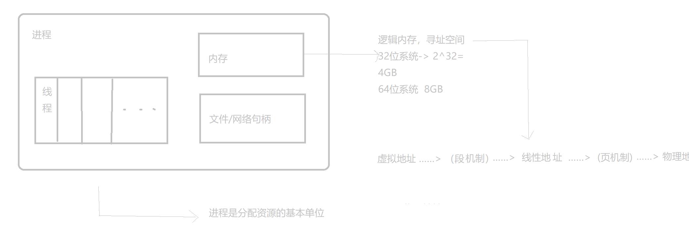

- 线程

  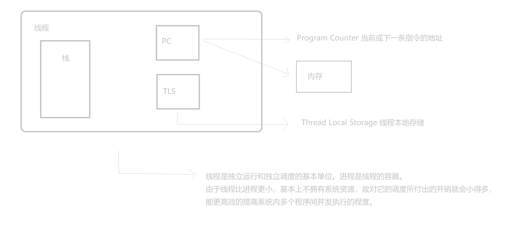

所以呢，进程是资源分配的基本单位，而线程是运行与调度的基本单位。

进程有着自己独立的地址空间，是不能共享内存的，而线程之间可以。

线程间有着共享内存，通信很方便。

**进程间通信(IPC，Interprocess communication)**：

1.  管道
    <br>它可以看作是特殊的文件，对于它的读写也可以使用普通的 read、write、open 等函数，不过它是只存在与内存中的。 - 普通管道(PIPE):通常有两种限制,一是单工,只能单向传输;二是只能在父子或者兄弟进程间使用.

        - 流管道(s_pipe):去除了第一种限制,为半双工，可以双向传输.

            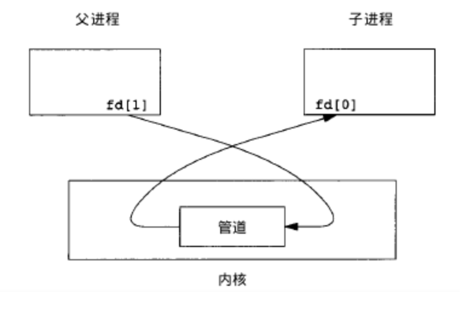

        如图,数据流从父进程流向子进程。
        若要数据从子进程流向父进程，则关闭父进程的写端与子进程的读端，打开子进程的写端与父进程的读端，即可。

        - 命名管道(name_pipe):去除了第二种限制,可以在许多并不相关的进程之间进行通讯.
        有路径名与之相关联，它以一种特殊设备文件形式存在于文件系统中.

2.  消息队列

消息队列，是消息的链接表，存放在内核中。一个消息队列由一个标识符(即队列 ID)来标识。

    特点：
    1. 消息队列是面向记录的，其中的消息具有特定的格式以及特定的优先级。
    2. 消息队列独立于发送与接收进程。进程终止时，消息队列及其内容并不会被删除。
    3. 消息队列可以实现消息的随机查询,消息不一定要以先进先出的次序读取,也可以按消息的类型读取。

3. 信号量

信号量(semaphore)与已经介绍过的 IPC 结构不同，它是一个计数器。信号量用于实现进程间的互斥与同步，而不是用于存储进程间通信数据。

    特点
    1. 信号量用于进程间同步，若要在进程间传递数据需要结合共享内存。
    2. 信号量基于操作系统的 PV 操作，程序对信号量的操作都是原子操作。
    3. 每次对信号量的 PV 操作不仅限于对信号量值加 1 或减 1，而且可以加减任意正整数。
    4. 支持信号量组。

4. 共用内存

共享内存(Shared Memory)，指两个或多个进程共享一个给定的存储区。

    特点
    1. 共享内存是最快的一种 IPC，因为进程是直接对内存进行存取。
    2. 因为多个进程可以同时操作，所以需要进行同步。
    3. 信号量+共享内存通常结合在一起使用，信号量用来同步对共享内存的访问。

5. TCP

通过网络 socket 与其他进程进行数据交流

#### 死锁、饥饿

- 死锁(deadlock)

  指的是两个或者两个以上的进程相互竞争系统资源，导致进程永久阻塞。

  - 死锁条件

    - 互斥条件
    - 不可剥夺条件
    - 请求和保持
    - 循环等待

- 饥饿(starvation)

指的是等待时间已经影响到进程运行，此时成为饥饿现象。如果等待时间过长，导致进程使命已经没有意义时，称之为“饿死”。

#### 生产者消费者模型

- 问题的核心是： 1.要保证不让生产者在缓存还是满的时候仍然要向内写数据; 2.不让消费者试图从空的缓存中取出数据。

多个生产者进行生产，多个消费者进行消费，缓冲区作为双方的纽带(阻塞队列)
当生产者生产较多的产品，超过缓冲区的容量时，阻塞生产者进程
当缓冲区中无产品时，消费者进行阻塞

#### 网络 IO 模型

> https://www.jianshu.com/p/f444a74babcf

在 UNIX 下，我们有五种不同的 IO 模型，分别是：

- 阻塞 IO(Blocking IO)
- 非阻塞 IO(NonBlocking IO)
- 多路复用 IO(I/O Multiplexing)
- 信号驱动 IO(signal driven I/O)
- 异步 IO(Asynchronous IO)

对于一个读操作来说，一般会经过以下两个过程：

- 等待数据就绪.对于网络连接来说，就是等待数据通过连接到达主机，接着拷贝数据到内核缓冲区
- 将数据从内核拷贝到进程，即把数据从内核缓冲区拷贝到应用程序缓冲区

* 阻塞 IO(Blocking IO)

  最常用的 IO 就是阻塞 IO。

  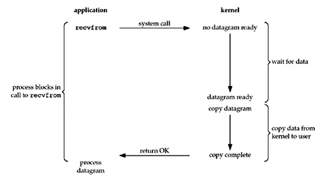

* 非阻塞 IO(NonBlocking IO)

  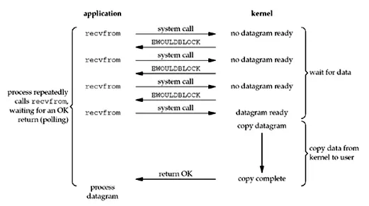

* 多路复用 IO(I/O Multiplexing)

  阿达

* 信号驱动 IO(signal driven I/O)
* 异步 IO(Asynchronous IO)

#### 例题

有关线程说法正确的是( A C )

A 线程是程序的多个顺序的流动态执行

B 线程有自己独立的地址空间

C 线程不能够独立执行，必须依存在应用程序中,由应用程序提供多个线程执行控制

D 线程是系统进行资源分配和调度的一个独立单位


## 计算机网络

#### osi 七层模型、TCP/IP 模型

- 应用层 HTTP、SMTP 、telnet、DHCP、PPTP
- 传输层 判断数据包的可靠性，错误重传机制，TCP/UDP 协议
  - TCP 协议 基于连接的
- 网络层 路由 ip 协议，标识各个网络节点
- 数据链路层 节点到节点数据包的传递,并校验数据包的安全性

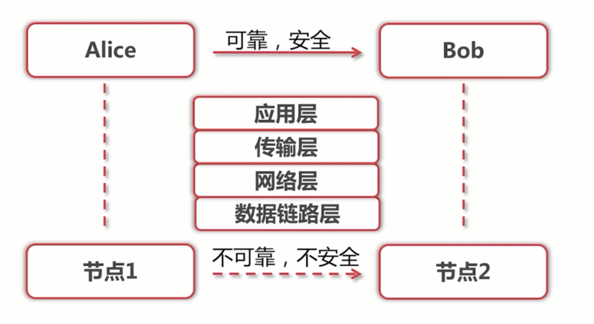

#### 网络传输

- 不可靠
  - 丢包、重复包
  - 出错
  - 乱序
- 不安全
  - 中间人攻击
  - 窃取
  - 篡改

#### TCP

TCP(Transmission Control Protocol 传输控制协议)是一种面向连接的、可靠的、基于字节流的传输层通信协议

    - 在数据正确性与合法性上，TCP用一个校验和函数来检验数据是否有错误，在发送和接收时都要计算校验和;同时可以使用md5认证对数据进行加密。
    - 在保证可靠性上，采用超时重传和捎带确认机制。
    - 在流量控制上，采用滑动窗口协议，协议中规定，对于窗口内未经确认的分组需要重传。
    - 在拥塞控制上，采用TCP拥塞控制算法(也称AIMD算法)。该算法主要包括三个主要部分：1)加性增、乘性减;2)慢启动;3)对超时事件做出反应。


    * TCP 是面向连接的传输层协议
    * 每一条 TCP 连接只能有两个端点(endpoint),每一条 TCP 连接只能是点对点的(一对一)
    * TCP 提供可靠交付的服务
    * TCP 提供全双工通信
    * 面向字节流

- 报头

  

  我们来分析分析每部分的含义和作用

  - 源端口号/目的端口号: 各占两个字节，端口是传输层与应用层的服务接口
  - 32 位序号: 占 4 字节，连接中传送的数据流中的每一个字节都编上一个序号。序号字段的值则指的是本报文段所发送的数据的第一个字节的序号。
  - 确认序号: 占 4 字节,是期望收到对方的下一个报文段的数据的第一个字节的序号
  - 4 位首部长度: 表示该 tcp 报头有多少个 4 字节(32 个 bit)
  - 6 位保留: 占 6 位,保留为今后使用,但目前应置为 0
  - 6 位标志位：

    URG: 标识紧急指针是否有效

    ACK: 标识确认序号是否有效 。只有当 ACK=1 时确认号字段才有效.当 ACK=0 时,确认号无效

    PSH: 用来提示接收端应用程序立刻将数据从 tcp 缓冲区读走

    RST: 要求重新建立连接. 我们把含有 RST 标识的报文称为复位报文段

    SYN: 请求建立连接. 我们把含有 SYN 标识的报文称为同步报文段 。　同步 SYN = 1 表示这是一个连接请求或连接接受报文

    FIN: 通知对端, 本端即将关闭. 我们把含有 FIN 标识的报文称为结束报文段。FIN=1 表明此报文段的发送端的数据已发送完毕,并要求释放运输连接

  - 16 位窗口大小:
  - 16 位检验和: 由发送端填充, 检验形式有 CRC 校验等. 如果接收端校验不通过, 则认为数据有问题. 此处的校验和不光包含 TCP 首部, 也包含 TCP 数据部分.
  - 16 位紧急指针: 用来标识哪部分数据是紧急数据.
    选项和数据暂时忽略

- 三次握手

  客户端 CLOSE 状态，服务器 LISTEN(监听)状态<br>
  客户端向服务器主动发出连接请求, 服务器被动接受连接请求

  客户端 -- > 服务端 发送 SYN 包，请求建立连接<br>
  服务端 -- > 客户端 发送 SYN+ACK 包，确认收到连接请求，并回复响应<br>
  客户端 -- > 服务端 发送 ACK 包，确认回复，建立连接

  

  **为什么不用两次?**

        主要是为了防止已经失效的连接请求报文突然又传送到了服务器，从而产生错误。

        如果使用的是两次握手建立连接，那么假设：
            客户端发送的第一个请求在网络中滞留较长时间，由于客户端迟迟没有收到服务端的回应，重新发送请求报文，服务器收到后与客户端建立连接，传输数据，然后关闭连接。此时滞留的那一次请求因为网络通畅了，到达了服务器，这个报文本应是失效的，但是两次握手的机制将会让客户端与服务端再次建立连接，导致不必要的错误和资源浪费。

            如果采用的是三次握手，就算失效的报文传送过来，服务端就收到报文并回复了确认报文，但是客户端不会再次发送确认。由于服务端没有收到确认，就知道客户端没有连接。

  **为什么不用四次？**

        因为三次就足够了，四次就多余了。

- 四次挥手

  客户端和服务器都是处于 ESTABLISHED 状态<br>
  客户端主动断开连接，服务器被动断开连接

  客户端 -- > 服务端 发送 FIN=1(连接释放报文)，并且停止发送数据，进入 FIN-WAIT-1(终止等待 1)状态<br>
  服务端 -- > 客户端 发送确认报文 ACK，并带上自己的序列号 seq=v，进入了 CLOSE-WAIT(关闭等待)状态<br>
  客户端 收到服务器确认，进入 FIN-WAIT-2(终止等待 2)状态，等待服务器发送连接释放报文(在这之前还需要接受服务器发送的最终数据)<br>
  服务端 -- > 向客户端发送连接释放报文，FIN=1，确认序号为 v+1,服务器就进入了 LAST-ACK(最后确认)状态，等待客户端的确认。<br>
  客户端 -- > 服务端 发送 ACK 包，确认,断开连接<br>
  服务器 收到确认,断开连接

  

  **为什么最后客户端还要等待 2\*MSL 的时间呢?**

        MSL(Maximum Segment Lifetime)，TCP允许不同的实现可以设置不同的MSL值

        1. 保证客户端发送的最后一个ACK报文能够到达服务器，如果ACK报文丢失，服务器未收到确认，会再次发送，而客户端就能在这个2MSL时间段内收到重传的报文，接着给出回应报文，并且会重启2MSL计时器。

        2. 防止类似与"三次握手"中提到了的"已经失效的连接请求报文段"出现在本连接中。客户端发送完最后一个确认报文后，在这个2MSL时间中，就可以使本连接持续的时间内所产生的所有报文段都从网络中消失。这样新的连接中不会出现旧连接的请求报文。(简单讲，就是这段时间所有的报文段会慢慢消失，以至于其余的连接请求是不会有正确确认的)

  **为什么建立连接是三次握手，关闭连接确是四次挥手呢？**

        断开连接时，服务器收到对方的FIN包后，仅仅表示对方不在发送数据了，但是还能接收数据。所以己方还可能有数据发送给客户端，因此己方ACK与FIN包会分开发送，从而导致多了一次。

  **如果已经建立了连接, 但是客户端突发故障了怎么办?**

        TCP设有一个保活计时器。
        显然，如果客户端发生故障，服务器不能一直等下去，浪费资源。
        服务器每收到一次客户端的请求都会重置复位这个计时器，时间通常设置为2小时。两小时没有收到客户端请求，会发送一个探测报文段，以后每隔75分钟发送一次，连续10次后，客户端仍没反应，则认为客户端故障，关闭连接。

- 确认应答机制(ACK 机制)

  TCP 将每个字节的数据都进行了编号, 即为序列号

  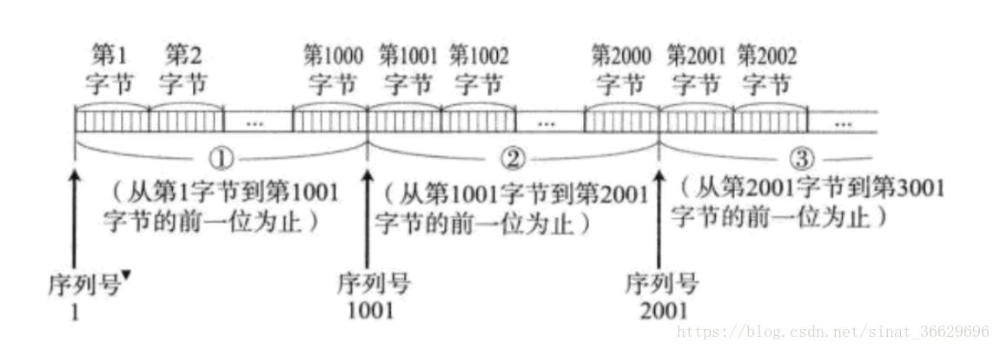

  每一个 ACK 都带有对应的确认序列号, 意思是告诉发送者, 我已经收到了哪些数据; 下一次你要从哪里开始发.

  比如, 客户端向服务器发送了 1005 字节的数据, 服务器返回给客户端的确认序号是 1003, 那么说明服务器只收到了 1-1002 的数据.
  1003, 1004, 1005 都没收到.
  此时客户端就会从 1003 开始重发.

- 超时重传机制

  特定的时间间隔内，发生网络丢包(到客户端的数据包丢失或者客户端确认的 ACK 包丢失)，主机未收到另一端的确认应答，就会进行重发。

  这种情况下, 主机 B 会收到很多重复数据.
  那么 TCP 协议需要识别出哪些包是重复的, 并且把重复的丢弃.
  这时候利用前面提到的序列号, 就可以很容易做到去重.

  **超时时间如何确定?**

  TCP 为了保证任何环境下都能保持较高性能的通信, 因此会动态计算这个最大超时时间.

> https://www.cnblogs.com/wxgblogs/p/5616829.html

- 滑动窗口

  缓存

- 流量控制

  通过控制滑动窗口控制流量

- 拥塞控制

  - 慢开始

    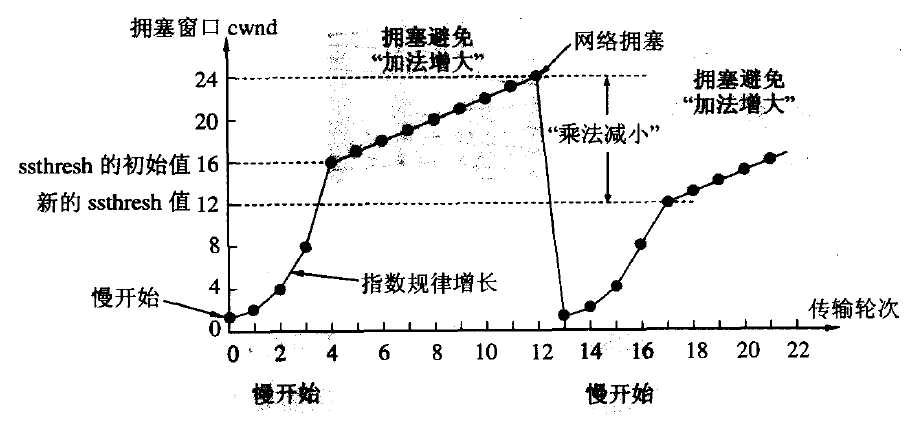

    一开始从 1 开始，慢慢来，指数增长

  - 拥塞避免

    乘法减小
    加法增大

  - 快重传

    三次重复确认回复则断定分组缺失，立即重传丢失的报文段，而不必等待重传计时器超时

  - 快恢复

    乘法减小
    加法增大

当 cwnd<ssthresh 时，使用慢开始算法。

当 cwnd>ssthresh 时，改用拥塞避免算法。

当 cwnd=ssthresh 时，慢开始与拥塞避免算法任意。


## 数据结构&算法

> https://github.com/xiufengcheng/DATASTRUCTURE

#### 线性表

- 是 n(n≥0)个相同类型的数据元素构成的有限序列。

  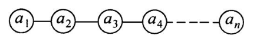

  - 线性表除第一个和最后一个元素之外，每一格数据元素只有一个前驱和一个后继
  - 分有序线性表(顺序表)和无序线性表(链表)，有序线性表的元素按照值的递增顺序排列;无序线性表在元素的值与位置之间没有特殊的联系

- 顺序表

  顺序表：一组连续地址存储线性表的各个元素

  求址：
  每个元素占用 k 个存储单元，则
  LOC(ai)= LOC(a1)+(i-1)\*k (1≤i ≤n)
  LOC(ai+1)= LOC(ai)+k (1≤i ≤n)

  **注意**

        访问顺序表中元素的时间都相等,具有这一特点的称为 随机存取结构

- 链表

  链表：一组随机地址存储线性表各个元素，元素之间使用指针连接起来

  单链表：各元素只有一个指针域的链表(只含有一个指针域)

  头结点在链表中并不是必须的，仅仅是为了操作上的方便。

  双向链表: 有两个指针域的链表，一个指向前驱，另一个指向后继

        节点p既指向前驱，又指向后继。因此可随意在其上向前或向后移动，使得操作更加容易。

        操作上比单链表更加便利，但存储开销增大。

        双(向)链表是非循环的，有首尾节点，注意与双向循环链表区别开来

  循环链表(约瑟夫环)：

        尾部指针的next指向头指针,形成环状数据结构

        一般有两种形式的循环链表，即单向循环链表和双向循环链表。

        单向循环链表中，表尾结点的指针域不为空，回指第一个结点，整个链表形成一个环。

        在双向循环链表中，除了表尾结点的后继指针域回指第一个结点外，同时表头结点的前驱指针域回指表尾结点，这样在链表中构成了两个环。

#### 栈

可用顺序表或链表实现。特点：后进先出 (LIFO)

- 多栈共享邻接空间

  - 定义：即两个栈栈底位置为两端，两个栈顶在中间不断变化，由两边往中间延伸。动态变化(想象把两个花瓶口对口连起来)。
  - 目的：若多个栈同时使用，可能出现一个栈的空间被占满而其它栈空间还有大量剩余，因此采用这个方法。
  - 特点：设有 top1 和 top2 两个指针，top1 = -1 表示左栈为空，top2 >= StackSize 表示右栈为空; top1 + 1 >= top2 时表示栈满。

    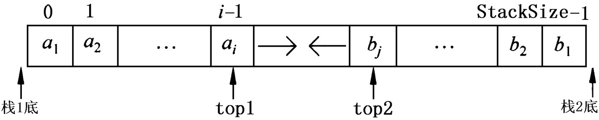

#### 队列

- 先进先出
- 顺序循环队列

  - 初始状态为 front = rear = 0
  - 入队时，把元素插到 rear 指示位置，然后 rear++
  - 出队时，把 front 指示位置元素删除，然后 front++

  - **判断空**

    1. 少用一个存储单元

       插入时，判断下一元素是否为 front，如果是，则停止插入。

       判满条件：(rear+1) mod maxsize = front

       判空条件：rear == front

    2. 设置一个标志位

       即设置一个标志位 tag=0,当进队成功时 tag=1;当出队成功时 tag=0

       判满条件：(rear==front) && (tag==1)

       判空条件：(rear==front) && (tag==0)

    3. 设置计数器

       即设置一个计数器 count=0，当进队成功时 count++;当出队成功时 count--

       判满条件：(rear==front) && count>0\*\*

       判空条件：count == 0

#### 查找

#### 排序

- 快速排序

  快排是不稳定的排序，最好的情况对半分，时间复杂度为 nlogn
  最坏的情况选择最小或最大的元素作为切分元素，时间复杂度为 n^2

  快排是内部进行比较交换，所以不需要额外的空间，但是递归调用会占用栈空间

  ArrayList.sort()方法使用的是快排

  对快排的优化：

  1. 对于小数组或者切分为小数组时可以用插入排序，效率较高
  2. 可以选择三个数，从中取中值
  3. 对于重复值多的序列，可以三向切分，大于、等于、小于


    补充：
        快速排序通过一个切分元素将数组分为两个子数组，左子数组小于等于切分元素，右子数组大于等于切分元素。再将两个子数组排序就是整个数组排序了

        ```
        public class QuickSort<T extends Comparable<T>> exths Sort<T>{

            @override
            public void sort(T[] nums){
                shuffle(nums);
                sort(nums,0,nums.length-1);
            }

            public void sort(t[] nums, int l,int h){
                if(l == h){
                    return
                }
                int mid =partition(nums, l, h);
                sort(nums, l, mid+1);
                sort(nums, mid-1, h);
            }

            public void shuffle(T[] nums){
                List<Comparable> list = Arrays.asList(nums);
                Collections.shuffle(lsit);
                list.toArray(nums);
            }
        }
        ```

        取a[l]元素作为切分元素，定义i指针指向l，从左向右(i++)扫描数组，直到找到第一个大于等于他的元素，接着从右往左扫描，遇到第一个小于等于他的元素，交换这两个元素，不断重复这个过程，直到两个指针相遇。最后将切分元素a[l]与a[j]交换。这样保证了切分元素左面都是小于等于他的元素，右面都是大于等于他的元素。

        ```
        private int partition(T[] nums, int l, int h){
            T v = T[l];
            int i = l, j = h + 1;
            while(true){
                while(less(nums[++i], v) && i!=h);
                while(less(nums[--j], v) && j!=l);
                if (i>=j){
                    break;
                }
                swap(nums,i,j);
            }
            swap(nums,l,j);
            return j;
        }
        ```

    排序的话，快排是不稳定的排序，同样不稳定排序有 选择排序、希尔排序、堆排序

    Java中Arrays.sort()使用的是快排

- 堆排序

  堆可以看做是一颗树，节点在树中的高度可以被定义为从本节点到叶子节点的最长简单下降路径上边的数目；定义树的高度为树根的高度。我们将看到，堆结构上的一些基本操作的运行时间至多是与树的高度成正比，为 O(lgn)

  1. 先将初始数列建成一个大根堆，此堆为初始的无序区
  2. 将堆顶元素 R[1]与最后一个 R[n]交换，此事得到新的无序区(R1,R2,......Rn-1)和新的有序区(Rn)
  3. 由于交换后新的堆顶 R[1]可能违反堆的性质，因此需要对当前无序区(R1,R2,......Rn-1)调整为新堆，然后再次将 R[1]与无序区最后一个元素交换，得到新的无序区(R1,R2....Rn-2)和新的有序区(Rn-1,Rn)。不断重复此过程直到有序区的元素个数为 n-1，则整个排序过程完成

  初始大顶堆：从最后一个有子节点的开始网上调整最大堆 从下往上 从右往左
  调整堆： 堆顶元素 R[1]与最后一个元素 R[n]交换，交换后堆长度减一
  即每次调整都是从父节点、左孩子节点、右孩子节点三者中选择最大者跟父节点进行交换(交换之后可能造成被交换的孩子节点不满足堆的性质，因此每次交换之后要重新对被交换的孩子节点进行调整)。有了初始堆之后就可以进行排序了。 从上往下 从左往右

  堆排序 平均时间复杂度 nlog2(n) 空间复杂度 o(1)

  Java 中 PriorityQueue 实现依赖小根堆

  实现：

        首先初始化堆，从最后一个有子节点的开始网上调整最大堆

        ```
        private static void maxHeapify(int[] nums,int heapSize,int index){
            int left = getChildLeftIndex();
            int right = getChildRightIndex();
            int largest = index;

            if (left < index && data[index] < data[left])
                larget = left;
            if (right < index && data[largest] < data[right])
                largest = right;

            if (largest!=index){
                swap(data,index,largest);
                //得到最大值后可能需要交换，如果交换了，其子节点可能就不是最大堆了，需要重新调整
                maxHeapify(data, heapSize, largest);
            }
        }
        ```

        依次从下往上 从右往左，调整堆

        ```
        private static void buildMaxHeapify(int[] data) {
            int startIndex = getParentIndex(data.length - 1);
            for (int i = startIndex; i >= 0; i--) {
                maxHeapify(data, data.length, i);
            }
        }
        ```

        进行堆排序

        ```
        private static void heapSort(int[] data) {
            for (int i = data.length - 1; i > 0; i--) {
                ArrayMethod.swap(data, 0, i);
                maxHeapify(data, i, 0);
            }
        }
        ```

#### 搜索二叉树 (Binary Search Tree)

#### 平衡二叉树 (Balanced Binary Search Tree)

#### 红黑树 (Red-Black-Tree)

AVL 是高度平衡的树，插入删除都需要大量的左旋右旋进行重新平衡
而红黑树放弃了极致平衡以追求插入删除时的效率

红黑树的特点：

1.  节点非黑即红
2.  叶子节点为黑色
3.  到叶子节点的任意路径下的黑色节点个数一致
4.  红色节点的两个子节点都为黑色

#### b 树,b+树，b-树(易于混淆)

> https://www.xuebuyuan.com/3191430.html
 > https://www.cnblogs.com/qlqwjy/p/7965491.html

动态查找树主要有：二叉查找树(Binary Search Tree),平衡二叉树，红黑树，B-tree/B+-tree/b\*-tree

强调： B-tree 读作 b 树,B+-tree 读作 b+树，所以 b-树就是 b 树。

前三者是典型的二叉查找树结构，其查找的时间复杂度 O(logN)与树的深度相关，那么降低树的深度自然会查找提高效率。

- b 树即二叉树(binary )

#### Trie 树

> https://blog.csdn.net/sunhuaqiang1/article/details/52463257

#### 用两个栈实现一个队列或者俩个队列实现一个栈

1. 区别与联系

相同点：
(1)栈和队列都是控制访问点的线性表;
(2)栈和队列都是允许在端点处进行数据的插入和删除的数据结构;

不同点：
(1)栈遵循“后进先出(LIFO)”的原则，即只能在该线性表的一头进行数据的插入和删除，该位置称为“栈顶”，而另外一头称为“栈底”;根据该特性，实现栈时用顺序表比较好;
(2)队列遵循“先进先出(FIFO)”的原则，即只能在队列的尾部插入元素，头部删除元素。根据该特性，在实现队列时用链表比较好

2. 两站实现队列
   栈是后进先出的，所以两个栈 一个栈用来入栈，而将栈中的数据再次出栈存入另一个栈中，这样经过两次后进先出， 则实现了先进先出

3. 两队列实现栈
   始终保持一个队列为空，需要出队时，队列抛出 n-1 个数据到另一队列中，只留下一个 top1 数据，这样那个队列再次 pop,pop 的数据就是队首元素了。


## 数据库

#### 范式

- 1NF 一个属性不允许在分成多个属性，即每个属性具有 **原子性**
- 2NF **完全函数依赖**，第二范式的目标就是消除函数依赖关系中左边存在的冗余属性。例如，(学号，班级)->姓名，事实上，只需要学号就能决定姓名，因此班级是冗余的，应该去掉。
- 3NF **消除传递依赖** 数据库中的属性依赖仅能依赖于主属性，不存在于其他非主属性的关联。
- BCNF
  - 所有非主属性对每一个码都是完全函数依赖
  - 所有的主属性对于每一个不包含它的码，也是完全函数依赖
  - 没有任何属性完全函数依赖于非码的任意一个组合。
  - R 属于 3NF，不一定属于 BCNF，如果 R 属于 BCNF，一定属于 3NF。
  - 例：配件管理关系模式 WPE(WNO，PNO，ENO，QNT)分别表仓库号，配件号，职工号，数量。有以下条件
    a.一个仓库有多个职工。
    b.一个职工仅在一个仓库工作。
    c.每个仓库里一种型号的配件由专人负责，但一个人可以管理几种配件。
    d.同一种型号的配件可以分放在几个仓库中。

#### 特性

- A atomicity 原子性  
  整个事务中的所有操作，要么全部完成，要么全部不完成，不可能停滞在中间某个环节。事务在执行过程中发生错误，会被回滚(Rollback)到事务开始前的状态，就像这个事务从来没有执行过一样。
- C consistency 一致性
  一个事务可以封装状态改变(除非它是一个只读的)。事务必须始终保持系统处于一致的状态，不管在任何给定的时间并发事务有多少。
- I isolation 隔离性
  隔离状态执行事务，使它们好像是系统在给定时间内执行的唯一操作。如果有两个事务，运行在相同的时间内，执行相同的功能，事务的隔离性将确保每一事务在系统中认为只有该事务在使用系统。这种属性有时称为串行化，为了防止事务操作间的混淆，必须串行化或序列化请求，使得在同一时间仅有一个请求用于同一数据。
- D durability 持久性
  在事务完成以后，该事务对数据库所作的更改便持久的保存在数据库之中，并不会被回滚。

#### 隔离级别

事务的隔离级别有四种，隔离级别高的数据库的可靠性高，但并发量低，而隔离级别低的数据库可靠性低，但并发量高，系统开销小

|                 | 脏读(dirty read) | 不可重复读(unrepeatable read) | 幻读(phantom read) |
| --------------- | ---------------- | ----------------------------- | ------------------ |
| read uncommited | y                | y                             | y                  |
| read commited   | n                | y                             | y                  |
| repearable read | n                | n                             | n                  |
| serialable      | n                | n                             | n                  |

1.  READ UNCOMMITED 未提交读 **更新的瞬间加 行级共享锁**
    事务还没提交，而别的事务可以看到他其中修改的数据的后果，-->脏读(该事物出错而回滚，其他事物已读到改变的值，发生脏读)。
2.  READ COMMITED 提交读 **对被读取的数据加 行级共享锁 读完释放** **更新的瞬间加 行级排他锁**
    其他事务只能看到已经完成的事务的结果，正在执行的，是无法被其他事务看到的。这种级别会出现读取旧数据的现象。大多数数据库系统的默认隔离级别是 READ COMMITTED
    也容易发生丢失更新： 如果 A、B 同时获取资源 X，然后事务 A 先发起更新记录 X，那么事务 B 将等待事务 A 完成，然后获得记录 X 的排他锁，进行更改，这样事务 A 的更新就会丢失。

    |                           |     |                                          |
    | ------------------------- | --- | ---------------------------------------- |
    | 事务 A                    | --- | 事务 B                                   |
    | 读取 X=100(同时上共享锁)  | --- | 读取 X=100(同时上共享锁)                 |
    | 读取成功(释放共享锁)      | --- | 读取成功(释放共享锁)                     |
    | UPDATE X=X+100 (上排他锁) | --- |                                          |
    |                           | --- | UPDATING A(等待事务 A 释放对 X 的排他锁) |
    | 事务成功(释放排他锁)X=200 | --- |                                          |
    |                           | --- | UPDATE X=X+200(成功上排他锁)             |
    | (事务 A 的更新丢失)       | --- | 事务成功(释放排他锁)X=300<br>            |

3.  REPEATBLE COMMITED 可重复读 **对被读取的数据加 行级共享锁 事务结束释放** **更新的瞬间加 行级排他锁**
    事务结束才释放行级共享锁 ，这样保证了可重复读(既是其他的事务职能读取该数据，但是不能更新该数据)。　会导致幻读
4.  SERIALIZABLE 可串行化
    SERIALIZABLE 是最高的隔离级别，它通过强制事务串行执行(注意是串行)，避免了前面的幻读情况，由于他大量加上锁(加表锁)，导致大量的请求超时，因此性能会比较底下，再特别需要数据一致性且并发量不需要那么大的时候才可能考虑这个隔离级别

- 期间造的问题
  - 丢失更新
  - 脏读(未提交读)
  - 不可重复读 一个事务在自己没有更新数据库数据的情况，同一个查询操作执行两次或多次的结果应该是一致的;如果不一致，就说明为不可重复读。
  - 幻读 事务 A 读的时候读出了 15 条记录，事务 B 在事务 A 执行的过程中 增加 了 1 条，事务 A 再读的时候就变成了 16 条，这种情况就叫做幻影读。

#### 锁机制

- 共享锁 (S 锁)
  由读表操作加上的锁，加锁后其他用户只能获取该表或行的共享锁，不能获取排它锁，也就是说只能读不能写
- 排它锁 (X 锁)
  由写表操作加上的锁，加锁后其他用户不能获取该表或行的任何锁，典型是 mysql 事务</br>

根据锁的范围，可以分为

- 表锁
  给整张表加锁
- 行锁
  给行数据加锁

因此锁可以分为表级共享锁、行级共享锁、表级排它锁、行级排它锁。

#### 存储过程

对于我们常用的关系型数据库，操作数据库的语言一般是 SQL，SQL 在执行的时候需要先编译,然后执行.

而存储过程(Stored Procedure)是一组为了完成某种特定功能的*SQL 语句集*,经编译后存储在数据库中,用户通过存储过程的名字并给定参数(如果需要参数)来调用执行它。

- 创建存储过程

  ```
  create procedure sp_name
  @[参数名] [类型],@[参数名] [类型]
  as
  begin
  .........
  end
  以上格式还可以简写成：
  create proc sp_name
  @[参数名] [类型],@[参数名] [类型]
  as
  begin
  .........
  end
  /*注：“sp_name”为需要创建的存储过程的名字，该名字不可以以阿拉伯数字开头*/
  ```

- 调用存储过程

  基本语法：exec sp_name [参数名]

- 删除存储过程

  1.基本语法：
  drop procedure sp_name

  2.注意事项
  (1)不能在一个存储过程中删除另一个存储过程，只能调用另一个存储过程

- 其他常用命令

  1.show procedure status
  显示数据库中所有存储的存储过程基本信息，包括所属数据库，存储过程名称，创建时间等

  2.show create procedure sp_name
  显示某一个 mysql 存储过程的详细信息

  3、exec sp_helptext sp_name
  显示你这个 sp_name 这个对象创建文本

#### 索引

索引(index)是帮助数据库高效获取数据的数据结构。

在数据之外，数据库系统维护着满足特定查找算法的数据结构,这些数据结构以某种方式引用(指向)数据,可以在这些数据结构上实现高级查找算法，提高查询速度，这种数据结构，就是索引。

- 索引存储分类(MySql)

  - B-Tree 索引 最常见的索引类型，大部分引擎都支持 B 树索引。
  - Hash 索引
  - R-tree 索引(空间索引) 空间索引是 MyISAM 的一种特殊索引类型，主要用于地理空间数据类型。
  - Full-text(全文索引) 全文索引也是 MyISAM 的一种特殊索引类型，主要用于全文索引，InnoDB 从 MySQL5.6 版本提供对全文索引的支持。

- B-tree 索引类型

  - 普通索引

    最基本的索引类型，而且它没有唯一性之类的限制，可以通过以下几种方式创建：

    ```
    //创建索引
    create index index_name on table_name(col1,col2...)

    //修改表
    alter table_name add index index_name (col1,col2...)

    //创建表时指定索引
    create table table_name([...],index index_name (col1,col2...))
    ```

  - UNIQUE 索引

    唯一索引

    ```
    关键字为 UNIQUE INDEX

    //创建索引
    create UNIQUE INDEX index_name on table_name(col1,col2...)

    //修改表
    alter table_name add UNIQUE INDEX index_name (col1,col2...)

    //创建表时指定索引
    create table table_name([...],UNIQUE INDEX index_name (col1,col2...))
    ```

  - 主键索引

    主键是一种唯一性索引，但它必须指定为“PRIMARY KEY”,不允许 null

    ```
    // 1. 创建表时指定
    CREATE TABLE 表名( […], PRIMARY KEY (列的列表) );
    // 2. 修改表时加入
    ALTER TABLE 表名 ADD PRIMARY KEY (列的列表);
    ```

- 删除索引

  ```
  DROP INDEX index_name ON talbe_name

  ALTER TABLE table_name DROP INDEX index_name

  ALTER TABLE table_name DROP PRIMARY KEY
  ```

- 查看索引

  ```
  mysql> show index from table_name;
  ```

- 设置索引的规则

  1. 较频繁的作为查询条件的字段
  2. 唯一性太差的字段不适合单独做索引，即使频繁作为查询条件
  3. 更新非常频繁的字段不适合作为索引

- 索引的弊端

  索引是有代价的：索引文件本身要消耗存储空间，同时索引会加重插入、删除和修改记录时的负担，另外，MySQL 在运行时也要消耗资源维护索引，因此索引并不是越多越好。

- 处理重复记录的常用操作

  ```
  // 查找重复记录
  select * from table_name where column_name in (select column in table_name group by column having count(column) > 1)

  // 删除重复记录
  delete ...

  // 查找多个字段重复记录
  select * from table_name where column_name in (select column_1,column_2 in table_name group by column_1 column_2 having count(*) > 1)
  ```

#### SQL

- 数据定义：Create Table,Alter Table,Drop Table, Craete/Drop Index
- 数据操纵：Select ,insert,update,delete
- 数据控制：grant,revoke

- 内连接/外连接

  - 内连接是保证两个表中的数据要满足连接条件


> https://blog.csdn.net/gui951753/article/details/79489279

#### 数据库优化

- sql语句优化
  1. 应尽量避免在where字句中使用!=或<>操作符，否则引擎放弃使用索引而进行全表扫描
  2. 应避免在where字句中对字段进行null值判断，否则将导致引擎放弃索引而进行全表扫描。如：

    `select id from table where num is null`

    可以在num字段上设置默认值0，确保表中没有null值，然后这样查询：

    `select id from table where num = 0`

  3. 很多时候，exist代替in是一个很好的选择
  4. 使用where子句代替having子句，因为having会检索出所有记录后进行过滤

- 索引优化
- 数据库结构优化
  1. 范式优化

    消除冗余

  2. 反范式优化

    比如适当增加冗余等(减少join)

  3. 拆分表
      1. 水平拆分

          表中的数据量比较大时，可进行水平拆分，根据唯一id hash分区或者时间或者数据量，当对表进行查询时，通过中间件计算记录所在分区，然后只需在表分区中进行查询，缩短了查询时间
      2. 垂直拆分


- 服务器硬件优化

## 设计模式

> https://www.cnblogs.com/geek6/p/3951677.html <br>
 > https://github.com/CyC2018/CS-Notes/blob/master/notes/%E8%AE%BE%E8%AE%A1%E6%A8%A1%E5%BC%8F.md

#### 设计模式的六大原则

- 总原则：开闭原则(Open Close Principle)

  开闭原则就是说对扩展开放，对修改关闭。

  在程序需要进行拓展的时候，不能去修改原有的代码，而是要扩展原有代码，实现一个热插拔的效果。

1. 单一职责原则

   不要存在多于一个导致类变更的原因，也就是说每个类应该实现单一的职责，如若不然，就应该把类拆分。

2. 里氏替换原则(Liskov Substitution Principle)

   任何基类可以出现的地方，子类一定可以出现。

   在继承关系中，父类的对象如果替换为子类的对象，他原来执行的行为依然保持不变。这样来说，java 的多态正是依赖于里氏替换原则的。

3. 依赖倒转原则(Dependence Inversion Principle)

   面向接口编程，依赖于抽象而不依赖于具体。写代码时用到具体类时，不与具体类交互，而与具体类的上层接口交互。

4. 接口隔离原则(Interface Segregation Principle)

   每个接口中不存在子类用不到却必须实现的方法，如果不然，就要将接口拆分。使用多个隔离的接口，比使用单个接口(多个接口方法集合到一个的接口)要好。

5. 迪米特法则(最少知道原则)(Demeter Principle)

   一个类对自己依赖的类知道的越少越好。也就是说无论被依赖的类多么复杂，都应该将逻辑封装在方法的内部，通过 public 方法提供给外部。这样当被依赖的类变化时，才能最小的影响该类。

6. 合成复用原则(Composite Reuse Principle)

   原则是尽量首先使用合成/聚合的方式，而不是使用继承。

#### 简单工厂模式

就是建立一个工厂类，对实现了同一接口的一些类进行实例的创建

-
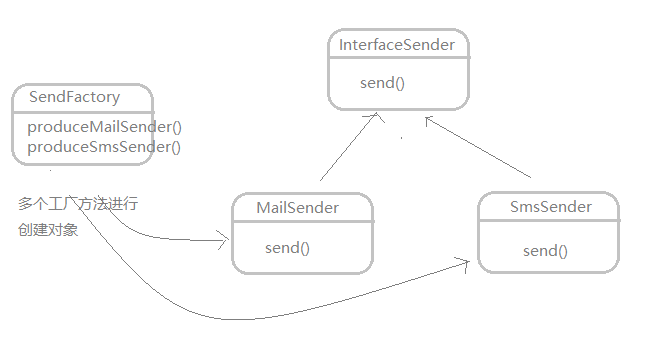

```
public interface Sender {
    public void Send();
}

public class MailSender implements Sender {
    @Override
    public void Send() {
        System.out.println("this is mailsender!");
    }
}

public class SmsSender implements Sender {

    @Override
    public void Send() {
        System.out.println("this is sms sender!");
    }
}

//1. 依据传入的字符串创建对象
//如果传入的字符串有误，不能正确创建对象
public class SendFactory {
    public Sender produce(String type) {
        if ("mail".equals(type)) {
            return new MailSender();
        } else if ("sms".equals(type)) {
            return new SmsSender();
        } else {
            System.out.println("请输入正确的类型!");
            return null;
        }
    }
}

//2. 多个工厂方法分别创建不同的对象
public class SendFactory {
    public Sender produceMail(){
        return new MailSender();
    }
    public Sender produceSms(){
        return new SmsSender();
    }
}

//3. 多个静态方法分别创建不同的对象
//相较于上一种，不需要实例化工厂类
public class SendFactory {
    public static Sender produceMail(){
        return new MailSender();
    }
    public static Sender produceSms(){
        return new SmsSender();
    }
}
```

总体来说，工厂模式适合：凡是出现了大量的产品需要创建，并且具有共同的接口时，可以通过工厂方法模式进行创建。

#### 工厂方法模式(Factory Method)

简单工厂模式有一个问题就是，类的创建依赖工厂类，也就是说，如果想要拓展程序，必须对工厂类进行修改，这违背了闭包原则.

所以，用到工厂方法模式，创建一个工厂接口和创建多个工厂实现类，这样一旦需要增加新的功能，直接增加新的工厂类就可以了，不需要修改之前的代码。

-
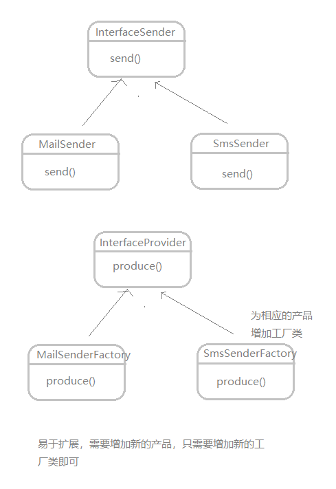

```
public interface Sender {
    public void Send();
}

public class MailSender implements Sender {
    @Override
    public void Send() {
        System.out.println("this is mailsender!");
    }
}

public class SmsSender implements Sender {
    @Override
    public void Send() {
        System.out.println("this is sms sender!");
    }
}

// 工厂接口
public interface Provider {
    public Sender produce();
}

public class SendMailFactory implements Provider {
    @Override
    public Sender produce(){
        return new MailSender();
    }
}

public class SendSmsFactory implements Provider{

    @Override
    public Sender produce() {
        return new SmsSender();
    }
}

// 调用时

public class Main {

    public static void main(String[] args) {
        Provider provider = new SendMailFactory();
        Sender sender = provider.produce();
        sender.Send();
    }
}
```

对于增加改变的产品，只需实现 Provider 接口，做一个相应的工厂类就行了。拓展性较好。

#### 抽象工厂模式

(_-_) 等等哈，没抽象明白！

#### 单例模式

- 适用场景：
  1. 有些类对象的创建与销毁非常耗费资源，而且有经常用到
  2. 需要生成唯一序列话的环境，如部分窗口对象，关闭后打开我们需要保持在之前的界面，
  3. 方便资源互相通信的环境， 如一个 log 日志单例类，不同地方的的调用可以将日志按顺序记录到一个文件中。
- 优点：
  1. 实现了对唯一实例的访问的可控
  2. 对于一些频繁创建和销毁的对象来说可以提高系统的性能
- 缺点：
  1. 滥用单例会带来一些负面问题，如为了节省资源将数据库连接池对象设计为单例类，可能会导致共享连接池对象的程序太多，而出现连接池溢出
  2. 如果实例化的对象长时间不被利用，系统会认为该对象是垃圾而被回收，这可能会导致对象状态的丢失
- 实现
  1. 饿汉式 初始化时直接创建一个单例对象 初始启动时创建对象延迟启动，而且对象长时间不用占用一定空间，浪费<br>
  2. 懒汉式 需要的时候再去创建。
  - 线程不安全
  - 线程安全
    - synchronized 锁住方法
    - synchronized 锁部分代码块，缩小锁粒度
    - 内部类，利用类的加载一定线程安全的原因
    - 枚举类 该实现在多次序列化再进行反序列化之后，不会得到多个实例

饿汉式

    ```
    static instance = new SingleInstance();
    ```

懒汉式(线程不安全)

    ```
    static instance = null;
    ...
    getInstance(){
        if(instance==null)
            return new SingleInstance();
    }
    ```

懒汉式加锁 synchronized(低效)

    ```
    synchronized getInsance(){
        if (instance==null){
            return new SingleInstance();
        }
    }
    ```

懒汉式双重锁检查(volatile 防止指令重排)

    ```
    static volatile instance = null;
    ...
    getInstance(){
        if(instance==null){
            synchronized(SingleInstance.class){
                if (instance==null){
                    return new SingleInstance();
                }
            }
        }
    }
    ```

内部类(在方法 getInstance()调用时加载内部类，利用 classLoader 保证了同步)

    ```
    // 内部类
    private static class InnerSingleInstance {
        private staic final SingleInstance INTANCE = new SingleInstance();
    }
    private SingleInstance(){};
    public static SingleInstance getInstance(){
        return InnerSingleInstance.INSTANCE;
    }
    ```

枚举实现

该实现可以防止反射攻击。在其它实现中，通过 setAccessible() 方法可以将私有构造函数的访问级别设置为 public，然后调用构造函数从而实例化对象，如果要防止这种攻击，需要在构造函数中添加防止多次实例化的代码。该实现是由 JVM 保证只会实例化一次，因此不会出现上述的反射攻击。

    ```
    public enum Singleton {
        INSTANCE;
        private String objName;

        public String getObjName() {
            return objName;
        }

        public void setObjName(String objName) {
            this.objName = objName;
        }
    ```

#### 代理模式

- 1. 实现类与代理类 都继承同一个接口， 代理类的方法实现实际是调用实现类的该方法实现。 如：spring AOP 中的 jdk 动态代理

  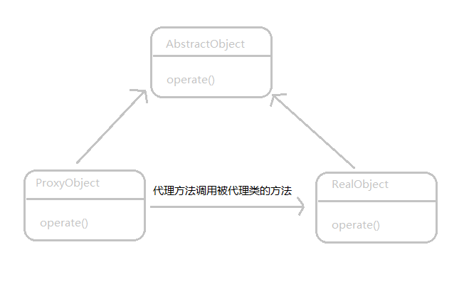

* 2. 代理类继承实现类，覆盖其中的方法。 如：spring AOP 中的 cglib 代理

  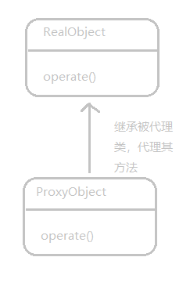

JDK 动态代理只能对实现了接口的类生成代理对象;

cglib 可以对任意类生成代理对象，它的原理是对目标对象进行继承代理，如果目标对象被 final 修饰，那么该类无法被 cglib 代理。

#### 适配器模式

#### 职责链模式

- 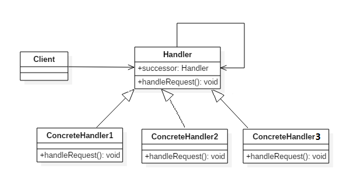

将能够处理同一类请求的对象连成一条链，使这些对象都有机会处理请求，所提交的请求沿着链传递，从而避免请求的发送者和接受者之间的耦合关系。链上的对象逐个判断是否有能力处理该请求，如果能则处理，如果不能，则传递给链上的下一个对象。直到有一个对象处理它为止。

场景：
打牌时，轮流出牌
接力赛跑
请假审批
公文审批

    ```
    // 共同抽象处理类
    public abstract class Handler {

        protected Handler successor ;

        public Handler (Handler successor ){
            this.successor  = successor ;
        }

        public abstract void handleRequest(Request request);
    }

    // 主任对应的处理类
    public class DirectorHandler extends Handler {

        private String name = "director";

        public DirectorHandler(Handler successor) {
            super(successor);
        }

        @Override
        public void handleRequest(Request request) {
            if (request.getlevel() == 1) {
                System.out.println("\t" + name + " handler the request: \n\t\t" + request.getMsg());
                return;
            }

            if (successor != null) {
                successor.handleRequest(request);
            }
        }
    }

    // 经理对应的处理类
    public class ManagerHandler extends Handler {

        private String name = "manager";

        public ManagerHandler(Handler successor) {
            super(successor);
        }

        @Override
        public void handleRequest(Request request) {
            if (request.getlevel() == 2) {
                System.out.println("\t" + name + " handler the request: \n\t\t" + request.getMsg());
                return;
            }

            if (successor != null) {
                successor.handleRequest(request);
            }
        }
    }

    // 请求类
    public class Request {
        private int level;
        private String msg;

        public Request(int level, String msg) {
            this.level = level;
            this.msg = msg;
        }

        public void setlevel(int level) {
            this.level = level;
        }

        public void setMsg(String msg) {
            this.msg = msg;
        }

        public int getlevel() {
            return this.level;
        }

        public String getMsg() {
            return this.msg;
        }
    }

    // 客户端
    public class Client {

        public static void main(String[] args) {
            Handler generalManagerHandler = new GeneralManagerHandler(null);
            Handler managerHandler = new ManagerHandler(generalManagerHandler);
            Handler directorHandler = new DirectorHandler(managerHandler);

            Request request1 = new Request(1,
                    "the request's level is 1 and request body is the person need one day to rest \n");
            directorHandler.handleRequest(request1);

            Request request2 = new Request(2,
                    "the request's level is 2 and request body is the person need ten day to rest \n");
            directorHandler.handleRequest(request2);
        }
    }

    // output:
        director handler the request:
                the request's level is 1 and request body is the person need one day to rest

        manager handler the request:
                the request's level is 2 and request body is the person need ten day to rest

    ```


## java编程基础

#### java 基础数据类型

- 内置数据类型

  八种基本类型。 六种数字类型(四个整形，两个浮点型)，一种字符型，一种布尔型

  一个字节八个位

  | 数据类型 | 大小(字节)                                 | 最小值           | 最大值                | 默认值 | 例子                                  | 备注                                                                                           |
  | -------- | ------------------------------------------ | ---------------- | --------------------- | ------ | ------------------------------------- | ---------------------------------------------------------------------------------------------- |
  | byte     | 1                                          | 最小值-128(-2^7) | 最大值 127(2^7)       | 0      | byte a = 100; <br> byte b = -50       | byte 类型用在大型数组中节约空间，主要代替整数，因为 byte 变量占用的空间只有 int 类型的四分之一 |
  | short    | 2                                          | -2^15 = -32768   | 2^15 = 32767          | 0      | short s = 1000; <br> short r = -20000 |
  | int      | 4                                          | -2^31            | 2^31                  | 0      | int a = 1                             | 一般地整型变量默认为 int 类型；                                                                |
  | long     | 8                                          | -2^63            | 2^64                  | 0L     | long a = 100000L                      | "L"理论上不分大小写，但是若写成"l"容易与数字"1"混淆，不容易分辩。所以最好大写                  |
  | float    | 4                                          |                  |                       | 0.0f   | float f1 = 234.5f                     | float 在储存大型浮点数组的时候可节省内存空间                                                   |
  | double   | 8                                          |                  |                       | 0.0d   | double d1 = 123.4                     | double 类型同样不能表示精确的值，如货币                                                        |
  | boolean  | 1/8,boolean 数据类型表示一位的信息         |                  |                       | false  | boolean one = true                    | 只有两个取值：true 和 false                                                                    |
  | char     | 2 char 类型是一个单一的 16 位 Unicode 字符 | \u0000（即为 0） | \uffff（即为 65,535） |        | char letter = 'A'                     |                                                                                                |

- 引用数据类型

#### hashSet 的遍历

1. 迭代遍历

```
    Set<String> set = new HashSet<String>();
    Iterator<String> it = set.iterator();
    while (it.hasNext()) {
        String str = it.next();
        System.out.println(str);
    }
```

2. for 循环遍历

```
for (String str : set) {
      System.out.println(str);
}
```

#### String 类为什么不可变

```
public final class String
    implements java.io.Serializable, Comparable<String>, CharSequence
{
    /** String本质是个char数组. 而且用final关键字修饰.*/
    private final char value[];
```

1. 字符串常量池的需要

字符串常量池是 Java 内存中一个特殊的存储区域，当创建一个 String 对象时，假如此字符串值在常量池中已经存在，则不会创建一个新的对象，而是引用已存在的对象。
因为 String 是不可变类，可靠。如果 String 可变，则某个对象的改变会引起其他对象的改变。

2. 允许 String 对象缓存 HashCode

java 中 String 对象的哈希码被频繁的使用，比如 hashMap 等容器中。
字符串不变保证了 hash 码的唯一性。如果可变，string 改变后将可能导致出现相同的 hashCode

3. 安全性

String 类被许多类库作为参数，例如，网络连接地址 url，文件路径 path，还有反射机制所需要的 String 参数等，假若 String 不是固定不变的，将会引起各种安全隐患

#### java 中 Byte 怎么转换为 String

- String 转化为 byte[]数组

```
String str = "abcd";
byte[] bs = str.getBytes();
```

- byte[]数组转化为 String 字符串

```
byte[] bs1 = {97,98,100};
String s = new String(bs1);
```

- 设置格式

```
byte[] srtbyte = {97,98,98};
String res = new String(srtbyte,"UTF-8");
```


## java面向对象

多态就是依赖运行期动态加载和动态链接这个特点实现的

#### java 基本数据类型

- 基本数据类型与包装类

- 基本数据类型缓存
  - https://www.cnblogs.com/javatech/p/3650460.html

#### Object 类

Object 类是所有类的父类，任何类都默认继承 Object。

该类中主要有以下方法：toString(), getClass(), equals(), clone(), finalize(),其中 toString(), getClass(), equals()是较为重要的方法。

另外，Object 类中的 getClass(), notify(), notifyall(), wait()等方法被定义为 final 类型，因此不能重写

- clone()方法

  `protected native Object clone() throws CloneNotSupportedException;`

  保护方法，实现对象的浅复制，只有实现了 Cloneable 接口才可以调用该方法，否则抛出 CloneNotSupportedException 异常。

  在 Java 中参数传递机制为值传递，对于 8 中基本类型来说直接拷贝值，而对于对象则是拷贝引用，原对象与拷贝对象指向同意内存地址，这就是浅拷贝。当对拷贝对象进行修改时，原对象也会改变。

  如果我们需要实现拷贝对象对原对象的完全拷贝则需要在类中重写 clone 方法(实现深复制)

  - clone 与 copy 的区别
  - Shallow Clone 与 Deep Clone
  - clone 方法的保护机制
  - clone 方法的使用

- toString()方法
- getClass()方法
- finalize()方法
- equals()方法
- hashCode()方法
- wait()方法
- notify()方法
- notifyAll 方法

#### 多态

#### 接口与抽象类

http://www.importnew.com/12399.html


## JDBC

> https://github.com/duiliuliu/Interview/tree/master/test/src/com/jdbc <br>
 > https://blog.csdn.net/limin0983/article/details/73500035

#### 概念

- JDBC (JAVA DATABASE CONNECTIVITY,JAVA 数据库连接)

  是一种用于执行 sql 语句的 java API，可以为多种关系数据库提供统一访问，它由一组用 java 语言编写的类和接口组成。

- JDBC API 支持两层和三层处理模型进行数据库访问，但一般的 JDBC 体系结构由两层组成：

  - JDBC API : 提供了应用程序对 JDBC 的管理连接
  - JDBC Driver API： 支持 JDBC 管理到驱动连接

    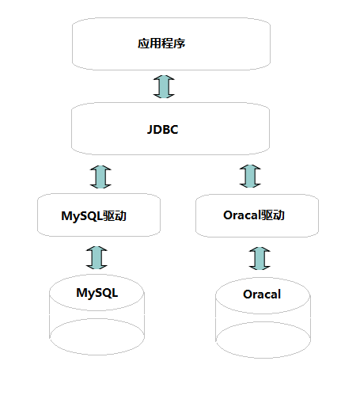

#### 常用接口

1. Driver 接口

   驱动，由数据库厂商提供，java 开发者只需使用即可

   不同的数据库有不同的驱动装载方法

   MySQL: Class.forName("com.mysql.jdbc.Driver")

   Oracle: Class.forName("oracle.jdbc.driver.OracleDriver")

2. DriverManager 接口

   DriverManager 是驱动的管理类，用它来连接数据库比 Driver 更为方便

3. Connection 接口

   Connection 接口是与特定数据库连接通信的对象。此接口有接触数据库的所有方法，连接对象便是通信上下文，即，与数据库中所有的通信都是 Connection 对象。

   通过 Driver 对象获取 Connection 对象：

   ```
   Connection connection = driver.connect(jdbcurl, user,password)
   ```

   通过 DriverManager 对象获取 Connection 对象：

   ```
   Connection connection = DriverManager.getConnection(url,user,password)
   ```

4. Statement 接口

   用于执行 sql 语句并返回生成结果的对象

   有三种 Statement 类：

   - Statement

     由 createStatement 创建，用于发送简单的 sql 语句(不带参数)

   - PreparedStatement

     继承自 Statement 接口，由 prepareStatement 创建，用于发送含有一个或多个参数的 sql 语句

     PreparedStatement 对象采用预编译，比 Statement 对象效率更高。并且可以防止 sql 注入

   - CallableStatement

     继承自 PreparedStatement，由方法 prearedCall()创建，用于调用存储过程

   常用的 Statement 方法：

   - execute(String sql) 运行语句，返回是否有结果集
   - executeQuery(String sql) 运行 select 语句，返回 ResultSet 结果集
   - executeUpdate(String sql) 运行 insert/delete/update 操作，返回更新的 行数。
   - addBatch(String sql) 把多条 sql 语句放到一个批处理中
   - executeBatch() 使用 executeBatch()执行批量 sql 语句(之前添加的)

5. ResultSet 接口

   查询结果集，提供了检索不同类型字段的方法


## java集合

#### Java 集合 Set/List

- 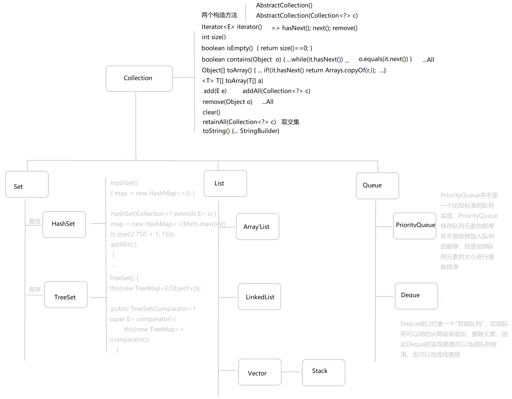
- ArrayList

  > https://www.cnblogs.com/kuoAT/p/6771653.html

  ArratList 是通过数组结构实现的，默认的初始容量为 10.在进行构造 ArrayList 对象时，若不指定容量，则选择容量为默认容量 10，不过此时只是初始化一个空数组(也不是初始化，其内部一直保留一个 final 修饰的空数组，只是让 elementData 指向这个空数组。原因可能是一直维护一个空数组比新建一个空数组更高效吧)

  - ArrayList 扩容

    对于 ArrayList，其容量是内部 elementData 数组的长度，在 add 元素的时候，倘若元素索引+1 大于 elementData 的长度则会进行扩容，即内部数组容纳不了的时候会进行扩容。

    ```
    public boolean add(E e) {
        ensureCapacityInternal(size + 1); // Increments modCount!!
        elementData[size++] = e;
        return true;
    }
    ```

    扩容时候会按照之前容量的 1.5 倍进行扩容。

  **ArrayList 什么时候扩容**

  元素个数大于当前容量的时候进行扩容，容量变为之前的 1.5 倍

  **ArrayList 与 Array**

  ArrayList 是 Array 的复杂版本
  ArrayList 内部封装了一个 Object 类型的数组，从一般的意义来说，它和数组没有本质的差别，甚至于 ArrayList 的许多方法，如 Index、IndexOf、Contains、Sort 等都是在内部数组的基础上直接调用 Array 的对应方法。

  1. 效率：Array 较为高效，但是其容量固定且无法改变
     而 ArrayList 容量可以动态增长，但相对效率低
  2. 类型识别：ArrayList 存入对象时，将所有对象存为 Object 类型，在运行是需要强制类型转换。或者运用泛型进行限制类型。而且不能够添加基本类型的元素。
  3. 工具类： J 对数组的一些基本操作，像排序、搜索与比较等是很常见的。因此在 Java 中提供了 Arrays 类协助这几个操作：sort(),binarySearch(),equals(),fill(),asList().

     同样为集合提供了一些集合间的通用函数。

* LinkedList
* vector

#### Map

- HashMap

  HashMap 是基于散列表的 map 接口的非同步实现。散列表使用数组结构，使用链地址法解决冲突。

  HashMap 构造的时候可以指定容量与负载因子，默认容量为 16（1<<4 即 2^4），默认负载因子为 0.75。在我们构造时指定容量后，为了更好的 hash，会将容量进行扩充，使其变为大于等于该容量的最小的 2 的幂数值(此处通过对低位值进行无符号右移，将低位都填充为 1，最后结果+1，得出最小 2 的幂数值)

  - put 函数

    ```
    /**
     * 指定节点 key,value，向 hashMap 中插入节点
     */
    public V put(K key, V value) {
        // 注意待插入节点hash值的计算，调用了hash(key) 函数
        // 实际调用 putVal() 进行节点的插入
        return putVal(hash(key), key, value, false, true);
    }
    ```

    put 函数实质上调用的时 putVal 函数，此处我们先看看 hash(key).

    hash 算法是对 key 的 hashcode()的高 16 位与低 16 位异或得到的，目的是数组 table 的 length 比较小的时候让更多的位参与 hash 运算中。

    ```
    static final int hash(Object key) {
        int h;
        return (key == null) ? 0 : (h = key.hashCode()) ^ (h >>> 16);
    }
    ```

    对于 key value 的 put 操作，初始进行判断 table 是否初始化或者长度为 0 的情况下需要对 table 进行扩容

    然后呢使用过 hash 值计算 key 下标位置，此处是通过 hash&n-1 进行计算，由于 n 一定是 2 的幂数值，所以这个操作相当于对 hash 取模，但是位运算比除法运算更加高效。

    在此之后会进行三次判断

    1. 下标位置处是否有值

       无值的话直接插入，有值则继续往下判断

    2. 下标位置处第一个元素 是否为 所要插入的 key， **对于可以的比较总是 先比较 hash 值是否相等，再接着使用 == 与 equals 分别进行比较**

       若果是所要插入的 key，则将值替换掉，返回替换掉的值

    3. 是否 TreeNode 的子类

       倘若是树结构，则调用 putTreeVal 方法进行 put

    4. 到了这儿只能是链表结构了

       此处插入做法是从尾部插入

       先遍历链表，对每个节点进行判断是否为所要插入的 key ， 是则替换，跳出遍历
       直到尾部，然后创建新的 node，并插入尾部
       倘若链表的长度大于 8，则转化为树结构


    ```
    final V putVal(int hash, K key, V value, boolean onlyIfAbsent,
                   boolean evict) {
        Node<K,V>[] tab; Node<K,V> p; int n, i;
        // 若table未初始化或者长度为0，调用resize函数进行扩容
        if ((tab = table) == null || (n = tab.length) == 0)
            n = (tab = resize()).length;
        /* 根据 hash 值确定节点在数组中的插入位置，若此位置没有元素则进行插入，
           注意确定插入位置所用的计算方法为　(n - 1) & hash,由于　n 一定是２的幂次，这个操作相当于hash % n  位运算更快*/
        if ((p = tab[i = (n - 1) & hash]) == null)
            // 空桶，创建新的键值对节点，放入table数组中
            tab[i] = newNode(hash, key, value, null);
        else {
            // 说明待插入位置存在元素 即tab[i]不为空，需要组成单链表或红黑树
            Node<K,V> e; K k;
            // 与桶（*bucket*）中首元素相比，如果 hash、key 均等，说明待插入元素和第一个元素相等，直接更新
            if (p.hash == hash &&
                ((k = p.key) == key || (key != null && key.equals(k))))
                // 此时p指的是table[i]中存储的那个Node，如果待插入的节点中hash值和key值在p中已经存在，则将p赋给e
                e = p;
            // 当前桶（*bucket*）中无该键值对，且桶是红黑树结构，按照红黑树结构插入
            else if (p instanceof TreeNode)
                e = ((TreeNode<K,V>)p).putTreeVal(this, tab, hash, key, value);
            else {// 当前桶（*bucket*）中无该键值对，且桶（*bucket*）是链表结构，按照链表结构插入到尾部
                // 在链表最末插入结点
                for (int binCount = 0; ; ++binCount) {
                    // 遍历到链表的尾部
                    if ((e = p.next) == null) {
                        // 创建链表节点并插入尾部
                        p.next = newNode(hash, key, value, null);
                        // 结点数量达到阈值，转化为红黑树
                        if (binCount >= TREEIFY_THRESHOLD - 1) // -1 for 1st
                            treeifyBin(tab, hash);
                        break;
                    }
                    // 判断链表中结点的 key 值与插入的元素的 key 值是否相等
                    if (e.hash == hash &&
                        ((k = e.key) == key || (key != null && key.equals(k))))
                        break;
                    // 用于遍历桶中的链表，与前面的e = p.next组合，可以遍历链表将；即p调整为下一个节点
                    p = e;
                }
            }
            // 表示在桶（*bucket*）中找到key值、hash值与插入元素相等的结点
            if (e != null) { // existing mapping for key
                // 记录e的value
                V oldValue = e.value;
                // 判断是否修改已插入节点的value
                if (!onlyIfAbsent || oldValue == null)
                    // 用新值替换旧值
                    e.value = value;
                // 访问后回调
                afterNodeAccess(e);// 空函数，由用户根据需要覆盖
                return oldValue;
            }
        }
        // 结构性修改
        ++modCount;
        // 键值对数目超过阈值时，进行 resize 扩容
        if (++size > threshold)
            resize();
        // 插入后回调
        afterNodeInsertion(evict);// 空函数，由用户根据需要覆盖
        return null;
    }
    ```

- get 函数

  ```
   public V get(Object key) {
      Node<K,V> e;
      return (e = getNode(hash(key), key)) == null ? null : e.value;
  }
  ```

  实际上是调用 getNode 通过 key 的 hash 值与 key 进行查找.

  与 put 函数有点类似，要经历几重判断

  1. table 已经初始化且长度大于零 并且 hash 取模(位运算)后得出的位置处有值
  2. 对比第一个节点，(比较时比较 hash 值与 key== ** 与 key.equals(**))
  3. 判断是否树结构
  4. 沿着链表查找
  5. 没找到返回 null

  ```
  final Node<K,V> getNode(int hash, Object key) {
      Node<K,V>[] tab; Node<K,V> first, e; int n; K k;
      // table已经初始化，长度大于0，根据hash寻找table中的项也不为空
      if ((tab = table) != null && (n = tab.length) > 0 &&
          (first = tab[(n - 1) & hash]) != null) {
          // 桶中第一项(数组元素)相等
          if (first.hash == hash && // always check first node
              ((k = first.key) == key || (key != null && key.equals(k))))
              return first;
          // 桶中不止一个结点
          if ((e = first.next) != null) {
              if (first instanceof TreeNode)
                  // 若定位到的节点是　TreeNode 节点，则在树中进行查找
                  return ((TreeNode<K,V>)first).getTreeNode(hash, key);
              do {  // 否则在链表中进行查找
                  if (e.hash == hash &&
                      ((k = e.key) == key || (key != null && key.equals(k))))
                      return e;
              } while ((e = e.next) != null);
          }
      }
      return null;
  }
  ```

**HashMap 与 HashTable 的区别**

1. hashMap 是非线程安全的，而 hashTable 线程安全
2. hashmap 允许 null 值 null 键，而 hashtable null 值与 null 键抛出空指针异常
3. hashmap 的初始容量为 16，每次扩容是 2 的 n 次幂，而 hashtable 的初始容量为 11，每次扩容是 2n+1
4. 计算元素位置是，hashmap 采用位运算，而 hashtable 使用取模除法运算
5. hashmap 实现了 iterable，而 hashtable 实现了 iterable 与 Enumration

**hashmap 如何线程安全**

HashMap 是线程不安全的，如果要线程安全，可以选择 HashTable、collections.synchronizedHashMap()包装或 concurrentHashMap,推荐

**hash 冲突发生的几种情况：**

1. 两节点　 key 值相同（hash 值一定相同），导致冲突；
2. 两节点　 key 值不同，由于 hash 函数的局限性导致 hash 值相同，冲突；
3. 两节点　 key 值不同，hash 值不同，但 hash 值对数组长度取模后相同，冲突；

**1.8 版本与 1.7 版本的不同**
增加了红黑树结构
1.7 版本得冲突产生后会再链表头部插入

**1.8 的优化--扩容**

因为我们使用 2 的 n 次幂的扩展，所以元素的位置要么再原位置，要么在原位置再移动 2 的 n 次幂的位移

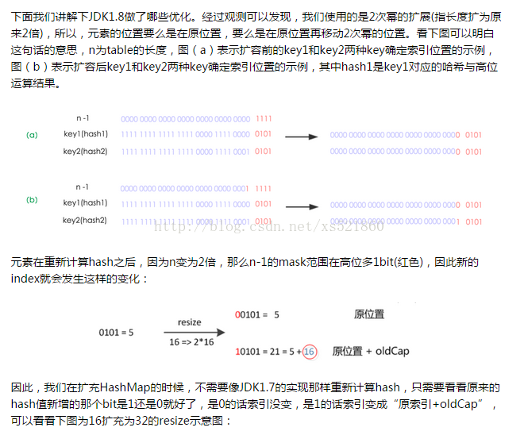

**hashmap 为什么线程不安全**

两个线程同时 put 时，恰好都再同一条链上，很可能丢失更新(同时读取到了链表尾部，第二个线程的更新会覆盖掉第一个线程的更新)


## javaIO

> https://www.cnblogs.com/Evsward/archive/2017/12/04/io.html
 > http://www.importnew.com/28021.html

\*
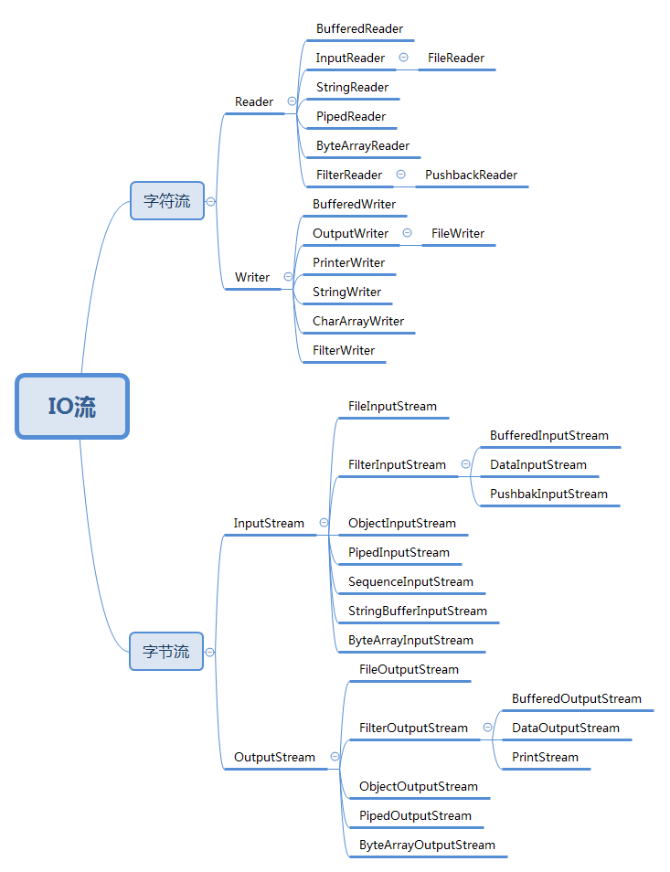

- 字节流和字符流

  io 默认都是直接操作字节的，多用于读取或书写二进制数据，这些类的基类为 InputStream 或 OutputStream。而字符流操作的是为了支持 Unicode 编码，用于字符国际化，一个字符占用两个字节，这些类的基类为 Reader 或 Writer。java 的 io 在 jdk1.1 以后添加了字符流的支持，为我们直接操作字符流提供了方便。

- IO

  根据数据的流向，流分为输入流和输出流，这里指的都是内存，内存输入为读，输出为写，I 读 O 写。

- java 的 IO 包大量应用了装饰者模式

- 流的分类

  - 按数据流的方向不同：输入流，输出流。

  - 按处理数据单位不同：字节流，字符流。

    (1) 字节流：数据流中最小的数据单元是字节。

    (2)字符流：数据流中最小的数据单元是字符， Java 中的字符是 Unicode 编码，一个字符占用两个字节。

  - 按功能不同：节点流，处理流。

    (1)程序用于直接操作目标设备所对应的类叫节点流。

    (2)程序通过一个间接流类去调用节点流类，以达到更加灵活方便地读写各种类型的数据，这个间接流类就是处理流。

* 节点流

  

  |              | 处理类型      | 字符流                               | 字节流                                          | 说明                             |
  | ------------ | ------------- | ------------------------------------ | ----------------------------------------------- | -------------------------------- |
  | 文件         | File          | FileReader <br> FileWriter           | FileInputStream <br> fileOutputStream           | 对文件进行读写操作               |
  | 内存(数组)   | Memory Array  | CharArrayReader <br> CharArrayWriter | ByteArrayInputStream <br> ByteArrayOutputStream | 从/向内存数组读写数据            |
  | 内存(字符串) | Memory String | StringWriter <br> StringReader       | ---                                             | 从/向内存字符串读写数据          |
  | 管道         | Pipe          | PipedReader <br> PipedWriter         | PipedInputStream <br> PipedOutputStream         | 实现管道的输入和输出(进程间通信) |

- 处理流

  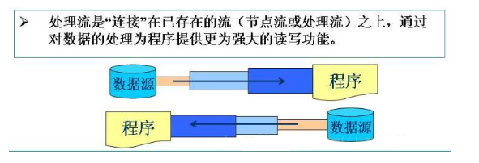

  |            | 处理类型                                   | 字符流                                    | 字节流                                        | 说明                                                                                                                                                                 |
  | ---------- | ------------------------------------------ | ----------------------------------------- | --------------------------------------------- | -------------------------------------------------------------------------------------------------------------------------------------------------------------------- |
  | 缓冲区     | Buffering                                  | BufferedReader <br> BufferedWriter        | BufferedInputStream <br> BufferedOutputStream | 将流放在缓冲区内操作                                                                                                                                                 |
  | 过滤流     | Filtering                                  | FilterReader <br> FilterWriter            | FilterInputStream <br> FilterOutputStream     | 抽象类，作为“装饰器”的接口，其中，“装饰器”为其他输入输出字符字节类提供有用功能                                                                                       |
  | 转换流     | coverting between <br> bytes and character | InputStreamReader <br> OutputStreamWriter | ---                                           | 处理字符流的抽象类 <br> InputStreamReader 是字节流通向字符流的桥梁,它将字节流转换为字符流. <br> OutputStreamWriter 是字符流通向字节流的桥梁，它将字符流转换为字节流. |
  | 对象流     | object Serialization                       | ---                                       | ObjectInputStream <br> ObjectOutputStream     | 序列化                                                                                                                                                               |
  | 基本类型   | Data conversion                            | ---                                       | DataInputStream <br> DataOutputStream         | 可传输基本类型数据                                                                                                                                                   |
  | 行号推入流 | Counting                                   | LineNumberReader                          | ---                                           | 可得到一个携带行号的字符读入流                                                                                                                                       |
  | 推回输入流 | Peeking ahead                              | PushbackReader                            | PushbackInputStream                           | 可将输入流 push back 或 unread 一个字节                                                                                                                              |
  | 合并流     | Sequence                                   | ---                                       | SequenceInputStream                           | 可逻辑串联其他输入流                                                                                                                                                 |
  | 打印流     | Printing                                   | PrintWriter                               | PrintStream                                   | 包含 print 和 println 的输出流                                                                                                                                       |

  - 注意

    - 默认都是操作字节，所有操作字符的类都需要先经过转化流将字节流转为字符流再使用。
    - LineNumberInputStream 已过时，因为它是基于字节输入流的，而错误假定字节能充分表示字符，现已被 LineNumberReader 取代。
    - StringBufferInputStream 已过时，因为此类未能正确地将字符转换为字节，现已被 StringReader 取代。


    * java io 转化流的适配器模式

        我们知道在字符流处理类加入java io类库之前，所有的类都是面向字节流的，在jdk1.1以后，添加了字符流的支持，根据“开闭原则”，所以在不改变原有类的基础上，有了转化流：InputStreamReader和OutputStreamWriter，这两个类正是所谓的“适配器类”，InputStreamReader可以吧InputStream转换为Reader，而OutputStreamWriter可以将OutputStream转换为Writer。字节流和字符流都有各自独立的一整套继承层次结构，而通过适配器类，可以在不改变原有类的前提下有效将他们结合起来。

    * java io 装饰器模式的研究：

        Java I/O类库需要多种不同功能的组合，存在filter类的原因就是抽象类filter是所有装饰器类的基类，装饰器必须具有和它所装饰对象相同的接口。FilterInputStream和FilterOutputStream是用来提供装饰器类接口以控制特定输入流(InputStream)和输出流(OutputStream)的两个类，他们的名字并不是很直观，包括DataInput/OutputStream, BufferedInput/OutputStream,LineNumberInputStream, PushbackInputStream,PrintStream等，这些过滤流类在下面都会有详细介绍。FilterInputStream和FilterOutputStream分别自I/O类库中的基类InputStream和OutputStream派生而立，这两个类是装饰器的必要条件(以便能为所有正在被修饰的对象提供通用接口)。

- 源码

  - InputStream

    InputStream 是输入字节流部分，装饰器模式的顶层类，重要规定了输入字节流的公共方法

    ```
    int read()                              //从输入流读取数据的下一字节
    int read(byte[] b)                      //从输入流读取b.length的字节
    int read(byte[] b, int off, int len)    //从输入流读取字节到b[off]~b[len-off]
    int available()                         //返回能从输入流读取的字节数的估计
    void close()                            //关闭输入流并释放它所占取的系统资源
    long skip(long n)                       //跳过或丢弃输入流的n个字节
    boolean markSupported()                 //测试这个输入流是否支持mark()和reset()
    void mark(int readlimit)                //标记这个输入流的当前位置
    void reset()                            //最后一次调用这个输入流上的mark方法时的初始位置
    ```

    ```
    package java.io;

    public abstract class InputStream implements Closeable {

        private static final int SKIP_BUFFER_SIZE = 2048;  //用于skip方法，和skipBuffer相关

        private static byte[] skipBuffer;    // skipBuffer is initialized in skip(long), if needed.

        /**
        * 从输入流中读取下一个字节，
        * 正常返回0-255，到达文件的末尾返回-1
        * 在流中还有数据，但是没有读到时该方法会阻塞(block)
        * Java IO和New IO的区别就是阻塞流和非阻塞流
        * 抽象方法！不同的子类会有不同的实现！
        */
        public abstract int read() throws IOException;

        /**
        * 将流中的数据读入放在byte数组的第off个位置先后的len个位置中
        * 放回值为放入字节的个数。
        */
        public int read(byte b[], int off, int len) throws IOException {
            if (b == null) {                       //检查输入是否正常。一般情况下，检查输入是方法设计的第一步
                throw new NullPointerException();
            } else if (off < 0 || len < 0 || len > b.length - off) {
                throw new IndexOutOfBoundsException();
            } else if (len == 0) {
                return 0;
            }
            int c = read();                         //读取下一个字节
            if (c == -1) {    return -1;   }        //到达文件的末端返回-1
            b[off] = (byte)c;                       //放回的字节downcast
            int i = 1;                              //已经读取了一个字节
            try {                                   //int i 在循环外申明，扩大作用域
                for (; i < len ; i++) {             //最多读取len个字节，所以要循环len次
                    c = read();                     //每次循环从流中读取一个字节。由于read方法阻塞，所以read(byte[],int,int)也会阻塞
                    if (c == -1) {  break;  }       //到达末尾，返回-1
                    b[off + i] = (byte)c;           //读到就放入byte数组中
                }
            } catch (IOException ee) {     }
            return i;
        }

        public int read(byte b[]) throws IOException {
            return read(b, 0, b.length);
        }

        public long skip(long n) throws IOException {
            long remaining = n;                                  //方法内部使用的、表示要跳过的字节数目，

            int nr;
            if (skipBuffer == null)
                skipBuffer = new byte[SKIP_BUFFER_SIZE];         //初始化一个跳转的缓存
            byte[] localSkipBuffer = skipBuffer;                 //本地化的跳转缓存
            if (n <= 0) {    return 0;      }                    //检查输入参数
            while (remaining > 0) {                              //一共要跳过n个，每次跳过部分，循环
                nr = read(localSkipBuffer, 0, (int) Math.min(SKIP_BUFFER_SIZE, remaining));
                                                                //利用上面的read(byte[],int,int)方法，读取n个字节
                if (nr < 0) {  break;    }                       //读到流的末端，则返回
                remaining -= nr;                                 //没有完全读到需要的，则继续循环
            }
            return n - remaining;                                //返回时要么全部读完，要么因为到达文件末端，读取了部分
        }

        public int available() throws IOException {             //查询流中还有多少可以读取的字节
            return 0;
        }

        public void close() throws IOException {}               //关闭当前流、同时释放与此流相关的资源

        public synchronized void mark(int readlimit) {}         //在当前位置对流进行标记，必要的时候可以使用reset方法返回。

        public synchronized void reset() throws IOException {   //对mark过的流进行复位。只有当流支持mark时才可以使用此方法。
            throw new IOException("mark/reset not supported");
        }

        public boolean markSupported() {                        //查询是否支持mark.绝大部分不支持，因此提供默认实现，返回false。子类有需要可以覆盖。
            return false;
        }
    }
    ```

  - FilterInputStream

    是字节输入流部分装饰器模式的核心。是我们在装饰器模式中的 Decorator 对象，主要完成对其它流装饰的基本功能。


## java网络IO

> https://blog.csdn.net/u011109589/article/details/80333775

> https://blog.csdn.net/anxpp/article/details/51512200?utm_source=blogxgwz0

#### 综述

同步与异步
阻塞与非阻塞


## java反射

#### 概念

- 反射机制

  反射是一种间接操作目标对象的机制。在程序运行时或者能够获取对象的信息，只要给定类的名字，就可以通过反射获取类的信息。

- 作用

  1. 在运行时判断任意一个对象所属的类
  2. 在运行时判断任意一个对象所具有的成员变量和方法
  3. 在运行时任意调用一个对象的方法
  4. 在运行时构造任意一个类的对象

- 优点

  动态编译：运行时确定类型，绑定对象。动态编译较大限度的发挥了 Java 的灵活性，体现了多态的应用，有利于降低类之间的耦合性。

- 缺点

  不利于封装

#### Class.forName 和 classloader 区别

Java 中 Class.forName 和 classloader 都可以对类进行加载。

不过 Class.forName()除了将.class 文件加载到 JVM 中之外，还会对类进行解释，_执行类中的 static 块_;而 classloader 只会做一件事，就是加载.class 文件到 JVM 中，不会执行 static 中的内容，只有在 newInstance 时才会去执行 static 块。

- 反射能够获取类的所有信息吗？


## java并发编程

#### 三个并发编程概念

- 原子性问题
  - 原子是世界上的最小单位，具有不可分割性
  - 一个操作是原子操作，那么我们称它具有原子性。

即一个操作或者多个操作 要么全部执行并且执行的过程不会被任何因素打断，要么就都不执行。

- 可见性问题

指当多个线程访问同一个变量时，一个线程修改了这个变量的值，其他线程能够立即看得到修改的值。

- 有序性问题

即程序执行的顺序按照代码的先后顺序执行。

#### 缓存一致性

> http://ifeve.com/volatile/

解决缓存不一致的问题：

1. 通过在总线加 LOCK#锁的方式

   因为 CPU 和其他部件进行通信都是通过总线来进行的，如果对总线加 LOCK#锁的话，也就是说阻塞了其他 CPU 对其他部件访问(如内存)，从而使得只能有一个 CPU 能使用这个变量的内存。

2. 通过缓存一致性协议

   最出名的就是 Intel 的 MESI 协议，MESI 协议保证了每个缓存中使用的共享变量的副本是一致的。它核心的思想是：当 CPU 写数据时，如果发现操作的变量是共享变量，即在其他 CPU 中也存在该变量的副本，会发出信号通知（广播）其他 CPU 将该变量的缓存行置为无效状态，因此当其他 CPU 需要读取这个变量时，发现自己缓存中缓存该变量的缓存行是无效的，那么它就会从内存重新读取。

#### 锁相关概念

- 可重入锁

  如果锁具备可重入性，则称作为可重入锁。像 synchronized 和 ReentrantLock 都是可重入锁，可重入性在我看来实际上表明了锁的分配机制：基于线程的分配，而不是基于方法调用的分配。举个简单的例子，当一个线程执行到某个 synchronized 方法时，比如说 method1，而在 method1 中会调用另外一个 synchronized 方法 method2，此时线程不必重新去申请锁，而是可以直接执行方法 method2。

  ```
  public MyClass{
      public synchronized void method1(){
          method2();
      }
      public synchronized void method2(){

      }
  }
  ```

  机制：每个锁都关联一个请求计数器和一个占有他的线程，当请求计数器为 0 时，这个锁可以被认为是 unhled 的，当一个线程请求一个 unheld 的锁时，JVM 记录锁的拥有者，并把锁的请求计数加 1，如果同一个线程再次请求这个锁时，请求计数器就会增加，当该线程退出 syncronized 块时，计数器减 1，当计数器为 0 时，锁被释放。

- 可中断锁

  可中断锁：顾名思义，就是可以相应中断的锁。

  在 Java 中，synchronized 就不是可中断锁，而 Lock 是可中断锁。

  如果某一线程 A 正在执行锁中的代码，另一线程 B 正在等待获取该锁，可能由于等待时间过长，线程 B 不想等待了，想先处理其他事情，我们可以让它中断自己或者在别的线程中中断它，这种就是可中断锁。

- 公平锁

  公平锁即尽量以请求锁的顺序来获取锁。比如同是有多个线程在等待一个锁，当这个锁被释放时，等待时间最久的线程(最先请求的线程)会获得该所，这种就是公平锁。

  非公平锁即无法保证锁的获取是按照请求锁的顺序进行的。这样就可能导致某个或者一些线程永远获取不到锁。

  在 Java 中，synchronized 就是非公平锁，它无法保证等待的线程获取锁的顺序。

  而对于 ReentrantLock 和 ReentrantReadWriteLock，它默认情况下是非公平锁，但是可以设置为公平锁。

  ```
  ReentrantLock lock = new ReentrantLock(true); \\公平锁
  ```

* 读写锁

  读写锁将对一个资源(比如文件)的访问分成了 2 个锁，一个读锁和一个写锁。

  正因为有了读写锁，才使得多个线程之间的读操作不会发生冲突。

  ReadWriteLock 就是读写锁，它是一个接口，ReentrantReadWriteLock 实现了这个接口。

  可以通过 readLock()获取读锁，通过 writeLock()获取写锁

* 偏向锁

  java 偏向锁(Biased Locking)是 java6 引入的一项多线程优化.它通过消除资源无竞争 q 情况下的同步原语,进一步提高了程序的运行性能.

  偏向锁，顾名思义，它会偏向于第一个访问锁的线程，如果在接下来的运行过程中，该锁没有被其他的线程访问，则持有偏向锁的线程将永远不需要触发同步。

  如果在运行过程中，遇到了其他线程抢占锁，则持有偏向锁的线程会被挂起，JVM 会尝试消除它身上的偏向锁，将锁恢复到标准的轻量级锁。(偏向锁只能在单线程下起作用)

  因此 流程是这样的 偏向锁->轻量级锁->重量级锁

  偏向锁，简单的讲，就是在锁对象的对象头中有个 ThreaddId 字段，这个字段如果是空的，第一次获取锁的时候，就将自身的 ThreadId 写入到锁的 ThreadId 字段内，将锁头内的是否偏向锁的状态位置 1.这样下次获取锁的时候，直接检查 ThreadId 是否和自身线程 Id 一致，如果一致，则认为当前线程已经获取了锁，因此不需再次获取锁，略过了轻量级锁和重量级锁的加锁阶段。提高了效率。

- 乐观锁，悲观锁

  - 乐观锁

    总是认为不会产生并发问题，每次*读取*数据的时候认为不会有其他线程对数据进行修改，因此不会上锁。

    但是在更新的时候会判断其他线程在这之前有没有对数据进行修改,一般会使用*版本控制机制或 CAS*实现。

    实现：

    - 版本控制机制

      一般是在数据表中加上一个数据版本号字段(version)，表示数据被修改的次数,当数据被修改时，version 值会加 1.

      当线程 A 要更新数据时，读取数据的同时也会读取 version，提交更新时对比 version，若之前读取的 version 与此刻数据库中 version 相等时进行更新，否则重试更新操作，直到更新成功。(类似锁的自旋)

    - CAS

      即 compare and swap 或者 compare and set,涉及到三个操作数:数据所在的内存值，预期值，新值。

      当需要更新时,判断内存值(公共)与旧的预期值(之前取的值)是否相等,若相等，则没有被其他线程修改过，使用新值进行更新，否则进行重试,一般情况下是一个自旋，即不断的重试。

#### CAS(Compare-and-Swap)

CAS 算法是由硬件直接支持来保证原子性的，有三个操作数：内存位置 V、旧的预期值 A 和新值 B，当且仅当 V 符合预期值 A 时，CAS 用新值 B 原子化地更新 V 的值，否则，它什么都不做。

- CAS 的 ABA 问题

  当然 CAS 也并不完美，它存在"ABA"问题，假若一个变量初次读取是 A，在 compare 阶段依然是 A，但其实可能在此过程中，它先被改为 B，再被改回 A，而 CAS 是无法意识到这个问题的。CAS 只关注了比较前后的值是否改变，而无法清楚在此过程中变量的变更明细，这就是所谓的 ABA 漏洞。

#### volatile 关键字

> http://ifeve.com/volatile/

1. 保证了不同线程对这个变量进行操作时的可见性，即一个线程修改了某个变量的值，这新值对其他线程来说是立即可见的。
2. 禁止进行指令重排序。

但是并不能保证 **原子性**,即：i 用 volatile 修饰,1000 个线程调 i++,结果并不一定 1000.因为自增操作不具备原子性，它包括读取变量的原始值、进行加一操作、写入内存。那么就是说自增操作的三个子操作可能会分割执行。

volatile 实现原理依赖与缓存一致性协议(MESI)([缓存一致性](#缓存一致性))

- 术语
  | 术语       | 英文单词               | 描述                                                                                                                                                                                         |
  | ---------- | ---------------------- | -------------------------------------------------------------------------------------------------------------------------------------------------------------------------------------------- |
  | 共享变量   |                        | 在多个线程之间能够被共享的变量被称为共享变量。共享变量包括所有的实例变量，静态变量和数组元素。他们都被存放在堆内存中，Volatile 只作用于共享变量。                                            |
  | 内存屏障   | Memory Barriers        | 是一组处理器指令，用于实现对内存操作的顺序限制。                                                                                                                                             |
  | 缓冲行     | Cache line             | 缓存中可以分配的最小存储单位。处理器填写缓存线时会加载整个缓存线，需要使用多个主内存读周期。                                                                                                 |
  | 原子操作   | Atomic operations      | 不可中断的一个或一系列操作。                                                                                                                                                                 |
  | 缓存行填充 | cache line fill        | 当处理器识别到从内存中读取操作数是可缓存的，处理器读取整个缓存行到适当的缓存（L1，L2，L3 的或所有）                                                                                          |
  | 缓存命中   | cache hit              | 如果进行高速缓存行填充操作的内存位置仍然是下次处理器访问的地址时，处理器从缓存中读取操作数，而不是从内存。                                                                                   |
  | 写命中     | write hit              | 当处理器将操作数写回到一个内存缓存的区域时，它首先会检查这个缓存的内存地址是否在缓存行中，如果存在一个有效的缓存行，则处理器将这个操作数写回到缓存，而不是写回到内存，这个操作被称为写命中。 |
  | 写缺失     | write misses the cache | 一个有效的缓存行被写入到不存在的内存区域。                                                                                                                                                   |

* 原理

  当 CPU 写数据时，如果发现操作的变量是共享变量，即在其他 CPU 中也存在该变量的副本，会发出信号通知其他 CPU 将该变量的缓存行置为无效状态，因此当其他 CPU 需要读取这个变量时，发现自己缓存中缓存该变量的缓存行是无效的，那么它就会从内存中重新读取。

  在 jvm 中所有变量都存在主存中，每个线程都有自己的工作内存，也就是说，当多个线程访问一个共享变量时，每个线程在自己的工作内存中会有这个共享变量的副本。当某个线程更改了自己工作内存中的数据后，不一定会立刻将更新后的数据立刻写入到内存中去(线程阻塞或其他原因)。而如果对申明了 volatile 关键字的 Java 变量进行写操作，JVM 就会向处理器发送一条 Lock 前缀的指令，将这个变量所在的缓冲行的数据写回到系统内存中。但是就算写回内存，如果其他处理器缓存的还是旧的，再执行计算操作就会有问题(读旧数据问题)，所以在多处理机下，为了保证各个处理器分缓冲是一致的，就会实现缓存一致性协议，每个处理器通过嗅探在总线上传播的数据来检查自己缓存的值是否过期了，当处理器发现自己缓存行*对应的地址*被修改，就会将当前处理器的缓存行设置为无效状态，当处理器要对这个数据进行修改时，就会强制重新从内存中把数据读到处理器缓存里。

* 例子：

  ```
  https://blog.csdn.net/SummerMangoZz/article/details/75098773?utm_source=blogxgwz0
  ```

* volatile 的优化

  著名的 Java 并发编程大师 Doug lea 在 jdk1.7 的并发包里新增一个集合队列类 LinkedTransferQueue，他在使用 volatile 变量时，用一个种追加字节的方式来优化队列出队和入队的性能。

  为什么追加 60 个字节能够提高并发编程的效率呢？

  因为对于英特尔 i7，酷睿，Atom 和 NetBurst，Core Solo 等处理器的 L1，L2 或 L3 缓存的高速缓存行都是 64 个字节宽，不支持*部分缓冲填充行*。这意味着如果队列的头节点和为节点不足 64 字节的话，处理器会将它们连续读进同一个缓冲行里，在多处理器下每个缓存同样的头尾节点，当一个处理器试图修改头节点时会将整个缓冲行锁定，而在*缓存一致性机制的作用下*，会导致其他处理器不能访问自己高速缓冲的尾节点，而队列的出队入队需要不停的修改头节点和尾节点，所以在所处理器情况下将会严重影响队列的出队和入队效率。Doug Lea 使用追加到 64 字节的方式来填满高速缓冲区的缓存行，避免队列头节点和尾节点加载到同一个缓冲行，使得头尾节点在修改时不会相互锁定。

  那是不是使用 Volatile 关键字时都应该将变量追加到 64 字节呢？不是的，

  1. 缓存行非 64 字节宽的处理器，如 P6 系列和奔腾处理器，他们的 L1 和 L2 高速缓存行是 32 个字节宽
  2. 共享变量不会被频繁的写时，没必须要。
     因为追加字节的方式需要处理器读取更多的字节到高速缓冲，这本身会带来一定的消耗。共享变量不被频繁更新的话，头尾节点相互锁定的情况会很少发生，所以没必要。

happens-before

> http://www.importnew.com/23520.html

#### Synchronized

synchronized 是 jvm 层面的锁，是 Java 的内置特性
在 jvm 层面实现对临界资源的互斥访问，不可响应中断
锁的释放有虚拟机完成,不用人工干预。这既是缺点又是优点.优点是不用担心死锁,缺点是有可能获取到锁的线程阻塞之后其他线程会一直等待,性能不高
非公平锁
可重入锁

- 使用

  - 修饰实例方法,对当前实例加锁,进入同步代码前要获得当前实例的锁

    ```
    public synchronized void method(){
        try{
            Thread.sleep();
            System.out.println("synchronized method");
        }catch(InterruptedException e){
            e.printStackTrace();
        }
    }
    ```

  - 修饰静态方法,对当前类加锁,进入同步代码前要获得类对象的锁

    ```
    public static synchronized void method1(){
        try {
            System.out.println("static synchronized method");
            Thread.sleep(3000);
        } catch (InterruptedException e) {
            e.printStackTrace();
        }
    }
    ```

  - 修饰代码块，指定加锁对象，对指定对象加锁，进入同步代码块前要获得指定对象的锁

    ```
    public void method1(){
        try {
            synchronized (this) {
                System.out.println("synchronized block method");
                Thread.sleep(3000);
            }
        } catch (InterruptedException e) {
            e.printStackTrace();
        }
    }
    ```

- 实现原理

  > https://blog.csdn.net/wu1226419614/article/details/73740899

  > https://blog.csdn.net/qq_37532186/article/details/79728231

  > https://blog.csdn.net/javazejian/article/details/72828483

  synchronized 可以保证变量的原子性/可见性/顺序性.并且是一个可重入锁

  - 字节码层面

    synchronized 是基于进入和退出管程(Monitor)对象实现(monitorEnter 和 monitorExit),monitorEnter 指令插入同步代码开始位置，monitorExit 指令插入到同步代码结束位置。任何一个对象都有一个 monitor 与之相关联，当一个线程处于 monitor 之后，它将处于锁定状态

    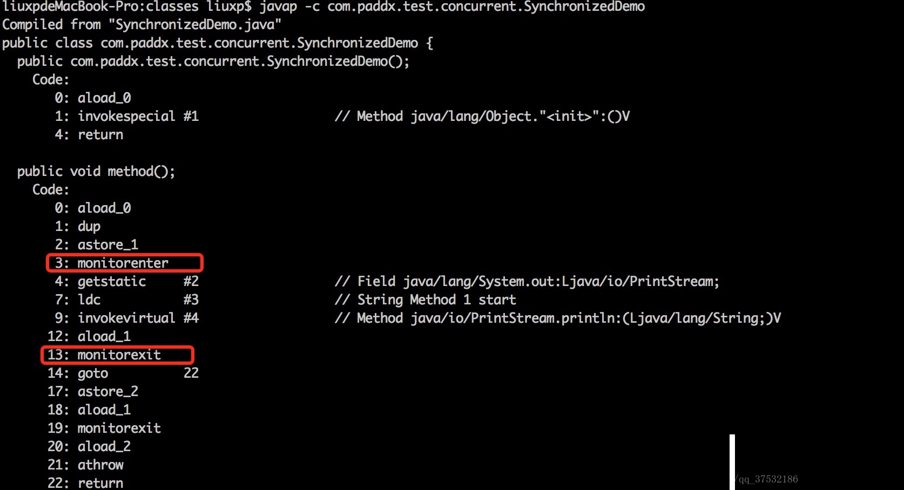

  - synchronized 的优化

    synchronized 在 jdk1.6 之前是重量级锁,在 jdk1.6 之后对 synchronized 做了优化，加入了偏向锁、轻量级锁、锁粗化、锁消除、适应性自旋等操作，大大增加了 synchronized 的效率

    - java 对象头

      | 长度     | 内容                   | 说明                         |
      | -------- | ---------------------- | ---------------------------- |
      | 32/64bit | Mark Word              | 存储对象 hashcode 或锁信息等 |
      | 32/64bit | Class Metadata Address | 存储到对象类型数据的指针     |
      | 32/64bit | Array Length           | 数组的长度(如果对象是数组)   |

    - Java 对象头里的 Mark Word 里默认存储对象的 HashCode，分代年龄和锁标记。

      32 位 JVM 的 Mark Word 的默认存储结构如下：

      |          | 25bit           | 4bit         | 1bit(是否偏向锁) | 2bit 锁标记位 |
      | -------- | --------------- | ------------ | ---------------- | ------------- |
      | 无锁状态 | 对象的 hashcode | 对象分代年龄 | 0                | 01            |

    - 运行期间 Mark Word 里的数据随着标志位的变化而变化。Mark Word 可能存储一下四种数据：

      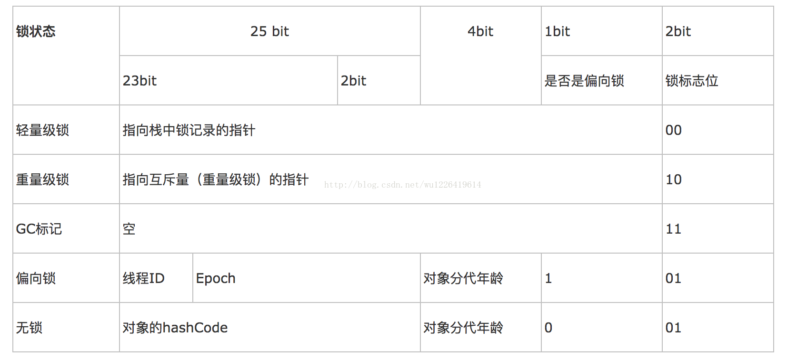

      当一个线程获取对象并加锁后，标志位从 01 变为 10，其他线程则处于排队状态。

      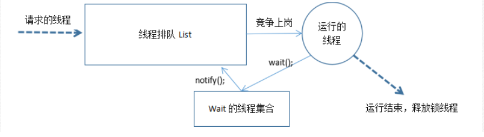


    - 偏向锁

      - 目的：为了在无线程竞争情况下，减少不必要的轻量级锁操作.因为轻量级锁的加锁解锁操作需要依赖多次的CAS原子操作。

      - 核心思想： 如果一个线程获取了锁,那么锁就进入偏向模式，此时MarkWordd的结构也变为锁偏向结构,当这个线程再次请求锁时，无需再申请锁.

      - 场景： 无其他线程竞争

      - 加锁流程：
        1.  检测MarkWord是否为可偏向状态,即是否为偏向锁1，锁标志为是否为01
        2.  若为可偏向锁，则检测线程id是否为当前线程id。
          -  如果是则执行同步代码
          -  如果不是，则通过CAS操作竞争锁
              -  如果竞争成功，则将MarkWord的线程id替换为当前线程ID
              -  如果竞争不成功，则CAS竞争失败，证明当前存在多线程竞争情况，这时候需要锁膨胀为轻量级锁，才能保证线程间公平竞争锁。
      - 解锁

        当有另一个线程来竞争锁的时候，就不能再使用偏向锁了，要膨胀为轻量级锁。

        竞争线程尝试 CAS 更新对象头失败，会等待到全局安全点（此时不会执行任何代码）撤销偏向锁。

      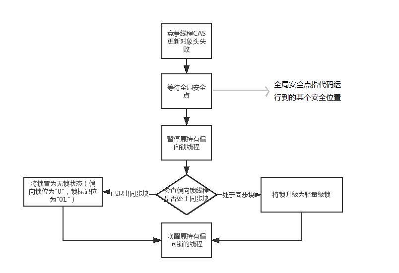
      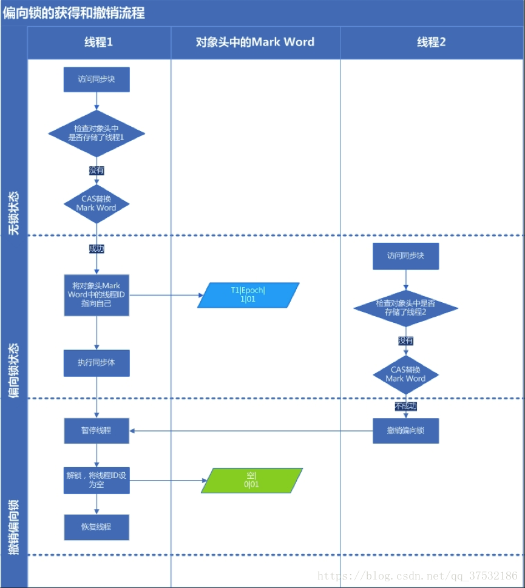

    - 轻量级锁

      - 目的： 在多线程竞争的情况下，减少传统的重量级锁使用操作系统互斥量产生的性能消耗

      - 场景： 线程交替执行同步块的场合

      - 加锁流程：
        1.  判断当前对象是否处于无锁状态(hashcode,o,01)
            - 如果是，JVM将在当前线程的栈帧中建立一个名为锁记录(Lock Record)的空间，用于存储当前锁对象markword的拷贝(Displaced Mark Word)
            - 如果不是，执行步骤3
        2.  JVM利用CAS操作尝试将对象的Mark Word更新为指向锁记录(Lock Record)的指针,
            - 如果成功，则表示竞争到锁,更新锁标志位为00(轻量级锁),执行同步操作
            - 如果失败，则进行步骤3
        3.  判断当前对象的Mark Word是否指向当前线程的栈帧,
            - 如果是，则表示当前线程已经持有当前对象的锁,直接进行同步代码
            - 否则说明对象是被其他线程所抢占,这是轻量级锁需要膨胀为重量级锁,锁标志位变为10,后面等待的线程将进入阻塞状态。

      - 解锁

        用CAS操作锁置为无锁状态（偏向锁位为”0”，锁标识位为”01”），若CAS操作失败则是出现了竞争，锁已膨胀为重量级锁了，此时需要释放锁（持有重量级锁线程的指针位为”0”，锁标识位为”10”）并唤醒重量锁的线程。

      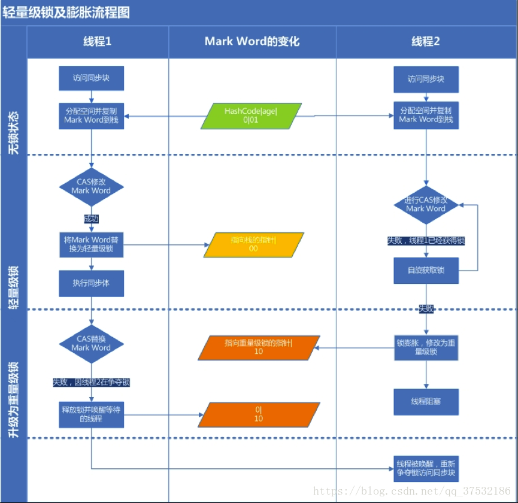

    - 自旋锁(自适应锁)

      轻量级锁失败后，虚拟机为了避免线程真实地在操作系统层面挂起，还会进行一项称为自旋锁的优化手段。这是基于在大多数情况下，线程持有锁的时间都不会太长，如果直接挂起操作系统层面的线程可能会得不偿失，毕竟操作系统实现线程之间的切换时需要从用户态转换到核心态，这个状态之间的转换需要相对比较长的时间，时间成本相对较高，因此自旋锁会假设在不久将来，当前的线程可以获得锁，因此虚拟机会让当前想要获取锁的线程做几个空循环(这也是称为自旋的原因)，一般不会太久，可能是50个循环或100循环，在经过若干次循环后，如果得到锁，就顺利进入临界区。如果还不能获得锁，那就会将线程在操作系统层面挂起，这就是自旋锁的优化方式，这种方式确实也是可以提升效率的。最后没办法也就只能升级为重量级锁了。


    - 重量级锁

      线程阻塞和唤醒都需要CPU从用户态转为核心态.
      让cpu通过操作系统指令,去调度多线程之间,谁执行代码，谁进行阻塞.这样会频繁出现程序运行状态的切换.会大量消耗资源

    - 锁粗化

      锁粗化的概念应该比较好理解，就是将多次连接在一起的加锁、解锁操作合并为一次，将多个连续的锁扩展成一个范围更大的锁。

      ```
      public class StringBufferTest {
          StringBuffer stringBuffer = new StringBuffer();

          public void append(){
              stringBuffer.append("a");
              stringBuffer.append("b");
              stringBuffer.append("c");
          }
      }
      ```

      这里每次调用stringBuffer.append方法都需要加锁和解锁，如果虚拟机检测到有一系列连串的对同一个对象加锁和解锁操作，就会将其合并成一次范围更大的加锁和解锁操作，即在第一次append方法时进行加锁，最后一次append方法结束后进行解锁。

    - 锁消除

      锁消除即删除不必要的加锁操作。根据代码逃逸技术，如果判断到一段代码中，堆上的数据不会逃逸出当前线程，那么可以认为这段代码是线程安全的，不必要加锁。看下面这段程序：

      ```
      public class SynchronizedTest02 {

          public static void main(String[] args) {
              SynchronizedTest02 test02 = new SynchronizedTest02();
              //启动预热
              for (int i = 0; i < 10000; i++) {
                  i++;
              }
              long start = System.currentTimeMillis();
              for (int i = 0; i < 100000000; i++) {
                  test02.append("abc", "def");
              }
              System.out.println("Time=" + (System.currentTimeMillis() - start));
          }

          public void append(String str1, String str2) {
              StringBuffer sb = new StringBuffer();
              sb.append(str1).append(str2);
          }
      }
      ```

      虽然StringBuffer的append是一个同步方法，但是这段程序中的StringBuffer属于一个局部变量，并且不会从该方法中逃逸出去，所以其实这过程是线程安全的，可以将锁消除

    - 对比

      | 锁                   | 优点                                                           | 缺点                                         | 场景                              |
      | -------------------- | -------------------------------------------------------------- | -------------------------------------------- | --------------------------------- |
      | <br>偏向锁<br><br>   | 加锁和解锁不需要额外的x消耗,和非同步方法相比仅存在纳秒级的差距 | 如果线程间存在锁竞争，会增加额外的锁撤销消耗 | 只有一个线程访问同步块的场景      |
      | <br>轻量级锁<br><br> | 竞争的线程不用阻塞，提高了程序的响应速度                       | 如果始终得不到锁竞争的线程会进入自旋消耗CPU  | 追求响应速度,同步快执行速度非常快 |
      | <br>重量级锁<br><br> | 线程竞争不使用自旋，不消耗CPU                                  | 线程阻塞，响应时间缓慢                       | 追求吞吐量，同步块执行速度较长    |

#### Lock

https://www.cnblogs.com/zouzz/p/6593748.html
https://blog.csdn.net/qpzkobe/article/details/78586619
> https://www.cnblogs.com/aishangJava/p/6555291.html

#### Synchronized 与 ReenTrantLock

两者较大的区别是，synchronized 是 JVM 层面的锁;而 ReenTrantLock 是 jdk 提供的 API 层面的互斥锁，需要 lock()和 unlock()方法配合 try/finally 语句块来完成。

1. Synchronized

   Synchronized 通过编译，会在同步块的前后分别形成 monitorenter 和 monitorexit 这两个字节码指令。执行 monitorenter 指令时，首先要尝试获取对象锁。如果这个对象没被锁定，或者当前线程已经拥有了那个对象锁，把锁的计算器加一，相应的，在执行 monitorexit 指令时会将锁计算器减一，当计算器为零时，所就释放了。


    每个对象有一个监视器锁(monitor)。当monitor被占用时就会处于锁定状态，线程执行monitorenter指令时尝试获取monitor的所有权，过程如下：
    *    1. 如果monitor的进入数为0，则该线程进入monitor，然后将进入数设置为1，该线程即为monitor的所有者。
    *    2. 如果线程已经占有该monitor，只是重新进入，则进入monitor的进入数加1.
    *    3. ’如果其他线程已经占用了monitor，则该线程进入阻塞状态，直到monitor的进入数为0，再重新尝试获取monitor的所有权。

    **synchronized锁住的是代码还是对象？**

        synchronized锁住的是对象，同一个对象中的方法在此访问时，并不会申请锁，而是计数加一，所以synchronized是可重入锁。

2. ReentrantLock

   ReentrantLock 是 java.util.concurrent 包下提供的一套互斥锁，相比 Synchronized，ReentrantLock 类提供了一些高级功能，主要有以下 3 项：

   - 1. 等待可中断，持有锁的线程长期不释放的时候，正在等待的线程可以选择放弃等待，这相当于 Synchronized 来说可以避免出现死锁的情况。
   - 2. 公平锁，多个线程等待同一个锁时，必须按照申请锁的时间顺序获得锁，Synchronized 锁非公平锁，ReentrantLock 默认的构造函数是创建的非公平锁，可以通过参数 true 设为公平锁，但公平锁表现的性能不是很好。
   - 3. 锁绑定多个条件，一个 ReentrantLock 对象可以同时绑定对个对象。
   - 4. 常见 api
        <br>isFair() //判断锁是否是公平锁
        　　 <br>isLocked() //判断锁是否被任何线程获取了
        　　 <br>isHeldByCurrentThread() //判断锁是否被当前线程获取了
        　　 <br>hasQueuedThreads() //判断是否有线程在等待该锁


    ```
    private Lock lock=new ReentrantLock();
    public void run() {
        lock.lock();
        try{
            for(int i=0;i<5;i++)
                System.out.println(Thread.currentThread().getName()+":"+i);
        }finally{
            lock.unlock();
        }
    }
    ```

#### Java 原子类

在 java 1.5 的 java.util.concurrent.atomic 包下提供了一些原子操作类，即对基本数据类型的 自增(加 1 操作)，自减(减 1 操作)、以及加法操作(加一个数)，减法操作(减一个数)进行了封装，保证这些操作是原子性操作。atomic 是利用 CAS 来实现原子性操作的(Compare And Swap)，CAS 实际上是利用处理器提供的 CMPXCHG 指令实现的，而处理器执行 CMPXCHG 指令是一个原子性操作。

    AtomicBoolean
    AtomicInteger
    AtomicIntegerArray
    AtomicIntegerFieldUpdater
    AtomicLong
    AtomicLongArray
    AtomicLongFieldUpdater
    AtomicMarkableReference
    AtomicReference
    AtomicReferenceArray
    AtomicReferenceFieldUpdater
    AtomicStampedReference
    DoubleAccumulator
    DoubleAdder
    LongAccumulator
    LongAdder

- 实现原理

  ```
  /**
      * Atomically increments by one the current value.
      *
      * @return the updated value
      */
      public final int incrementAndGet() {
          for (;;) {
              int current = get();
              int next = current + 1;
              if (compareAndSet(current, next))
                  return next;
          }
      }
  ```

1. 先获取当前的 value 值
2. 对 value 加一
3. 第三步是关键步骤，调用 compareAndSet 方法来来进行原子更新操作，这个方法的语义是：

   (CAS)

   先检查当前 value 是否等于 current，如果相等，则意味着 value 没被其他线程修改过，更新并返回 true。如果不相等，compareAndSet 则会返回 false，然后循环继续尝试更新。

#### java线程

- 线程中断与 synchronized

> https://github.com/duiliuliu/Interview/tree/master/test/src/com/thread/threadInterrupt

> https://blog.csdn.net/javazejian/article/details/72828483#%E7%BA%BF%E7%A8%8B%E4%B8%AD%E6%96%AD%E4%B8%8Esynchronized

- Java线程停止
  
  - stop

    会让线程戛然而止，无法得知线程完成了什么，没完成什么。当线程正在进行一些耗时操作如：文件读写/数据库操作，突然终止很可能会有错误发生。

    在线程外之间通过线程对象调用 thread.stop();

    ```
     Thread thread = new Thread(() -> {
          while (true) {
              System.out.println("thread running");
          }
      });

      thread.start();

      try {
          Thread.sleep(3000);
      } catch (Exception e) {
          // TODO: handle exception
      }

      thread.stop();
      System.out.println("thread stop");
    ```

  - interupt
    
    线程内部通过while循环一直判断isInterupted()来运行。
    ` while (!Thread.currentThread().isInterrupted()){}`
    不过循环块内部不能捕获ThreadInterruptedException,否则线程不会终止。
    线程外部通过调用线程对象调用interupt()方法进行终止线程

    ```
        Thread thread = new Thread(() -> {
            while (!Thread.currentThread().isInterrupted()) {
                System.out.println("thread running");
                // 循环快内不能捕获异常，因为是通过异常跳出循环
                // try {
                // Thread.sleep(1000);
                // } catch (Exception e) {
                // // TODO: handle exception
                // e.printStackTrace();
                // }
                
                // 倘若此处捕获中断异常，则线程不会终止
            }
        });
        thread.start();

        try {
            Thread.sleep(1000);
        } catch (Exception e) {
            // TODO: handle exception
        }

        thread.interrupt();
        System.out.println("thread stop");
    ```

  - volatile

    设置一个标志位,线程间共享信息。

    ```
    static volatile boolean flag = true;

    public static void main(String[] args) {
        Thread thread = new Thread(() -> {
            while (flag) {
                System.out.println("thread running");
                try {
                    Thread.sleep(1000);
                } catch (Exception e) {
                    // TODO: handle exception
                    e.printStackTrace();
                }
            }
        });
        thread.start();

        try {
            Thread.sleep(3000);
        } catch (Exception e) {
            // TODO: handle exception
        }

        flag = false;
        System.out.println("thread stop");
    }
    ```

  - 线程池shutdownNow()


  - 线程池 单个线程终止

- Java线程之wait/notify

  wait() 与 notify/notifyAll 方法必须在同步代码块中使用

  wait() 与 notify/notifyAll() 是Object类的方法，在执行两个方法时，要先获得锁。那么怎么获得锁呢？

  在这篇：JAVA多线程之Synchronized关键字--对象锁的特点文章中介绍了使用synchronized关键字获得锁。因此，wait() 与  notify/notifyAll() 经常与synchronized搭配使用，即在synchronized修饰的同步代码块或方法里面调用wait() 与  notify/notifyAll()方法。

- Java Thread 的 sleep() 和 wait() 

  > https://www.cnblogs.com/renhui/p/6069353.html

  sleep()是线程类(Thread)的方法,主要意思是让当前线程停止，让出cpu给其他的线程，但是*不会释放对象锁资源以及监控状态*，当指定的时间到了之后又会自动回复运行状态。

  wait()是object类里面的，主要的意义是让当前的线程放弃对象的锁，进入等待次对象的等待锁定池，只有针对此对象调动notify方法后本线程才能够进入对象锁定池准备获取对象锁进入运行状态。

  例题：

  关于sleep()和wait()，以下描述错误的一项是（ ）
  A. sleep是线程类（Thread）的方法，wait是Object类的方法；
  B. sleep不释放对象锁，wait放弃对象锁；
  C. sleep暂停线程、但监控状态仍然保持，结束后会自动恢复；
  D. wait后进入等待锁定池，只有针对此对象发出notify方法后获得对象锁进入运行状态。
  答案：D

- Java线程yield

  使当前线程从执行状态（运行状态）变为可执行态（就绪状态）。cpu会从众多的可执行态里选择，也就是说，当前也就是刚刚的那个线程还是有可能会被再次执行到的，并不是说一定会执行其他线程而该线程在下一次中不会执行到了。

  用了yield方法后，该线程就会把CPU时间让掉，让其他或者自己的线程执行（也就是谁先抢到谁执行）

- Java线程join

#### java 线程通信

> http://www.importnew.com/26850.html

有时候我们需要多个线程协同工作完成某个任务，这时就涉及线程通信了。

线程间通信有一下几种方式：

1. 共享变量
2. while 轮询
3. wait/notify/notifyall

   知识点：

   - Thread.join()
   - object.wait()
   - object.notify()
   - FutureTask
   - callable 等

- 如何让两个线程一次执行
- 那如何让两个线程按照指定方式有序交叉运行呢
- 让三个线程依次打印自己的 name 十次，如 ABCABCABC...

#### java 线程池

java.util.concurrent.Executors 工厂类可以创建四种类型的线程池，通过 Executors.new\*\*\*方式创建
分别为 newFiexdThreadPool、newCachedThreadPool、newSingleThreadPool、ScheduledThreadPool

- newFixedThreadPool

  ```
  public static ExecutorService newFixedThreadPool(int nThreads){
      return new ThreadPoolExecutor(nThreads, nThreads, 0L, TimeUnit.MILLISECONDS, new LinkedBlockingQueue<Runnable>());
  }
  ```

  创建容量固定的线程池
  阻塞队列采用 LinkedBlockingQueue (poll()、take()),它是一种无界队列
  由于阻塞队列是一个无界队列，因此永远不可能拒绝执行任务
  由于采用无界队列，实际线程数将永远维持在 nThreads,因此 maximumPoolSize 和 KeepAliveTime 将无效

- newCachedThreadPool

  ```
  public static ExecutorService newCachedThreadPool(){
      return new ThreadPoolExecutor(0, Interger.MAX_VALUE, 60L, TimeUnit.SECONDS, new SynchronousQueue<Runnable>());
  }
  ```

  CachedThreadPool 是一种可以无限扩容的线程池
  CachedThreadPool 比较适合执行时间片较小的任务
  KeepAliveTime 为 60，意味着线程空闲时间超过 60 秒就会被杀死
  阻塞队列采用 SynchronousQueue,这种阻塞队列没有存储空间，意味着只要有任务到来，就必须得有一个工作线程进行处理，如果当前没有空闲线程，就新建一个线程

- SingleThreadExecutor

  ```
  public static ExecutorService newSingleExecutor(){
      return new ThreadPoolExecutor(1, 1, 0L, TimeUnit.MILLSECONDS, new LinkedBlockingQueue<Runnable>());
  }
  ```

  SingleThreadExecutor 只会创建一个工作线程来处理任务

- ScheduledThreadPool 接收 ScheduleFutureTask 类型的任务，提交任务的方式有两种
  1. scheduledAtFixedRate
  2. scheduledWithFixedDelay
  - SchduledFutureTask 接收参数：
    time：任务开始时间
    sequenceNumber：任务序号
    period：任务执行的时间间隔
  - 阻塞队列采用 DelayQueue，它是一种无界队列
  - DelayQueue 内部封装了一个 PriorityQueue，它会根据 time 的先后排序，若 time 相同，则根据 sequenceNumber 排序
  - 工作线程执行流程：
    1. 工作线程会从 DelayQueue 中取出已经到期的任务去执行
    2. 执行结束后重新设置任务的到期时间，再次放回 DelayQueue。


- 对于以上四种类型线程池都实际创建了ThreadPoolExecutor实例，通过构造不同的ThreadPoolExecutor实例来实现不同的线程池。

    ThreadPoolExecutor的构造器如下：

    ```
    ThreadPoolExecute(
        int corePoolSize,
        int maxiumPoolSize,
        TimeUnit KeepALive,
        TimeUnit unit,
        BlockQueue queue,
        ThreadFactory factory,
        RejectHandler handler
    )
    ```

    corePoolsize 为核心线程数
    maxiumPoolSize 为最大线程数
    keepAlive 非核心线程的闲置超时时间，超过这个时间就会被回收
    unit 为时间单位
    queue 为任务队列
    factory 线程工厂，提供创建新线程的功能。ThreadFactory 是一个接口，只有一个方法:

        `public interface ThreadFactory { Thread newThread(Runnable r); }`

        默认的工厂

        ```
        static class DefaultThreadFactory implements ThreadFactory {
        private static final AtomicInteger poolNumber = new AtomicInteger(1);
        private final ThreadGroup group;
        private final AtomicInteger threadNumber = new AtomicInteger(1);
        private final String namePrefix;

        DefaultThreadFactory() {
            SecurityManager var1 = System.getSecurityManager();
            this.group = var1 != null?var1.getThreadGroup():Thread.currentThread().getThreadGroup();
            this.namePrefix = "pool-" + poolNumber.getAndIncrement() + "-thread-";
        }

        public Thread newThread(Runnable var1) {
            Thread var2 = new Thread(this.group, var1, this.namePrefix + this.threadNumber.getAndIncrement(), 0L);
            if(var2.isDaemon()) {
                var2.setDaemon(false);
            }

            if(var2.getPriority() != 5) {
                var2.setPriority(5);
            }

            return var2;
        }
        }
        ```

    handler 为拒绝策略

    当任务添加线程池后，线程池启动一个线程执行任务，直到运行线程与核心线程数相等，之后添加的任务加入任务队列等待执行；任务队列满后，启动新的线程执行任务，但是并不会超过最大线程数。任务队列满且当前线程数等于最大线程数时，执行拒绝策略。

    排队策略：
      直接提交 任务队列 SynchronousQueue 无界
      无界队列 LinkedBlockingQueue
      有界队列 ArrayBlockingQueue

    拒绝策略：
      ThreadPoolExecutor.AbortPolicy() throw rejectExecutorException
      ThreadPoolExecutor.DiscardPolicy() 抛弃当前的任务
      ThreadPoolExecutor.DiscardOldestPolicy() 抛弃旧的任务
      ThreadPoolExecutor.CallerRunsPolicy() 重试添加当前的任务，他会自动重复调用 execute()方法

- 使用


  java 线程的实现有四种： 1. 继承 Thread 类 2. 实现 Runnable 接口 3. 实现 callerable 接口，通过 FutureTask 来调用 4. 通过 ExecutorServicer 线程池来调动

  Java 里面线程池的顶级接口是 Executor，但是严格意义上讲 Executor 并不是一个线程池，而只是一个执行线程的工具。真正的线程池接口是 ExecutorService。
  ```
  ExecutorService fixedThreadPool = Executor.newFixedThreadPool(4);
  for( int i = 0; i ++; i < 3 ) {
    fixedThreadPool.execute(()=>{
      Thread.sleep(1000);
    })
  }
  ```

#### 阻塞队列

> http://ifeve.com/java-blocking-queue/
> https://mp.weixin.qq.com/s/AVDuP30guq5PEabotLR-rg

阻塞队列(BlockingQueue)是一个支持两个附加操作的队列。在队列为空时，获取元素的线程会进入阻塞状态直至队列非空；当队列满时，存储元素的线程会等待至队列可用。

阻塞队列常用于生产者消费者的场景，生产者是往队列里添加元素的线程，消费者是从队列中取元素的线程。

阻塞队列提供了四种处理方法：

    | 方法/处理/方式 | 抛出异常 | 返回特殊值 | 阻塞   | 超时退出           |
    | -------------- | -------- | ---------- | ------ | ------------------ |
    | 插入方法       | add(e)   | offer(e)   | put(e) | offer(e,time,unit) |
    | 移除方法       | remove() | poll()     | take   | poll(time,unit)    |
    | 检查方法       | element  | peek       | 不可用 | 不可用             |

    抛出异常： 是指当阻塞队列队满时，再往队列里插入元素，会抛出IllegalStateException("Queue full");当队列为空时，从队列里取元素时会抛出NoSuchElementException异常。
    返回特殊值： 插入方法会返回是否成功，成功则返回true。移除方法成功返回移除的元素，否则返回null。
    阻塞： 当队列满时，生产者线程向队列put元素，队列会一直阻塞生产者线程，直到队列中有元素被取出或线程响应中断退出；当队列空时，消费者线程试图从队列中take元素,队列会阻塞消费者线程，直至队列有元素。
    超时退出： 当阻塞队列满时，队列会阻塞生产者线程一段时间，如果超过一定的时间，生产者线程就会退出。


- 阻塞队列
  - ArrayBlockingQueue

    基于数组实现的，有界的队列，一旦创建后，容量不可变数组，此队列按照先进先出的顺序进行排序。支持公平锁和非公平锁。**为什么支持非公平锁？？**

  - LinkedBlockingQueue

    linkedBlockingQueue是一个用链表实现的有界阻塞队列，添加和获取元素是两个不同的锁，所以并发添加/获取效率更高些。此队列的默认和最大长度为Integer.MAX_VALUE，此队列按照先进先出的原则对元素进行排序

  - PriorityBlockingQueue

    基于数组的，支持优先级的，使用二叉堆实现的无界阻塞队列。使用自然排序或者指定排序规则添加元素时，当数组中元素大于等于容量时，会进行扩容(容量是否小于64，是则2\*capacity+2，否则1.5\*capacity)

  - DelayQueue

    支持延时获取元素的，无界阻塞队列。添加元素时如果超出限制也会扩容，使用Leader-Follower模型

  - SynchronousQueue

    容量为0。一个添加操作后必须等待一个获取操作才可以继续添加，CPU自旋等待消费者取走元素，自旋一定次数后结束

  - LinkedBlockingDeque

    由双向链表组成的、双向阻塞队列。可以从队列两端插入和移除元素。多了一个操作队列的方向，在多线程同时入队时，可以减少一半的竞争

  - LinkedTransferQueue

    一个由链表结构组成的无界阻塞队列，LinkedTransferQueue队列多了transfer()
    transfer()：如果当前有消费线程正在获取元素，transfer则把元素直接传给消费线程，否则加入到队列中，直到该元素被消费才返回。

#### ThreadLocal

ThreadLocal 是线程的局部变量，是每个线程独有的。

用来应对 为创建代价高昂的对象获取线程安全的方法，比如用来解决 数据库连接、Session 管理等。

这些对象进行不断的创建销毁会对系统造成很大的消耗，而且在多线程情况下，每个线程对比如数据库连接进行加锁会造成很大的执行效率的降低。当 ThreadLoacl 为每个线程维护一个变量副本，即多个线程访问的共享变量的各自的副本，并不会产生线程安全问题，而且因为是自己内存中的变量副本，也不会影响执行性能。

不过，ThreadLoacl 由于在每个线程中都创建了副本，所以要考虑他对资源的消耗，比如内存的占用会比不使用 ThreadLocal 要大

public T get() { }
public void set(T value) { }
public void remove() { }
protected T initialValue() { }

get()方法是用来获取 ThreadLocal 在当前线程中保存的变量副本
set()用来设置当前线程中变量的副本
remove()用来移除当前线程中变量的副本
initialValue()是一个 protected 方法，一般是用来在使用时进行重写的，它是一个延迟加载方法

```
public class ThreadLocal<T> {
     ...
    public void set(T value) {
        Thread t = Thread.currentThread();
        ThreadLocalMap map = getMap(t);
        if (map != null)
            map.set(this, value);
        else
            createMap(t, value);
    }

    ThreadLocalMap getMap(Thread t) {
        return t.threadLocals;
    }

    void createMap(Thread t, T firstValue) {
        t.threadLocals = new ThreadLocalMap(this, firstValue);
    }

        ThreadLocalMap(ThreadLocal<?> firstKey, Object firstValue) {
            table = new Entry[INITIAL_CAPACITY];
            int i = firstKey.threadLocalHashCode & (INITIAL_CAPACITY - 1);
            table[i] = new Entry(firstKey, firstValue);
            size = 1;
            setThreshold(INITIAL_CAPACITY);
        }
  ...
}
```

- ThreadLocal 的 set 方法:
  获取当前线程
  利用当前线程作为句柄，获取一个 ThreadLocalMap 的对象
  如果上述 ThreadLoacalMap 不为空，则设置值；否则，初始化 ThreadLocalMap 并设置值。

在 get 前需要 set，否则 throw nullPointException;

- 原理：
  Thread 里面有一个 ThreadLoacals 成员变量，是 ThreadLocalMap 类型的，key 为 ThreadLocal 实例对象
  当 ThreadLocal 类 set()时，首先获取当前线程的 ThreadLocalMap 对象(为 null 则初始化一个)，然后以 ThreadLocal 对象为 key，设置 value。get()类似
  ThreadLocal.set() 到线程中的对象是该线程自己使用的对象，其他线程是不需要访问的，也访问不到的。当线程终止后，这些值会作为垃圾回收。

会造成内存泄漏(key 为 null 的 Entry)
threadlocal 里面使用了一个存在弱引用的 map,当释放掉 threadlocal 的强引用以后,map 里面的 value 却没有被回收.而这块 value 永远不会被访问到了. 所以存在着内存泄露. 最好的做法是将调用 threadlocal 的 remove 方法.

- ThreadLocal内存泄漏问题

#### 例题

- 并行计算

  并行计算的方法：

  - 将数据拆分到节点上 如何拆分？
  - 每个节点并行的计算出结果 什么结果？
  - 将结果汇总 如何汇总？


    - 归并排序
        - 将数据分为左右俩半，分别进行归并排序，再把两个有序数据归并
        - 如何归并：

            [1,3,6,7], [1,2,3,5]

            分别保留两个指针，分别指向两个数组的最小元素，然后进行比较，选择较小的元素移除数组。

            当数据值一样时，我们选择左边的指针指向的数据作为较小数据移除数组，这样就是稳定的排序。

            [1,3,6,7], [1,2,3,5]  --  > 1
            [3,6,7], [1,2,3,5]  --  > 1
            [3,6,7], [2,3,5]  --  > 1
            [3,6,7], [3,5]  --  > 2
            [6,7], [3,5]  --  > 3
            ...
        - k路归并

            如何排序10G个元素，得到top10

            我们的电脑内存无法一次性对10g的数据进行排序，所以我们可以将部分排序分发到外面，进行外部排序。对结果进行汇总，然后归并。

            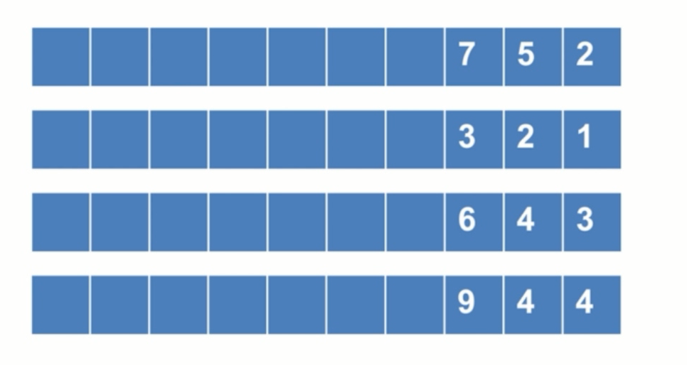

            我们可以看到有k个数列的第一个元素进行比较，所以我们每次要比较k次。
            k个元素比较k次的话就是o(n^2)了。

            此时我们可以大根堆，建立堆需要o(n),第一次调整堆，进行排序需要(o(nlogn),调整一次lgn，n-1次为nlogn)，而在之后每得到一个top，数列中去掉一个最大值，重新加入一个数，进行调整只需要lgn，取出最大值lgn，这样在之后的时间复杂度就达到了lgn。


## JVM

#### 类加载

> https://www.cnblogs.com/ITtangtang/p/3978102.html

Class 文件由类装载器装载后，在 JVM 中将形成一份描述 Class 结构的元信息对象，通过该元信息对象可以获知 Class 的结构信息：如构造函数，属性和方法等，Java 允许用户借由这个 Class 相关的元信息对象间接调用 Class 对象的功能。

虚拟机把描述类的数据从 class 文件加载到内存，并对数据进行校验，转换解析和初始化，最终形成可以被虚拟机直接使用的 Java 类型，这就是虚拟机的类加载机制。

- 步骤：

  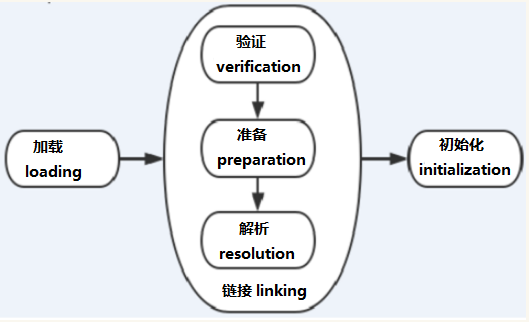

  某些情况中，解析阶段可以再初始化阶段之后在开始，这是为了支持 java 语言的运行时绑定(也称为动态绑定或晚期绑定)。

  1.  装载：查找和导入 Class 文件

      - 通过一个类的全限定名来获取定义此类的二进制字节流
      - 将这个字节流所代表的静态存储结构转化为方法区的运行时数据结构
      - 在 java 堆中生成一个代表这个类的 java.lang.Class 对象,作为方法区这些数据的访问入口。

  2.  链接：把类的二进制数据合并到 JRE 中

      (a)校验：检查载入 Class 文件数据的正确性

      (b)准备：给类的静态变量分配存储空间

          准备阶段是正式为类变量分配并设置类变量初始值的阶段，这些内存都将在方法区中进行分配

          这时候进行内存分配的仅包括类变量(被static修饰的变量),而不包括实例变量,实例变量将会在对象实例化时随着对象一起分配在Java堆中;这里所说的初始值"通常情况"是数据类型的零值，假如:

           public static int value = 123;

           value在准备阶段过后的初始值为0而不是123,而把value赋值的putstatic指令将在初始化阶段才会被执行

      (c)解析：将符号引用转成直接引用

          > https://blog.csdn.net/qq_34402394/article/details/72793119

          **待完善**

          - 符号引用
          - 直接引用

  3.  初始化：对类的静态变量，静态代码块执行初始化操作

- 类的初始化

  > <https://blog.csdn.net/justloveyou_/article/details/72466105>
 > <https://blog.csdn.net/justloveyou_/article/details/72217806>
 > <https://blog.csdn.net/justloveyou_/article/details/72466416>

  - 类的实例化是指创建一个类的实例(对象)的过程

  - 类的初始化是指为类中各个类成员(被 static 修饰的成员变量)赋初始值的过程，是类生命周期中的一个阶段。

  对于虚拟机初始化一个类，在虚拟机规范中指明有五种情况需立即对类进行初始化(发生在加载、验证、准备之后):

  1. 遇到 new、getstatic、putstatic 或 invokestatic、这四条字节码(注意：newarray 指令只是数组类型本身的初始化，而不会导致其相关类型的初始化。比如：new String[]只会直接触发 String[]类的初始化，也就是触发对类[Ljava.lang.String 的初始化，而不会导致触发 String 类的初始化)时，如果类没有初始化，则需要先对其初始化。生成这四条指令最常见的 java 代码场景是：

     - 使用 new 关键字实例化对象的时候
     - 读取或设置一个类的静态字段(被 final 修饰，编译器已把结果放入常量池的静态字段除外)的时候
     - 调用一个类的静态方法的时候

  2. 使用 java.lang.reflect 包的方法对类进行反射调用的时候，如果类没有进行过初始化，则进行初始化类

  3. 当初始化一个类时，如果发现其父类还未初始化过，则需要先触发其父类的初始化

  4. 当虚拟机启动时，用户需要指定一个需要运行的主类(包含 main()方法的那个类)，虚拟机会先初始化这个类

  5. 当使用 jdk1.7 动态语言支持时，如果一个 java.lang.invoke.MethodHandle 实例最后的解析结果 REF_getstatic,REF_putstatic,REF_invokeStatic 的方法句柄，并且这个方法句柄所对应的类没有进行初始化，则需要先出触发其初始化。


            JVM初始化步骤
            1、假如这个类还没有被加载和连接，则程序先加载并连接该类
            2、假如该类的直接父类还没有被初始化，则先初始化其直接父类
            3、假如类中有初始化语句，则系统依次执行这些初始化语句

            类初始化时机：只有当对类的主动使用的时候才会导致类的初始化，类的主动使用包括以下六种：
            – 创建类的实例，也就是 new 的方式
            – 访问某个类或接口的静态变量，或者对该静态变量赋值
            – 调用类的静态方法
            – 反射（如 Class.forName("com.shengsiyuan.Test")）
            – 初始化某个类的子类，则其父类也会被初始化
            – Java 虚拟机启动时被标明为启动类的类（Java Test），直接使用 java.exe 命令来运行某个主类

- 注意，对于这五种会触发类进行初始化的场景，虚拟机规范中使用了一个很强烈的限定语："有且只有"，这五种场景中的行为称为对一个类进行*主动引用*。除此之外，所有引用类的方式，都不会触发初始化，称为*被动引用*
- 被动引用的几种经典场景

  > https://github.com/duiliuliu/Interview/tree/master/test/src/com/javaBasic/classInitial

  - 通过子类引用父类的静态字段

    ```
    // PassiveReferenceParent
    public class PassiveReferenceParent {
        static {
            System.out.println("This is static block in the PassiveReferenceParent Class .");
        }
    }

    // PassiveReferenceSon_1
    public class PassiveReferenceSon_1 extends PassiveReferenceParent {
        static {
            System.out.println("This is static block in the PassiveReferenceSon_1 Class .");
        }

        public static String value = "PassiveReferenceSon_1_static_feild value";

        public PassiveReferenceSon_1() {
            System.out.println("PassiveReferenceSon_1 class init!");
        }
    }

    // PassiveReferenceSon_2
    public class PassiveReferenceSon_2 extends PassiveReferenceSon_1 {
        static {
            System.out.println("This is static block in the PassiveReferenceSon_2 Class .");
        }

        public PassiveReferenceSon_2() {
            System.out.println("PassiveReferenceSon_2 class init!");
        }
    }

    public static void main(String[] args) {
        System.out.println(PassiveReferenceSon_2.value);
    }

    // output:
      This is static block in the PassiveReferenceParent Class .
      This is static block in the PassiveReferenceSon_1 Class .
      PassiveReferenceSon_1_static_feild value
    ```

    对于静态字段，只有直接定义这个字段的类才会被初始化，因此通过其子类来引用父类中定义的静态字段，只会触发父类的初始化而不会触发子类的初始化。在本例中，由于 value 字段是在类 PassiveReferenceSon_1 中定义的，因此该类会被初始化；此外，在初始化类 PassiveReferenceSon_1 时，虚拟机会发现其父类 PassiveReferenceParent 还未被初始化，因此虚拟机将先初始化父类 PassiveReferenceParent PassiveReferenceSon_1，而 PassiveReferenceSon_2 始终不会被初始化。

  - 通过数组定义来引用类，不会触发此类的初始化

    ```
    PassiveReferenceSon_1[] passiveReferenceSons_1 = new PassiveReferenceSon_1[10];
    ```

    上述案例运行之后并没有任何输出，说明虚拟机并没有初始化类 PassiveReferenceSon_1[com.javaBasic.classInitial.PassiveReference.PassiveReferenceSon_1 的类的初始化。从类名称我们可以看出，这个类代表了元素类型为 PassiveReferenceSon_1 的一维数组，它是由虚拟机自动生成的，直接继承于 Object 的子类，创建动作由字节码指令 newarray 触发。

  - 常量在编译阶段会存入调用类的常量池中，本质上并没有直接引用到定义常量的类，因此不会触发定义常量的类的初始化

    ```
    System.out.println(PassiveReferenceParent.CONSTANT);
    // output:
    hello world
    ```

    述代码运行之后，只输出 "hello world"，这是因为虽然在 Java 源码中引用了 PassiveReferenceParent 类中的常量 CONSTANT，但是编译阶段将此常量的值"hello world"存储到了 NotInitialization 常量池中，对常量 PassiveReferenceParent.CONSTANT 的引用实际都被转化为 NotInitialization 类对自身常量池的引用了。也就是说，实际上 NotInitialization 的 Class 文件之中并没有 PassiveReferenceParent 类的符号引用入口，这两个类在编译为 Class 文件之后就不存在关系了。

- 类加载机制

  - 双亲委派模型：
    双亲委派模型的工作流程是：如果一个类加载器收到了类加载的请求，它首先不会自己去尝试加载这个类，而是把请求委托给父加载器去完成，依次向上，因此，所有的类加载请求最终都应该被传递到顶层的启动类加载器中，只有当父加载器在它的搜索范围中没有找到所需的类时，即无法完成该加载，子加载器才会尝试自己去加载该类。

  双亲委派机制:
  1、当 AppClassLoader 加载一个 class 时，它首先不会自己去尝试加载这个类，而是把类加载请求委派给父类加载器 ExtClassLoader 去完成。
  2、当 ExtClassLoader 加载一个 class 时，它首先也不会自己去尝试加载这个类，而是把类加载请求委派给 BootStrapClassLoader 去完成。
  3、如果 BootStrapClassLoader 加载失败（例如在$JAVA_HOME/jre/lib 里未查找到该 class），会使用 ExtClassLoader 来尝试加载；
  4、若 ExtClassLoader 也加载失败，则会使用 AppClassLoader 来加载，如果 AppClassLoader 也加载失败，则会报出异常 ClassNotFoundException。

- 类的实例化

  **待完善**

- 练习

  **java new 一个对象后创建了几个对象**

  - java String s = new String("abc")对象后创建了几个对象

    > https://juejin.im/entry/5a4ed02a51882573541c29d5

    创建了两个对象，一个对象时字符串‘abc’在常量池中，第二个对象是 Java heap 中的 String 对象

    使用 " " 双引号创建 ： String s1 = "first";
    使用字符串连接符拼接 ： String s2="se"+"cond";
    使用字符串加引用拼接 ： String s12="first"+s2;
    使用 new String("")创建 ： String s3 = new String("three");
    使用 new String("")拼接 ： String s4 = new String("fo")+"ur";
    使用 new String("")拼接 ： String s5 = new String("fo")+new String("ur");

    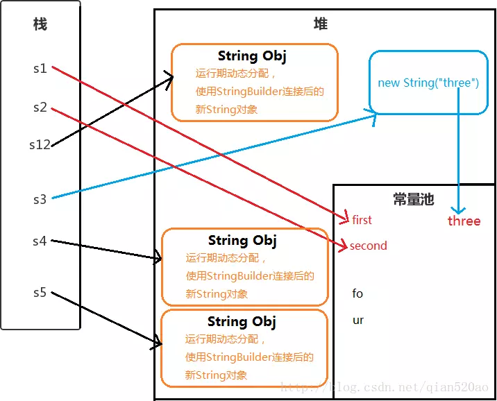

    Java 会确保一个字符串常量只有一个拷贝。

    s1 ： 中的"first" 是字符串常量，在编译期就被确定了，先检查字符串常量池中是否含有"first"字符串,若没有则添加"first"到字符串常量池中，并且直接指向它。所以 s1 直接指向字符串常量池的"first"对象。

    s2 ： "se"和"cond"也都是字符串常量，当一个字符串由多个字符串常量连接而成时，它自己肯定也是字符串常量，所以 s2 也同样在编译期就被解析为一个字符串常量，并且 s2 是常量池中"second"的一个引用。

    s12 ： JVM 对于字符串引用，由于在字符串的"+"连接中，有字符串引用存在，而引用的值在程序编译期是无法确定的，即("first"+s2)无法被编译器优化，只有在程序运行期来动态分配使用 StringBuilder 连接后的新 String 对象赋给 s12。
    (编译器创建一个 StringBuilder 对象，并调用 append()方法，最后调用 toString()创建新 String 对象，以包含修改后的字符串内容)

    s3 ： 用 new String() 创建的字符串不是常量，不能在编译期就确定，所以 new String() 创建的字符串不放入常量池中，它们有自己的地址空间。
    但是"three"字符串常量在编译期也会被加入到字符串常量池（如果不存在的话）

    s4 ： 同样不能在编译期确定，但是"fo"和"ur"这两个字符串常量也会添加到字符串常量池中，并且在堆中创建 String 对象。（字符串常量池并不会存放"four"这个字符串）

    s5 ： 原理同 s4

  - java new 一个对象后，内存中发生了什么

    1. 类加载检查

       虚拟机遇到一条 new 指令时，首先将去检查这个指令的参数是否能在常量池中定位到一个类的符号引用，并且检查这个符号引用所代表的类是否已加载/解析和初始化过。如果没有则进行相应加载解析初始化

    2. 分配内存空间

       类加载检查通过后，jvm 为新生对象分配内存空间，这是对象所需内存大小已经完全确定了

    3. 设置对象基本信息
    4. 程序员意愿的初始化和调用构造函数

**java 创建一个对象有哪几种方法**

#### oom

- 内存溢出 out of memory

程序在申请内存空间时，没有足够的内存空间供其使用，就发生了溢出。如申请一个

- 内存泄漏 memory leak

是指程序在申请内存后，无法释放已申请的内存空间，一次内存泄露危害可以忽略，但内存泄露堆积后果很严重，无论多少内存,迟早会被占光。

- OOM 的可能原因?
  - 数据库的 cursor 没有及时关闭
  - 构造 Adapter 没有使用缓存 contentview
  - RegisterReceiver()与 unRegisterReceiver()成对出现
  - 未关闭 InputStream outputStream
  - Bitmap 使用后未调用 recycle()
  - static 等关键字
  - 非静态内部类持有外部类的引用　 context 泄露

#### 垃圾回收

jvm 内存区域分为方法区，本地方法栈，虚拟机栈，堆，程序计数器

- 方法区

  主要是存储类信息，常量池（static 常量和 static 变量），编译后的代码（字节码）等数据

- 栈 用来存放基本类型数据与对象引用，每个线程会有个私有的栈。
- 堆 用来存放对象
- 分为新生代、年老代，以比例 1：2 划分

  新生代分为 Eden，survival （from+ to）(8:1:1)

  堆里面分为新生代和老生代（java8 取消了永久代，采用了 Metaspace），新生代包含 Eden+Survivor 区，survivor 区里面分为 from 和 to 区，内存回收时，如果用的是复制算法，从 from 复制到 to，当经过一次或者多次 GC 之后，存活下来的对象会被移动到老年区，当 JVM 内存不够用的时候，会触发 Full GC，清理 JVM 老年区

      当新生区满了之后会触发Minor GC,先把存活的对象放到其中一个Survice
      区，然后进行垃圾清理。因为如果仅仅清理需要删除的对象，这样会导致内存碎
      片，因此一般会把Eden 进行完全的清理，然后整理内存。那么下次GC 的时候，
      就会使用下一个Survive，这样循环使用。如果有特别大的对象，新生代放不下，
      就会使用老年代的担保，直接放到老年代里面。因为JVM 认为，一般大对象的存
      活时间一般比较久远。

      所以 Minor GC  新生代，频繁执行;Full GC 很少执行，较慢 system.gc()显式触发 或 老年代空间不足触发

- 垃圾收集主要针对的是堆和方法区进行。
  程序计数器、虚拟机栈、和本地方法都是属于线程私有的，只存在与线程的生命周期内，线程结束后也会消失，所以不需要对这三个区域进行垃圾回收。

  - 垃圾收集算法

  垃圾收集有**根回收算法**与**引用计数算法**。

  - 根回收算法是从跟对象为起点，能够到达的对象都是存活的，不可达的对象可被回收。
  - java 中可以作为 GC Roots 对象包括以下几种：
    - 1.虚拟机栈（栈帧中的本地变量表）中的引用对象。
    - 2.方法区中的类静态属性引用的对象。
    - 3.方法区中的常量引用的对象。
    - 4.本地方法栈中 JNI(也即一般说的 Native 方法)的引用的对象。
  - 引用计数是给对象添加一个引用计数器，当对象增加一个引用时计数器加 1，引用失效时计数器减 1。引用计数不为 0 的对象仍然存活。
    两个对象出现循环引用的情况下，此时引用计数器永远不为 0，导致无法对它们进行回收。

  - Java 语言使用跟搜索算法进行垃圾回收，回收方法有：

    - 标记-清除 将存活的对象标记，清理掉未标记的对象 不足：产生大量不连续内存
    - 标记-整理 将存活的对象移到一端，清理掉边界外的对象
    - 复制 分一半内存，一块内存用满后对此块内存中还存活的对象复制的另一块内存中，然后清理此块内存 不足：只占用了一半的内存
      分代回收
      Young Generation 复制
      Old Generation 标记清除
      Permanent Generation

- 垃圾收集器

  > 多线程/单线程 ： 单线程指垃圾收集器只使用一个线程清理，而多线程使用多个线程 <br>
  > 串行/并行 ： 串行指的是垃圾收集器与用户程序交替执行，意味着执行垃圾收集的时候需要停顿用户程序。并行指的是垃圾收集与用户程序同时执行。除了 CMS 和 G1，其他垃圾收集器使用串行方式。

  - serial 串行 单线程 Client 模式下的默认新生代收集器 优点：简单高效
  - parNew serial 的多线程版本
  - Parallel scavenge 多线程 "吞吐量优先"收集器 这里的吞吐量指 CPU 用于运行用户代码的时间占总时间的比值
  - CMS CMS（Concurrent Mark Sweep），Mark Sweep 指的是标记 - 清除算法
  - serial Old Serial 收集器的老年代版本 Client 模式下的虚拟机使用
  - Parallel Old Parallel Scavenge 收集器的老年代版本
  - G1 一款面向服务端应用的垃圾收集器，在多 CPU 和大内存的场景下有很好的性能

- CMS (Concurrent Mark sweep collector 并发标记清楚收集器)
  主要被用来收集老年代的未被使用的对象(垃圾)，以获取最小停顿时间为目的
  如果需要使用 CMS，需添加命令到 JVM 的命令行中 `-XX:+UseConcMarkSweepGC`

  - 特点：

    - 希望 java 垃圾收集器收集垃圾的时间尽可能的短
    - 应用运行在多 CPU 的机器上，有足够的 CPU 资源
    - 希望应用的响应时间短

  - 流程
    CMS 也是采用分代策略的，用于收集老年代的垃圾对象。过程有 6 个阶段(4 个并发，2 个暂停其他应用程序)

    - 初始标记(CMS-initial-mark)
      - 这个阶段会扫描 root 对象直接关联的可达对象。不过并不会递归的追踪下去，只是到达第一层而已。这个过程会 stop-the-world，但是时间很短
    - 并发标记(CMS-concurrent-mark)
      - 从初次收集到的'根对象'引用开始，遍历所有能被引用的对象
    - 并发预处理()
      - 由当前应用程序产生的对象引用，并递归遍历，更新第二阶段的结果
    - 重新标记
      - 在并发 mark 阶段，应用的线程可能产生新的垃圾，所以需要重新标记，这个阶段也是会 stop-the-world.这一阶段十分重要，因为必须避免收集到仍被引用的对象
    - 并发清理
      - 所有不再被应用的对象将从堆里清除掉
    - 并发重置
      - 收集器做一些收尾的工作，以便下一次 GC 周期能有一个干净的状态

  - 问题

    - 如何确定老年代是活着的
      - 通过 GC ROOT TRACING 可到达的对象就是活着的
    - 是否需要扫描新生代，确定新生代的对象是否活着
      - 必须扫描新生代来确保。这也是为什么 CMS 虽然是老年代的 gc，但仍要扫描新生代的原因。(注意初始标记也会扫描新生代)
    - 全量的扫描新生代和老年代会不会很慢
      - 很慢
    - 如何解决
      - 扫描新生代前先进行一次 Minor GC
    - CMS 有什么问题
      - 并发问题
        并发意味着多线程抢占 CPU 资源。即 GC 线程和用户线程抢占 CPU，造成用户线程执行效率下降
      - 浮动垃圾
        CMS 提供了 CMSInitiatingOccupancyFraction 参数来设置老年代空间使用百分比，达到百分比就进行垃圾回收。这个参数默认是 92%。
        设置太小会导致频繁的 GC
        设置太大会使得用户线程空间过小，可能产生 Concurrent Mode Fail 错误(并发模式失败)
      - 空间碎片

  - MinorGC FullGC
    - http://www.importnew.com/15820.html

#### JVM 调优

- 堆大小设置

  JVM 中最大堆大小有三方面限制：
  相关操作系统的数据模型(32-bit 或 64-bit)限制；
  系统的可用虚拟内存限制
  系统的可用物理内存限制
  如：java -Xmx3550m -Xms3550m -Xmn2g -Xss128k
  -Xmx3550m: 设置最大可用内存为 3550m
  -xms3550m：设置 JVM 初始内存为 3550m。此值可以设置与-Xmx 相同，以避免每次垃圾回收完后 JVM 重新分配内存
  -Xmn2g：设置年轻代大小为 2g。持久代大小一般固定为 64m
  -Xss128k: 设置每个堆栈大小

- 回收器选择
- 辅助信息


## newJVM

JVM(java virtual machine)是 Java 虚拟机的缩写，是 Java 程序运行的平台

#### 内存模型

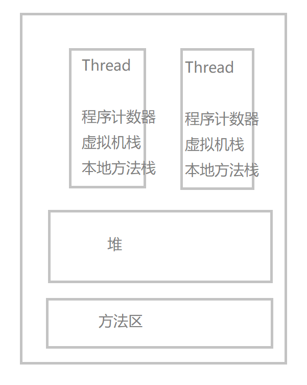

JVM 分为方法区，虚拟机栈，本地方法栈，程序计数器，堆。其中，虚拟机栈与本地方法栈，程序计数器是属于线程私有的，只存活于该线程的生命周期内，各个线程共享方法区与堆。

- 程序计数器

  记录正在执行的虚拟即字节码指令的地址

- 虚拟机栈

  即 Java 方法栈。每个方法执行的时候会创建一个存放 局部变量(对象引用)、操作数栈、常量池引用等信息，方法的执行就是虚拟栈中的栈帧出栈、入栈的过程。

  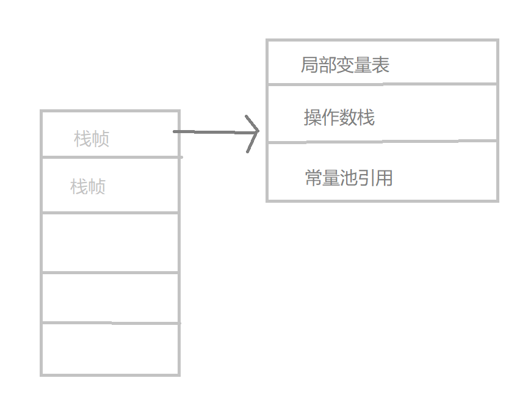

  可以通过 -Xss 这个虚拟机参数来调整每个线程虚拟机栈的内存大小

  `java -Xss 128k HackTheJava`

  当 Xss 值越大，每个线程虚拟机栈的内存也就越大，线程所占的空间也就越大，系统所容纳的线程就变得越少了。容易出现 OutofMemoryEror(系统内存不足) 错误
  当 Xss 值越小，栈中存储得信息也就越少，容易出现 StackOverflowError(栈溢出) 错误

  StackOverflowError --> 栈内存过小，递归过深
  OutofMemoryError --> 系统空间不足，无法申请到足够的内存

- 本地方法栈

  类似于虚拟机栈，不过是为本地方法(c++)服务的。

- 堆

  大部分对象的存储地，是垃圾收集的主要区域

  主要分为新生代与老年代两大块，其中新生代占堆区域的 1/3.新生代用来存储新建立的对象，年老代存储经过多次垃圾回收后依然存活的对象。

  将堆分块是因为 Java 垃圾收集算法使用的是分代回收，采用分而治之的思想，吧不同生命周期的对象放在不同代上。越是新生的对象它的生命周期也就越短，越是年老的对象，生存能力越强，所以老年代的空间是新生代空间的两倍

  新生代又分为 Eden 区域与两个 survival，空间比例为 8:1:1,同样是因为新生的对象生命周期短，所以 eden 区域较大。两个 survival 是为了方便进行垃圾回收复制算法。

  可以通过 -Xmx 和 -Xms 调整堆内存的大小

  `java -Xmx3550m -Xms3550m`

      -Xmx3550m: 设置最大可用内存为 3550m
      -xms3550m：设置 JVM 初始内存为 3550m。此值可以设置与-Xmx 相同，以避免每次垃圾回收完后 JVM 重新分配内存 FFF

  -XX:NewSize 和-XX:MaxNewSize

      用于设置年轻代的大小，建议设为整个堆大小的 1/3 或者 1/4,两个值设为一样大。

  -XX:SurvivorRatio

      用于设置 Eden 和其中一个 Survivor 的比值，这个值也比较重要。

  -XX:+PrintTenuringDistribution

      这个参数用于显示每次Minor GC时Survivor区中各个年龄段的对象的大小。

  -XX:InitialTenuringThreshol 和-XX:MaxTenuringThreshold

      用于设置晋升到老年代的对象年龄的最小值和最大值，每个对象在坚持过一次Minor GC之后，年龄就加1。

  - 不需要连续内存，可以动态扩展，增加内存失败后 --> OutofMemoryError

- 方法区

  用来存储 已被加载的类信息、常量、静态变量、即时编译后的代码等数据

  垃圾回收时主要是对常量池的回收和对类的卸载

  - 不需要连续内存，可以动态扩展，增加内存失败后 --> OutofMemoryError

#### 垃圾回收

#### 类加载

- 过程
- 加载机制


## 分布式

一致性 hash

#### 单点问题

> https://blog.csdn.net/guchuanyun111/article/details/52253220


## MySql

> https://www.cnblogs.com/frankielf0921/p/5930743.html

#### MyISAM 与 InnoDB 的区别

- mysql 分页机制

#### 例题


## MongoDB


## Redis

> https://blog.csdn.net/qq_39783244/article/details/79403613
 >https://blog.csdn.net/yupi1057/article/details/82703280?utm_source=blogxgwz0

#### Redis 基本概念

- 名称： Remote Dictionary Server

redis 是速度非常快的非关系型(NoSql)内存键值数据库，可以存储键和五种数据类型。

键的类型只能字符串，值支持的数据类型有五种：字符串/列表/集合/有序集合/散列表

redis 支持很多特性，如可将数据持久化到硬盘中，使用复制来扩展读性能，使用分片来扩展写性能


## ElasticSearch

> https://blog.csdn.net/yezonggang/article/details/80064394

#### 综述

- 大规模数据是如何*检索*的

  如：当系统数据量达到了 10 亿/100 亿条的时候，我们在做系统架构的时候通常会考虑：

  1. 用什么数据库好
     MySQL/Sybase/SQL serve/Oracle/MongoDB/HBase
  2. 如何解决单点故障
     lvs/F5/A10/Zookeeper/MQ
  3. 如何保证数据安全性
     热备份/冷备份/异地多活
  4. 如何解决建索难题
     数据库代理中间件/mysql-proxy/Cobar/MaxScale 等
  5. 如何解决统计分析
     离线/近实时

**以上问题中的关键字待熟悉**

- 传统数据库的应对方案

  对于关系型数据库，通常采用以下类似架构解决查询瓶颈与写入瓶颈：

  1. 通过*主从备份*解决数据安全性问题
  2. 通过*数据库代理中间件心跳检测*，解决单点故障问题
  3. 通过代理中间件将查询语句分发到各个 slave 节点进行查询，并汇总结果

  **不成熟思考：分发查询---1.分发各个节点，汇总结果 2.计算查询 id 所属库表所在节点，进行查询**

  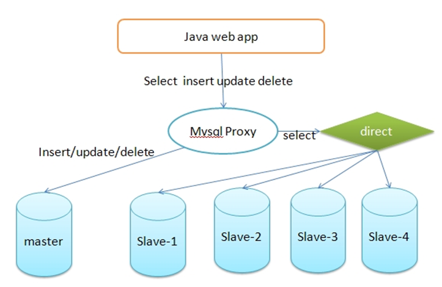

- 非关系型数据库应对方案

  对于 NoSql 数据库，以 mongodb 为例，其他原理类似：

  1. 通过副本备份保证数据安全性
  2. 通过节点竞选机制解决单点问题
  3. 先从配置库检索分片信息，然后将请求分发到各个节点，最后由路由节点合并红汇总结果

  **图还未看懂，待深挖**

  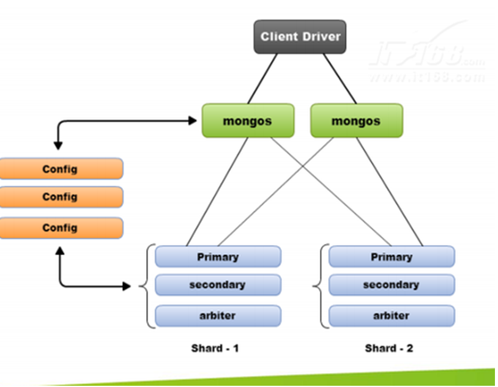

- 另辟蹊径--完全把数据放入内存

  完全将数据放入内存成本过高，所以从以下方式中寻找优化：

  1. 存储数据时按有序存储
  2. 将数据和索引分离
  3. 压缩数据

  **数据和索引分离，将索引都存入内存中，部分数据存储内存**

#### ES 基础概念

- Shard 分片

  当有大量的文档时，由于内存的限制，磁盘处理能力不足，无法较快的相应客户端的请求等，一个节点可能不够。这种情况下，数据可以分为较小的多个分片，分别存储在多个节点上。

  当查询的索引分布在多个分片上时，es 会把查询发送给每个相关的分片，并将结果汇总在一起。

- Replia 副本

  为提高查询吞吐量或实现高可用性，可以使用分片副本

  副本是一个分片的精确复制，每个分片可以有 0 个或多个分片，当进行更新操作时，其中之一被选作为主分片

  当主分片丢失时，集群会将分布提升为新的主分片

  **吞吐量：吞吐量是指在单位时间内中央处理器（CPU）从存储设备读取->处理->存储信息的量**

  **副本提高吞吐量：读取数据时，可对数据分块，每个副本中读取部分快，这样就提升了单位时间内 CPU 从其他设备中读取的数据量了，类似 p to p 下载**

#### elasticsearch 基础操作

> https://github.com/duiliuliu/duiliuliu.github.io/blob/master/_posts/2018-07-25-elasticsearch%E5%85%A5%E9%97%A8.md

单个 Elastic 实例称为一个节点（node）。一组节点构成一个集群（cluster）。

Elastic 数据管理的顶层单位就叫做 Index（索引）。它是单个数据库的同义词。每个 Index （即数据库）的名字必须是小写。

下面的命令可以查看当前节点的所有 Index。

$ curl -X GET 'http://localhost:9200/_cat/indices?v'

下面的命令可以列出每个 Index 所包含的 Type。

$ curl 'localhost:9200/\_mapping?pretty=true'

- \_cat 命令查看状态

  查看所有索引

  `GET _cat/indies?v`

  \_cat 命令可以查看 elasticsearch 状态

  - verbose

  每个命令都支持？v 参数，来显示详细信息

  ```
  $ curl localhost:9200/_cat/master?v
  id                     host      ip        node
  QG6QrX32QSi8C3-xQmrSoA 127.0.0.1 127.0.0.1 Manslaughter
  ```

  - help

  每个命令都支持使用 help 参数，来输出可以显示的列：

  ```
  GET _cat/master?help
  id   |   | node id
  host | h | host name
  ip   |   | ip address
  node | n | node name
  ```

  - headers

  通过 h 参数，可以指定输出字段

  ```
  GET /_cat/master?v
  id                     host      ip        node
  QG6QrX32QSi8C3-xQmrSoA 127.0.0.1 127.0.0.1 Manslaughter

  GET /_cat/master?h=host,ip,node
  127.0.0.1 127.0.0.1 Manslaughter
  ```

- 索引增删

  新建 Index，可以直接向 Elastic 服务器发出 PUT 请求。下面的例子是新建一个名叫 weather 的 Index。

  `PUT /weather`

  服务器返回一个 JSON 对象，里面的 acknowledged 字段表示操作成功。

  ```
  {
    "acknowledged":true,
    "shards_acknowledged":true
  }
  ```

  查看 weather 索引信息

  ```
  GET weather

  {
    "weather": {
      "aliases": {},
      "mappings": {},
      "settings": {
        "index": {
          "creation_date": "1532482584126",
          "number_of_shards": "5",
          "number_of_replicas": "1",
          "uuid": "2tl4hhjRS4Cj3fD475p5JQ",
          "version": {
            "created": "5040099"
          },
          "provided_name": "weather"
        }
      }
    }
  }
  ```

  其中，number_of_replicas 是数据备份数，如果只有一台机器，设置为 0；number_of_shards 是数据分片数，默认为 5，有时候设置为 3

  获取设置信息

  ```
  #获取weather的设置
  GET weather/_settings

  #获取所有的设置
  GET _all/_settings
  #获取所有的设置(同上)
  GET _settings

  #获取weather和accounts的设置
  GET weather,accounts/_settings
  ```

  修改副本数量：

  ```
  PUT weather/_settings
  {
    "number_of_replicas": 2
  }
  ```

- 新增记录

  向指定的 /Index/Type 发送 PUT 请求，就可以在 Index 里面新增一条记录。比如，向/accounts/person 发送请求，就可以新增一条人员记录。

  ```
  PUT accounts/job/1
  {
    "user":"王二麻",
    "title":"系统分析师"
  }
  ```

  服务器返回的 JSON 对象，会给出 Index、Type、Id、Version 等信息。

  ```
  {
    "_index":"accounts",
    "_type":"person",
    "_id":"1",
    "_version":1,
    "result":"created",
    "_shards":{"total":2,"successful":1,"failed":0},
    "created":true
  }
  ```

  新增记录的时候，也可以不指定 Id，这时要改成 POST 请求。

  ```
  POST /accounts/job
  {
    "user": "李四",
    "title": "工程师",
    "desc": "系统管理"
  }'
  ```

  服务器返回的 JSON 对象里面，\_id 字段就是一个随机字符串。

  ```
  {
    "_index":"accounts",
    "_type":"person",
    "_id":"AV3qGfrC6jMbsbXb6k1p",
    "_version":1,
    "result":"created",
    "_shards":{"total":2,"successful":1,"failed":0},
    "created":true
  }
  ```

- 查询记录

  使用 GET 方法，直接请求/Index/Type/\_search，就会返回所有记录。

  ```
  #查询该索引下所有文档
  GET accounts/_search
  GET accounts/job/_search

  查询单个文档
  GET accounts/job/1
  GET accounts/job/1?_source
  GET accounts/job/1?_source=title
  GET accounts/job/1?_source=user,title
  ```

  查询返回结果中字段含义：

  ```
        took: 表示该操作的耗时(ms)
        timeout: 是否超时
        hits: 表示命中的记录
        total：返回记录数
        max_score：最高的匹配程度
        hits：返回的记录组成的数组。
        _score: 匹配程度，最高为1.0，默认是按照这个字段降序排列。
  ```

  全文搜索

  Elastic 的查询非常特别，使用自己的查询语法，要求 GET 请求带有数据体。

  ```
  GET accounts/job/\_search
  {
    "query":{
      "match": {
        "desc": "师"
      }
    }
  }
  ```

  上面代码使用 Match 查询，指定的匹配条件是 desc 字段里面包含"师"这个词。返回结果如下:

  ```
  {
    "took": 26,
    "timed_out": false,
    "\_shards": {
      "total": 5,
      "successful": 5,
      "failed": 0
    },
    "hits": {
      "total": 1,
      "max_score": 0.28582606,
      "hits": [
        {
          "_index": "accounts",
          "_type": "job",
          "_id": "1",
          "_score": 0.28582606,
          "_source": {
            "user": "张三",
            "title": "工程师",
            "desc": "数据管理工程师"
          }
        }
      ]
    }
  }
  ```

  Elastic 默认一次返回 10 条结果，可以通过 size 字段改变这个设置。

  ```
  GET accounts/job/\_search
  {
  "query":{
    "match": {
        "desc": "师"
      }
    },
    "size":1
  }
  ```

  上面代码指定，每次只返回一条结果。

  还可以通过 from 字段，指定位移。

  ```
  GET accounts/job/\_search
  {
    "query":{
      "match": {
        "desc": "师"
      }
    },
    "from":1,
    "size":1
  }
  ```

  如果有多个搜索关键字， Elastic 认为它们是 or 关系

  ```
  GET accounts/job/\_search
  {
    "query":{
      "match": {
        "desc": "师 shi"
      }
    }
  }
  ```

  上面代码搜索的是软件 or 系统。

  如果要执行多个关键词的 and 搜索，必须使用布尔查询。

  ```
  GET accounts/job/\_search
  {
    "query":{
      "bool": {
        "must": [
          {"match": {
            "title": "师"
          }},
          {"match": {
            "desc": "师"
          }}
        ]
      }
    }
  }
  ```

- 修改记录 (直接覆盖)

  ```
  PUT accounts/job/1
  {
  "user":"张三",
  "title":"工程师" ,
  "desc":"数据管理工程师"
  }

  #或者

  POST accounts/job/AWTPLR57niBd4cuXBYQc/\_update
  {
  "doc":{
  "desc":"teacher"
  }
  }
  ```

  更新记录后，返回结果中有几个字段发生改变：

  ```
  "\_version" : 2,
  "result" : "updated",
  "created" : false
  ```

  版本（version）从 1 变成 2，操作类型（result）从 created 变成 updated，created 字段变成 false，因为这次不是新建记录。

- 删除记录

  ```
  #删除一条记录(文章),
  DELETE accounts/job/1

  #删除一个 type(表) es5 不再支持删除 type
  DELETE accounts/job

  #删除整个 index (库)
  DELETE accounts
  ```


## Python

#### python 基本数据类型

整型--int

布尔型--bool

字符串--str

列表--list

元组--tuple

字典--dict

#### python 赋值/浅拷贝/深拷贝

- 赋值（=），就是创建了对象的一个新的引用，修改其中任意一个变量都会影响到另一个。

- 浅拷贝：创建一个新的对象，但它包含的是对原始对象中包含项的引用（如果用引用的方式修改其中一个对象，另外一个也会修改改变）{1,完全切片方法；2，工厂函数，如 list()；3，copy 模块的 copy()函数}

- 深拷贝：创建一个新的对象，并且递归的复制它所包含的对象（修改其中一个，另外一个不会改变）{copy 模块的 deep.deepcopy()函数}

#### python 中的比较： is 与 ==

> https://www.cnblogs.com/kiko0o0/p/8135184.html

在 python 中会用到对象比较，可以用 is，也可以用 ==。

- is 比较的是两个对象是不是相同。比较的是对象的内存地址(对象的 id)
- - == 比较的两个对象是不是相等。比较的是对象的值。即内存地址可以不一样，有相等的值就返回 true。默认调用对象的\_\_eq\_\_e()方法

```
>>> a = ["i", "love", "python"]
# a的引用复制给b，在内存中其实是指向了用一个对象
>>> b = a
>>> b is a
True
>>> id(a)
2830205149832
>>> id(b)
2830205149832
# 当然，内容也肯定是相等的
>>> b == a
True
```

a 和 b 指向同一块内存，所以 is 与==比较结果为 True，下面将 a 复制为 b，内存地址不同，值一样

```
>>> b = a[:]
>>> b is a
False
>>> b == a
True
>>> id(a)
2830205149832
>>> id(b)
2830206374920
```

不过在这里需要注意的是，如果比较 a[0]与 b[0],a[0] is b[0]，结果是 True
因为切片拷贝是浅拷贝，列表中的元素并未重新创建

#### python 中 yield

#### fun(*args,\*\*kwargs)中的*args,\*\*kwargs

\*args 和\*\*kwargs 主要用于函数定义时传入不定量参数。

\*args 是用来发送一个非键值对的可变数量的参数元组
\*\*kwargs 是用来发送一个键值对的可变数量的参数字典

```
def test(*args,**kwargs):
    print(args)

test('a','b','c','d')
# output: ('a','b','c','d')


def test(*args,**kwargs):
    print(kwargs)

test(a='a',b='b',c='c',d='d')
# output: {'a': 'a', 'b': 'b', 'c': 'c', 'd': 'd'}
```

#### python 闭包

#### python 内存管理

https://blog.csdn.net/zhzhl202/article/details/7547445?utm_source=blogxgwz0
https://www.aliyun.com/jiaocheng/510889.html

- 引用计数
  - python 内部使用引用计数的方式
- 垃圾回收
- 内存池机制

#### 全局解释器锁 GIL

#### 导入机制探究

https://blog.csdn.net/gaifuxi9518/article/details/81038818

#### scrapy

#### scrapy-redis

#### WSGI

WSGI 是 Web 服务器网关接口。它是一个规范，描述了 Web 服务器如何与 Web 应用程序通信，以及 Web 应用程序如何链接在一起以处理一个请求。

WSGI 是一个详细描述的 Python 标准 [PEP 3333](https://www.python.org/dev/peps/pep-3333)。

#### 面试题

- 解决 python 循环引用的方法
  - 延迟导入
  - 将 from xxx import yyy 改为 import xxx;xxx.yyy 来访问的形式
  - 组织代码，将循环变为单向

> http://python.jobbole.com/85231/

collections 库

- 数组拷贝

  `new = old[:]`


## JavaScript

#### javaScript 读取 json

- var obj = eval(str)
- var obj = str.parseJSON() <---> obj.toJSONString()
- var obj = JSON.parse(str) <---> JSON.stringify(obj)

#### js 闭包

> https://blog.csdn.net/qq_29066959/article/details/50803576?utm_source=blogxgwz1

- this
  - 在全局函数中的 this 等于 window
  - 当函数被当作某个对象的方法使用时，this 等于那个对象
  - 匿名函数的执行环境具有全局性，this 通常指向 window

闭包是一个可以访问外部的(封闭)函数作用域链中变量的内部函数。闭包可以访问三种范围中的变量：

    - 自己范围内的变量
    - 封闭函数范围内的变量
    - 全局变量

    ```
    var gloableVar = "global variable";

    (function outerFunc(outerArg) {
        var outerVar = "outer variable";

        (function innerFunc(innerArg) {
            var innerVar = "inner variable";

            console.log([outerArg, innerArg, outerVar, innerVar, gloableVar].join("\n"));
        })("param: innerArg")
    })("param: outerArg")

    //在上面的例子中，来自于 innerFunc， outerFunc和全局命名空间的变量都在 innerFunc的范围内。
    // output:
    param: outerArg
    param: innerArg
    outer variable
    inner variable
    global variable
    ```

- 封装 javascript 源文件的内容到一函数块有什么意义与理由

  这是一个越来越普遍的做法，被许多流行的 JavaScript 库(JQuery,node 等)采用.这种做法是创建了一个围绕文件全部内容的闭包.


## Shell


## Spring

> https://blog.csdn.net/hrbeuwhw/article/details/79476988

#### Spring 常用注解

#### bean 生命周期

> https://www.cnblogs.com/kenshinobiy/p/4652008.html

#### Spring AOP

- 切面（Advisor）：是 AOP 中的一个术语，表示从业务逻辑中分离出来的横切逻辑，比如性能监控，日志记录，权限控制等。
  这些功能都可以从核心的业务逻辑中抽离出去。可以解决代码耦合问题，职责更加单一。封装了增强和切点。
- 增强（Advice）：增强代码的功能的类，横切到代码中。
- 目标：目标方法（JDK 代理）或目标类（CGLIB 代理）
- 代理：JDK 代理，CGLIB 代理。或是通过 ProxyFactory 类生产。
- 切点：通过一个条件来匹配要拦截的类，这个条件称为切点。如拦截所有带 Controller 注解的类。增强的条件。

连接点：作为增强方法的入参，可以获取到目标方法的信息

Spring AOP 原理---动态代理

spring 的动态代理实现有两种：
jdk 的动态代理 (目标对象的实现类实现了接口)
cglib 动态代理 (目标对象的实现类没有实现接口) (通过实现修改字节码来实现)

jdk 动态代理实现的核心类库为 java.lang.reflect.Proxy 类与 java.lang.reflect.InvocationHandler 接口

动态代理的实现为实现 InvocationHandler 接口(invoke(Object o, Method m))，再通过反射接收代理类。
实际代理类继承了 Proxy 类，并实现了 ISubject 接口，由此也可以看到 JDK 动态代理为什么需要实现接口，已经继承了 Proxy 是不能再继承其余类了。

其中实现了 ISubject 的 execute() 方法，并通过 InvocationHandler 中的 invoke() 方法来进行调用的。

CGLIB 动态代理
cglib 是对一个小而快的字节码处理框架 ASM 的封装。 他的特点是继承于被代理类，这就要求被代理类不能被 final 修饰。

#### 例题

- 有哪些不同类型的 IOC（依赖注入）方式

  - 构造器依赖注入
  - setter 方法注入

- 哪种依赖注入方式你建议使用，构造器注入，还是 Setter 方法注入

  - 两种依赖方式都可以使用，构造器注入和 Setter 方法注入。最好的解决方案是用构造器参数实现强制依赖，setter 方法实现可选依赖

- 如何给 Spring 容器提供配置元数据

  - xml 配置
  - 基于注解
  - 基于 java 的配置

- 解释 Spring 支持的几种 bean 的作用域

  Spring 框架支持以下五种 bean 的作用域：

  - singleton
  - prototype
  - request
  - session
  - global-session

  缺省的 Spring bean 的作用域是 Singleton

- Spring 框架中的单例 bean 是线程安全的吗

  Spring 框架中的单例 bean 不是线程安全的


## 面试题

#### 海量数据排序

> https://blog.csdn.net/yusiguyuan/article/details/12903975
 > https://blog.csdn.net/v_JULY_v/article/details/6279498

1. 分而治之/Hash 映射 堆/快速/归并排序

   - 一个 10g 的关键词 log，找出词频最高的前 k 个词，设可用内存为 2g

     难点分析：

     1. 如何在有限的内存中对大量数据进行词频统计
     2. 如何在有限的内存中找出前 k 个高频词

     词频统计：我们自然的会想到 hash，然而数据太多内存不足，所以我们需要将数据分段，然后将每段的结果进行汇总计算即可。

     分段：

     1. 普通分段
     2. hash 计算，按照范围分段(因为是词频统计，尽可能将同样的词划分到一段中，让最后的计算只需要词频排序即可。避免最后还需要对不同分段的同一个词进行词频汇总)

     汇总：汇总所有分段结果进行排序。

     1. 一般汇总，
     2. 缓冲区，汇总部分

     排序：

     对于排序算法的选择，如果一次性将结果汇总，快排/归并/堆排序同样的时间复杂度。
     倘若是按照缓冲区一段段的读取数据进行汇总，此时选用堆排序性能更优。堆排序中，堆的构建需要 o(n)，而堆与堆的调整只需要 lgn，在第一次堆排序需要调整 n-1 次，复杂度为 o(nlogn),但是在之后的调整与读取数据中只需要 lgn 的时间。

   - 堆排序，大顶堆，小顶堆
     应用场景：

     1. 比如求 10 亿个数中最大的前 10 个数，可以构建只有 10 个元素的小顶堆，如果比堆顶小，则不处理；如果比堆顶大，则替换堆顶，然后依次下沉到适当的位置。
     2. 同样，求 10 亿个数中最小的前 10 个数，可以构建只有 10 个元素的大定堆，如果比堆顶大，则不处理；如果比堆顶小，则替换堆顶，然后调整堆。

        [堆排序实现](https://github.com/duiliuliu/Interview/blob/master/java-test/src/com/algorithm/sort/HeapSort.java)

2. 多层桶划分
3. bitmap
4. Trie 树/数据库/倒排索引
5. 外部排序
6. 分布式处理之 Map reduce

#### 浏览器中输入 www.taobao.com 发生了什么

#### 对于缓存有什么思考

缓存是对读取数据速度的提升，将常用/高频的数据存放与缓存中，可以在下一次的数据访问中提升效率。

对于缓存，很多地方都有遇到，有磁盘缓存，DB 缓存，浏览器缓存，CPU 一级/二级缓存等。

- 简单的 Java 缓存队列
  在 Java 程序中，对于缓存可以用 LRU 队列进行实现，将最新访问的数据作为头节点，而最久未使用的数据存放队尾，在队列长度达到限制后，扔掉队尾的数据。可以运用 LinkedHashMap 来实现 LRU 队列，因为 LInkedHashMap 有两个指针域分别指向前驱与后缀，保证了队列顺序，而且采用 hash 散列存储，访问效率较高。构造时构造一个空的 linkedhashmap。get 时传入 key，类似与 hashmap，将 key 的 hashcode 二次 hash 后与长度-1 进行&运算，快速得到位置下标，获取数据，并修改数据指针域，将其插入头节点。set 方法通过 hash 得出位置后，存储数据然后后缀指针域指向头节点。

- LRU 算法实现

  LRU 全称是 Least Recently Used，即最近最久未使用的意思。

  LRU 算法的设计原则是：如果一个数据在最近一段时间没有被访问到，那么在将来它被访问的可能性也很小。也就是说，当限定的空间已存满数据时，应当把最久没有被访问到的数据淘汰。

  1.  数组+时间计数
      每访问一次数据，相应的时间计数归零，其他数据时间计数加一，当数组空间已满时，将时间计数最大的数据项淘汰。
  2.  链表实现
      每次插入新的数据都选择从头部插入，如果数据已存在，则将数据移到头部；那么当链表满的时候，就将链表尾部的数据丢弃。
  3.  链表和 hashmap
      当需要插入新的数据项的时候，如果新数据项在链表中存在（一般称为命中），则把该节点移到链表头部，如果不存在，则新建一个节点，放到链表头部，若缓存满了，则把链表最后一个节点删除即可。在访问数据的时候，如果数据项在链表中存在，则把该节点移到链表头部，否则返回-1。这样一来在链表尾部的节点就是最近最久未访问的数据项。(LinkedHashMap)

- DB 缓存

  关键点：

  - 如何与 DB 保持同步
  - 缓存过期时间
  - 存储结构
  - 缓存异常捕获
  - 超时设置

**Spring 缓存**
**分布式缓存**

- redis 缓存设计

> https://blog.csdn.net/zjttlance/article/details/80234341?utm_source=blogxgwz3

> https://blog.csdn.net/tangkund3218/article/details/50915007?utm_source=blogxgwz8

- 注意问题
  > https://blog.csdn.net/wuxing26jiayou/article/details/79544410?utm_source=blogxgwz0
  - 缓存穿透
  - 缓存雪崩
  - 缓存击穿

#### 设计一个秒杀系统

1. 前端层面，必须提到浏览器缓存、尽可能减少请求数量、使用延迟加载（ajax 技术）、使用 cdn 缓存、压缩静态文件等；

2. web 服务器层面，必须提到开启 gzip 压缩技术、卸载 web 服务器不必要的模块、开启服务器缓存等；

3. PHP 语言层面，开启编译缓存、使用 PHP 扩展实现计算密集型模块、使用 HHVM 或 PHP7 替代旧版本 PHP、修改 php.ini 参数对 PHP 性能调优、减少高消耗函数使用等；

4. 数据库 MySQL 层面，合理创建索引、合理设计数据表结构、尽可能减少数据库连接、对数据库内常用数据进行缓存、读写分离、垂直（水平）分库分表等；

5. 非关系型数据库，使用非关系数据库减少数据库链接、保持数据库与非关系数据库数据一致性等


## 其他

---
---

innodb

redis，数据类型，消息队列，过期时间问题

装饰者模式

缓冲区溢出及其影响

内存中页的大小，为什么是这么大

问了一下流量控制，还是很隐晦，当时大概问的是“一个服务器有很多 TCP 连接，然后某一时刻他可能来不及处理接受到的数据，这时候该怎么办？”。坦白说刚开始听到我是比较懵 B 的，但是仔细想过之后发现这好像就是流量控制，所以很流利的回答了流量控制，顺道说了一下原理。

1. Elastic Search 索引建立
2. Elastic Search 查询的过程
3. Elastic Search 集群管理、Master 选举，节点特性
