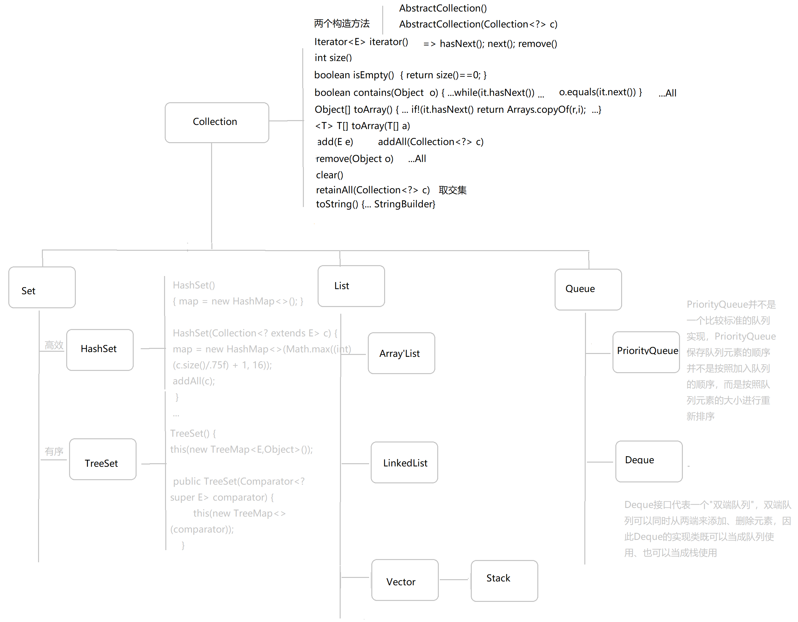

#### Java 集合 Set/List

- 
- ArrayList

  > https://www.cnblogs.com/kuoAT/p/6771653.html

  ArratList 是通过数组结构实现的，默认的初始容量为 10.在进行构造 ArrayList 对象时，若不指定容量，则选择容量为默认容量 10，不过此时只是初始化一个空数组(也不是初始化，其内部一直保留一个 final 修饰的空数组，只是让 elementData 指向这个空数组。原因可能是一直维护一个空数组比新建一个空数组更高效吧)

  - ArrayList 扩容

    对于 ArrayList，其容量是内部 elementData 数组的长度，在 add 元素的时候，倘若元素索引+1 大于 elementData 的长度则会进行扩容，即内部数组容纳不了的时候会进行扩容。

    ```
    public boolean add(E e) {
        ensureCapacityInternal(size + 1); // Increments modCount!!
        elementData[size++] = e;
        return true;
    }
    ```

    扩容时候会按照之前容量的 1.5 倍进行扩容。

  **ArrayList 什么时候扩容**

  元素个数大于当前容量的时候进行扩容，容量变为之前的 1.5 倍

  **ArrayList 与 Array**

  ArrayList 是 Array 的复杂版本
  ArrayList 内部封装了一个 Object 类型的数组，从一般的意义来说，它和数组没有本质的差别，甚至于 ArrayList 的许多方法，如 Index、IndexOf、Contains、Sort 等都是在内部数组的基础上直接调用 Array 的对应方法。

  1. 效率：Array 较为高效，但是其容量固定且无法改变
     而 ArrayList 容量可以动态增长，但相对效率低
  2. 类型识别：ArrayList 存入对象时，将所有对象存为 Object 类型，在运行是需要强制类型转换。或者运用泛型进行限制类型。而且不能够添加基本类型的元素。
  3. 工具类： J 对数组的一些基本操作，像排序、搜索与比较等是很常见的。因此在 Java 中提供了 Arrays 类协助这几个操作：sort(),binarySearch(),equals(),fill(),asList().

     同样为集合提供了一些集合间的通用函数。

  - 源码分析

    add()增加元素到尾部

    ```
      public boolean add(e){
        ensureCapacityInternal(size+1); //确保内部数组有足够的空间
        elementData[size+1] = e; //将元素添加到数组尾部
        return true;
      }
    ```

    ArrayList 中的 add()方法的性能决定于 ensureCapacity()方法，当元素个数大于其容量，则调用 grow 方法进行扩容。

    ```
      private void grow(int minCapacity) {
        // overflow-conscious code
        int oldCapacity = elementData.length;
        // 1.5 倍 原来容量
        int newCapacity = oldCapacity + (oldCapacity >> 1);
        if (newCapacity - minCapacity < 0)
            newCapacity = minCapacity;
        if (newCapacity - MAX_ARRAY_SIZE > 0)
            newCapacity = hugeCapacity(minCapacity);
        // minCapacity is usually close to size, so this is a win:
        elementData = Arrays.copyOf(elementData, newCapacity);
    }
    ```

    除了提供元素到 List 的尾端，List 接口还提供了在任意位置插入元素的方法：void add(int index,E element);

    可以看到每次插入操作，都会进行一次数组复制。而这个操作在增加元素到 List 尾端的时候是不存在的，大量的数组重组操作会导致系统性能低下。并且插入元素在 List 中的位置越是靠前，数组重组的开销也越大。

    ```
      public void add(int index,E element){
        if(index > size || index < 0)
            throw new IndexOutOfBoundsException("Index:"+index+",size: "+size);
        ensureCapacity(size+1);
        System.arraycopy(elementData,index,elementData,index+1,size-index);
        elementData[index] = element;
        size++;
      }
    ```

- LinkedList

  双向链表。元素内容、前驱、后继

  在下图展示了一个包含 3 个元素的 LinkedList 的各个表项间的连接关系。在 JDK 的实现中，无论 LikedList 是否为空，链表内部都有一个 header 表项，它既表示链表的开始，也表示链表的结尾。表项 header 的后驱表项便是链表中第一个元素，表项 header 的前驱表项便是链表中最后一个元素。

  

  **ArrayList 与 LinkedList**

  1. ArrayList 基于数组，而 LinkedList 基于链表
  2. 对于随机访问 get 和 set，Arraylist 优于 LInkedList,因为 LinkedList 要移动指针，ArrayList 直接根据下表定位
  3. 对于 add 与 remove，LinkedList 占优势,因为 ArrayList 要移动数据

  - 源码分析

    add()增加元素到列表尾端：

    ```
    public boolean add(E e){
      addBefore(e,header);//将元素增加到header的前面
      return true;
    }
    ```

    其中 addBefore()的方法实现如下：

    ```
      private Entry<E> addBefore(E e,Entry<E> entry){
          Entry<E> newEntry = new Entry<E>(e,entry,entry.previous);
          newEntry.provious.next=newEntry;
          newEntry.next.previous=newEntry;
          size++;
          modCount++;
          return newEntry;
      }
    ```

    除了提供元素到 List 的尾端，List 接口还提供了在任意位置插入元素的方法：void add(int index,E element);

    ```
      public void add(int index,E element){
        addBefore(element,(index==size?header:entry(index)));
      }
    ```

    remove(int index)与 add(int index，E e)是类似的,都需要查找元素.

    在 LinkedList 的实现中，首先要通过循环找到要删除的元素。如果要删除的位置处于 List 的前半段，则从前往后找；若其位置处于后半段，则从后往前找。因此无论要删除较为靠前或者靠后的元素都是非常高效的；但要移除 List 中间的元素却几乎要遍历完半个 List，在 List 拥有大量元素的情况下，效率很低。

    ```
    public E remove(int index){
      return remove(entry(index));
    }
    private Entry<E> entry(int index){
      if(index<0 || index>=size)
          throw new IndexOutBoundsException("Index:"+index+",size:"+size);
          Entry<E> e= header;
          if( index < (size >> 1)){  //要删除的元素位于前半段
            for(int i=0;i<=index;i++)
                e=e.next;
        }else{
            for(int i=size;i>index;i--)
                e=e.previous;
        }
            return e;
    }
    ```

- vector

  与 ArrayList 相比

  1. vector 是线程安全的,源码中有很多的 synchronized 可以看出来，而 arrayList 不是.因此，vetor 效率比 arrayList 低，不过线程安全
  2. ArrayList 和 vector 都是基于数组的，当存储空间不足时,ArrayList 默认扩容为原来的 1，5 倍，vetor 扩为 2 倍
  3. vector 可以设置 capacityIncrement(增加容量的参数)，而 ArrayList 不可以，

  构造器

  ```
    //构造一个指定默认长度的list
    public Vector(int initialCapacity) {
          this(initialCapacity, 0);
      }
    //构造一个默认初始容量为10的list
    public Vector() {
          this(10);
      }
    //构造一个包含collection 元素的list
    public Vector(Collection<? extends E> c) {
          ...
      }
    //区别在于可以设置capacityIncrement
    public Vector(int initialCapacity, int capacityIncrement) {
          super();
        ...
    }
  ```

  添加元素方法

  ```
    public synchronized boolean add(E e) {
         modCount++;
         ensureCapacityHelper(elementCount + 1);  // 判断内部数组容量是否足够
         elementData[elementCount++] = e;
         return true;
     }

     private void ensureCapacityHelper(int minCapacity) {
         // overflow-conscious code
         if (minCapacity - elementData.length > 0) // 如果元素的个数超过容量，进行扩容
             grow(minCapacity);
     }

     private void grow(int minCapacity) {
         // overflow-conscious code
         int oldCapacity = elementData.length;
         int newCapacity = oldCapacity + ((capacityIncrement > 0) ?
                                          capacityIncrement : oldCapacity);

         /**

         这个扩容需要做个判断：如果容量增量初始化的不是0，即使用的public Vector(int initialCapacity,int capacityIncrement)

         构造方法进行的初始化，那么扩容的容量是(oldCapacity+capacityIncrement)，就是原来的容量加上容量增量的值；

         如果没有设置容量增量，那么扩容后的容量就是(oldCapacity+oldCapacity)，就是原来容量的二倍。

         **/

         if (newCapacity - minCapacity < 0)
             newCapacity = minCapacity;
         if (newCapacity - MAX_ARRAY_SIZE > 0)
             newCapacity = hugeCapacity(minCapacity);
         elementData = Arrays.copyOf(elementData, newCapacity);
     }
  ```

#### Map

- HashMap

  HashMap 是基于散列表的 map 接口的非同步实现。散列表使用数组结构，使用链地址法解决冲突。

  HashMap 构造的时候可以指定容量与负载因子，默认容量为 16（1<<4 即 2^4），默认负载因子为 0.75。在我们构造时指定容量后，为了更好的 hash，会将容量进行扩充，使其变为大于等于该容量的最小的 2 的幂数值(此处通过对低位值进行无符号右移，将低位都填充为 1，最后结果+1，得出最小 2 的幂数值)

  - put 函数

    ```
    /**
     * 指定节点 key,value，向 hashMap 中插入节点
     */
    public V put(K key, V value) {
        // 注意待插入节点hash值的计算，调用了hash(key) 函数
        // 实际调用 putVal() 进行节点的插入
        return putVal(hash(key), key, value, false, true);
    }
    ```

    put 函数实质上调用的时 putVal 函数，此处我们先看看 hash(key).

    hash 算法是对 key 的 hashcode()的高 16 位与低 16 位异或得到的，目的是数组 table 的 length 比较小的时候让更多的位参与 hash 运算中。

    ```
    static final int hash(Object key) {
        int h;
        return (key == null) ? 0 : (h = key.hashCode()) ^ (h >>> 16);
    }
    ```

    对于 key value 的 put 操作，初始进行判断 table 是否初始化或者长度为 0 的情况下需要对 table 进行扩容

    然后呢使用过 hash 值计算 key 下标位置，此处是通过 hash&n-1 进行计算，由于 n 一定是 2 的幂数值，所以这个操作相当于对 hash 取模，但是位运算比除法运算更加高效。

    在此之后会进行三次判断

    1. 下标位置处是否有值

       无值的话直接插入，有值则继续往下判断

    2. 下标位置处第一个元素 是否为 所要插入的 key， **对于可以的比较总是 先比较 hash 值是否相等，再接着使用 == 与 equals 分别进行比较**

       若果是所要插入的 key，则将值替换掉，返回替换掉的值

    3. 是否 TreeNode 的子类

       倘若是树结构，则调用 putTreeVal 方法进行 put

    4. 到了这儿只能是链表结构了

       此处插入做法是从尾部插入

       先遍历链表，对每个节点进行判断是否为所要插入的 key ， 是则替换，跳出遍历
       直到尾部，然后创建新的 node，并插入尾部
       倘若链表的长度大于 8，则转化为树结构


    ```
    final V putVal(int hash, K key, V value, boolean onlyIfAbsent,
                   boolean evict) {
        Node<K,V>[] tab; Node<K,V> p; int n, i;
        // 若table未初始化或者长度为0，调用resize函数进行扩容
        if ((tab = table) == null || (n = tab.length) == 0)
            n = (tab = resize()).length;
        /* 根据 hash 值确定节点在数组中的插入位置，若此位置没有元素则进行插入，
           注意确定插入位置所用的计算方法为　(n - 1) & hash,由于　n 一定是２的幂次，这个操作相当于hash % n  位运算更快*/
        if ((p = tab[i = (n - 1) & hash]) == null)
            // 空桶，创建新的键值对节点，放入table数组中
            tab[i] = newNode(hash, key, value, null);
        else {
            // 说明待插入位置存在元素 即tab[i]不为空，需要组成单链表或红黑树
            Node<K,V> e; K k;
            // 与桶（*bucket*）中首元素相比，如果 hash、key 均等，说明待插入元素和第一个元素相等，直接更新
            if (p.hash == hash &&
                ((k = p.key) == key || (key != null && key.equals(k))))
                // 此时p指的是table[i]中存储的那个Node，如果待插入的节点中hash值和key值在p中已经存在，则将p赋给e
                e = p;
            // 当前桶（*bucket*）中无该键值对，且桶是红黑树结构，按照红黑树结构插入
            else if (p instanceof TreeNode)
                e = ((TreeNode<K,V>)p).putTreeVal(this, tab, hash, key, value);
            else {// 当前桶（*bucket*）中无该键值对，且桶（*bucket*）是链表结构，按照链表结构插入到尾部
                // 在链表最末插入结点
                for (int binCount = 0; ; ++binCount) {
                    // 遍历到链表的尾部
                    if ((e = p.next) == null) {
                        // 创建链表节点并插入尾部
                        p.next = newNode(hash, key, value, null);
                        // 结点数量达到阈值，转化为红黑树
                        if (binCount >= TREEIFY_THRESHOLD - 1) // -1 for 1st
                            treeifyBin(tab, hash);
                        break;
                    }
                    // 判断链表中结点的 key 值与插入的元素的 key 值是否相等
                    if (e.hash == hash &&
                        ((k = e.key) == key || (key != null && key.equals(k))))
                        break;
                    // 用于遍历桶中的链表，与前面的e = p.next组合，可以遍历链表将；即p调整为下一个节点
                    p = e;
                }
            }
            // 表示在桶（*bucket*）中找到key值、hash值与插入元素相等的结点
            if (e != null) { // existing mapping for key
                // 记录e的value
                V oldValue = e.value;
                // 判断是否修改已插入节点的value
                if (!onlyIfAbsent || oldValue == null)
                    // 用新值替换旧值
                    e.value = value;
                // 访问后回调
                afterNodeAccess(e);// 空函数，由用户根据需要覆盖
                return oldValue;
            }
        }
        // 结构性修改
        ++modCount;
        // 键值对数目超过阈值时，进行 resize 扩容
        if (++size > threshold)
            resize();
        // 插入后回调
        afterNodeInsertion(evict);// 空函数，由用户根据需要覆盖
        return null;
    }
    ```

- get 函数

  ```
   public V get(Object key) {
      Node<K,V> e;
      return (e = getNode(hash(key), key)) == null ? null : e.value;
  }
  ```

  实际上是调用 getNode 通过 key 的 hash 值与 key 进行查找.

  与 put 函数有点类似，要经历几重判断

  1. table 已经初始化且长度大于零 并且 hash 取模(位运算)后得出的位置处有值
  2. 对比第一个节点，(比较时比较 hash 值与 key== ** 与 key.equals(**))
  3. 判断是否树结构
  4. 沿着链表查找
  5. 没找到返回 null

  ```
  final Node<K,V> getNode(int hash, Object key) {
      Node<K,V>[] tab; Node<K,V> first, e; int n; K k;
      // table已经初始化，长度大于0，根据hash寻找table中的项也不为空
      if ((tab = table) != null && (n = tab.length) > 0 &&
          (first = tab[(n - 1) & hash]) != null) {
          // 桶中第一项(数组元素)相等
          if (first.hash == hash && // always check first node
              ((k = first.key) == key || (key != null && key.equals(k))))
              return first;
          // 桶中不止一个结点
          if ((e = first.next) != null) {
              if (first instanceof TreeNode)
                  // 若定位到的节点是　TreeNode 节点，则在树中进行查找
                  return ((TreeNode<K,V>)first).getTreeNode(hash, key);
              do {  // 否则在链表中进行查找
                  if (e.hash == hash &&
                      ((k = e.key) == key || (key != null && key.equals(k))))
                      return e;
              } while ((e = e.next) != null);
          }
      }
      return null;
  }
  ```

**HashMap 与 HashTable 的区别**

1. hashMap 是非线程安全的，而 hashTable 线程安全
2. hashmap 允许 null 值 null 键，而 hashtable null 值与 null 键抛出空指针异常
3. hashmap 的初始容量为 16，每次扩容是 2 的 n 次幂，而 hashtable 的初始容量为 11，每次扩容是 2n+1
4. 计算元素位置是，hashmap 采用位运算，而 hashtable 使用取模除法运算
5. hashmap 实现了 iterable，而 hashtable 实现了 iterable 与 Enumration

**hashmap 如何线程安全**

HashMap 是线程不安全的，如果要线程安全，可以选择 HashTable、collections.synchronizedHashMap()包装或 concurrentHashMap,推荐

**hash 冲突发生的几种情况：**

1. 两节点　 key 值相同（hash 值一定相同），导致冲突；
2. 两节点　 key 值不同，由于 hash 函数的局限性导致 hash 值相同，冲突；
3. 两节点　 key 值不同，hash 值不同，但 hash 值对数组长度取模后相同，冲突；

**1.8 版本与 1.7 版本的不同**
增加了红黑树结构
1.7 版本得冲突产生后会再链表头部插入

**什么时候扩容**

当数组元素数量大于容量乘以负载因子时，进行扩容。

**1.8 的优化--扩容**

因为我们使用 2 的 n 次幂的扩展，所以元素的位置要么再原位置，要么在原位置再移动 2 的 n 次幂的位移


**hashmap 为什么线程不安全**

两个线程同时 put 时，恰好都再同一条链上，很可能丢失更新(同时读取到了链表尾部，第二个线程的更新会覆盖掉第一个线程的更新)

#### ConcurrentHashMap


