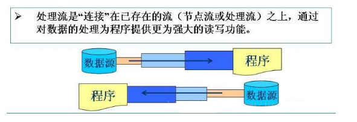

> https://www.cnblogs.com/Evsward/archive/2017/12/04/io.html
> http://www.importnew.com/28021.html

*
    

* 字节流和字符流

    io默认都是直接操作字节的，多用于读取或书写二进制数据，这些类的基类为InputStream或OutputStream。而字符流操作的是为了支持Unicode编码，用于字符国际化，一个字符占用两个字节，这些类的基类为Reader或Writer。java的io在jdk1.1以后添加了字符流的支持，为我们直接操作字符流提供了方便。

* IO

    根据数据的流向，流分为输入流和输出流，这里指的都是内存，内存输入为读，输出为写，I读O写。

* java的IO包大量应用了装饰者模式

* 流的分类

    - 按数据流的方向不同：输入流，输出流。

    - 按处理数据单位不同：字节流，字符流。 

        (1) 字节流：数据流中最小的数据单元是字节。 

        (2)字符流：数据流中最小的数据单元是字符， Java中的字符是Unicode编码，一个字符占用两个字节。

    - 按功能不同：节点流，处理流。 

        (1)程序用于直接操作目标设备所对应的类叫节点流。 

        (2)程序通过一个间接流类去调用节点流类，以达到更加灵活方便地读写各种类型的数据，这个间接流类就是处理流。


* 节点流

    

    |  | 处理类型 | 字符流 | 字节流 | 说明 |
    | ------ | ------ | ------ | ------ | ------ |
    | 文件 | File | FileReader <br> FileWriter | FileInputStream <br> fileOutputStream | 对文件进行读写操作 |
    | 内存(数组) | Memory Array | CharArrayReader <br> CharArrayWriter | ByteArrayInputStream <br> ByteArrayOutputStream | 从/向内存数组读写数据  |
    | 内存(字符串) | Memory String | StringWriter <br> StringReader | --- | 从/向内存字符串读写数据 |
    | 管道 | Pipe | PipedReader <br> PipedWriter | PipedInputStream <br> PipedOutputStream | 实现管道的输入和输出(进程间通信)  |


* 处理流

    

    |  | 处理类型 | 字符流 | 字节流 | 说明 |
    | ------ | ------ | ------ | ------ | ------ |
    | 缓冲区 | Buffering | BufferedReader <br> BufferedWriter | BufferedInputStream <br> BufferedOutputStream | 将流放在缓冲区内操作 |
    | 过滤流 | Filtering | FilterReader <br> FilterWriter | FilterInputStream <br> FilterOutputStream | 抽象类，作为“装饰器”的接口，其中，“装饰器”为其他输入输出字符字节类提供有用功能 |
    | 转换流 | coverting between <br> bytes and character | InputStreamReader <br> OutputStreamWriter | --- | 处理字符流的抽象类 <br> InputStreamReader 是字节流通向字符流的桥梁,它将字节流转换为字符流. <br> OutputStreamWriter是字符流通向字节流的桥梁，它将字符流转换为字节流. |
    | 对象流 | object Serialization | --- | ObjectInputStream <br> ObjectOutputStream | 序列化 |
    | 基本类型 | Data conversion | --- | DataInputStream <br> DataOutputStream | 可传输基本类型数据 |
    | 行号推入流 | Counting | LineNumberReader | --- | 可得到一个携带行号的字符读入流 |
    | 推回输入流 | Peeking ahead | PushbackReader | PushbackInputStream | 可将输入流push back或unread一个字节 |
    | 合并流 | Sequence | --- | SequenceInputStream | 可逻辑串联其他输入流 |
    | 打印流 | Printing | PrintWriter | PrintStream | 包含print和println的输出流 |

    * 注意

        - 默认都是操作字节，所有操作字符的类都需要先经过转化流将字节流转为字符流再使用。
        - LineNumberInputStream已过时，因为它是基于字节输入流的，而错误假定字节能充分表示字符，现已被LineNumberReader取代。
        - StringBufferInputStream已过时，因为此类未能正确地将字符转换为字节，现已被StringReader取代。


    * java io 转化流的适配器模式

        我们知道在字符流处理类加入java io类库之前，所有的类都是面向字节流的，在jdk1.1以后，添加了字符流的支持，根据“开闭原则”，所以在不改变原有类的基础上，有了转化流：InputStreamReader和OutputStreamWriter，这两个类正是所谓的“适配器类”，InputStreamReader可以吧InputStream转换为Reader，而OutputStreamWriter可以将OutputStream转换为Writer。字节流和字符流都有各自独立的一整套继承层次结构，而通过适配器类，可以在不改变原有类的前提下有效将他们结合起来。

    * java io 装饰器模式的研究：

        Java I/O类库需要多种不同功能的组合，存在filter类的原因就是抽象类filter是所有装饰器类的基类，装饰器必须具有和它所装饰对象相同的接口。FilterInputStream和FilterOutputStream是用来提供装饰器类接口以控制特定输入流(InputStream)和输出流(OutputStream)的两个类，他们的名字并不是很直观，包括DataInput/OutputStream, BufferedInput/OutputStream,LineNumberInputStream, PushbackInputStream,PrintStream等，这些过滤流类在下面都会有详细介绍。FilterInputStream和FilterOutputStream分别自I/O类库中的基类InputStream和OutputStream派生而立，这两个类是装饰器的必要条件(以便能为所有正在被修饰的对象提供通用接口)。

* 源码

    * InputStream

        InputStream是输入字节流部分，装饰器模式的顶层类，重要规定了输入字节流的公共方法

        ```
        int read()                              //从输入流读取数据的下一字节
        int read(byte[] b)                      //从输入流读取b.length的字节
        int read(byte[] b, int off, int len)    //从输入流读取字节到b[off]~b[len-off]
        int available()                         //返回能从输入流读取的字节数的估计
        void close()                            //关闭输入流并释放它所占取的系统资源
        long skip(long n)                       //跳过或丢弃输入流的n个字节
        boolean markSupported()                 //测试这个输入流是否支持mark()和reset()
        void mark(int readlimit)                //标记这个输入流的当前位置
        void reset()                            //最后一次调用这个输入流上的mark方法时的初始位置
        ```

        ```
        package java.io;

        public abstract class InputStream implements Closeable {

            private static final int SKIP_BUFFER_SIZE = 2048;  //用于skip方法，和skipBuffer相关

            private static byte[] skipBuffer;    // skipBuffer is initialized in skip(long), if needed.

            /**
            * 从输入流中读取下一个字节，
            * 正常返回0-255，到达文件的末尾返回-1
            * 在流中还有数据，但是没有读到时该方法会阻塞(block)
            * Java IO和New IO的区别就是阻塞流和非阻塞流
            * 抽象方法！不同的子类会有不同的实现！
            */
            public abstract int read() throws IOException;      

            /**
            * 将流中的数据读入放在byte数组的第off个位置先后的len个位置中
            * 放回值为放入字节的个数。
            */ 
            public int read(byte b[], int off, int len) throws IOException {         
                if (b == null) {                       //检查输入是否正常。一般情况下，检查输入是方法设计的第一步
                    throw new NullPointerException();
                } else if (off < 0 || len < 0 || len > b.length - off) {
                    throw new IndexOutOfBoundsException();
                } else if (len == 0) {
                    return 0;
                }  
                int c = read();                         //读取下一个字节
                if (c == -1) {    return -1;   }        //到达文件的末端返回-1
                b[off] = (byte)c;                       //放回的字节downcast
                int i = 1;                              //已经读取了一个字节
                try {                                   //int i 在循环外申明，扩大作用域
                    for (; i < len ; i++) {             //最多读取len个字节，所以要循环len次
                        c = read();                     //每次循环从流中读取一个字节。由于read方法阻塞，所以read(byte[],int,int)也会阻塞
                        if (c == -1) {  break;  }       //到达末尾，返回-1
                        b[off + i] = (byte)c;           //读到就放入byte数组中
                    }
                } catch (IOException ee) {     }
                return i;
            } 

            public int read(byte b[]) throws IOException {
                return read(b, 0, b.length);
            }

            public long skip(long n) throws IOException {
                long remaining = n;                                  //方法内部使用的、表示要跳过的字节数目，
            
                int nr;
                if (skipBuffer == null)
                    skipBuffer = new byte[SKIP_BUFFER_SIZE];         //初始化一个跳转的缓存
                byte[] localSkipBuffer = skipBuffer;                 //本地化的跳转缓存
                if (n <= 0) {    return 0;      }                    //检查输入参数
                while (remaining > 0) {                              //一共要跳过n个，每次跳过部分，循环
                    nr = read(localSkipBuffer, 0, (int) Math.min(SKIP_BUFFER_SIZE, remaining));
                                                                    //利用上面的read(byte[],int,int)方法，读取n个字节  
                    if (nr < 0) {  break;    }                       //读到流的末端，则返回
                    remaining -= nr;                                 //没有完全读到需要的，则继续循环
                }       
                return n - remaining;                                //返回时要么全部读完，要么因为到达文件末端，读取了部分
            }

            public int available() throws IOException {             //查询流中还有多少可以读取的字节
                return 0;
            }

            public void close() throws IOException {}               //关闭当前流、同时释放与此流相关的资源
                    
            public synchronized void mark(int readlimit) {}         //在当前位置对流进行标记，必要的时候可以使用reset方法返回。

            public synchronized void reset() throws IOException {   //对mark过的流进行复位。只有当流支持mark时才可以使用此方法。
                throw new IOException("mark/reset not supported");
            }

            public boolean markSupported() {                        //查询是否支持mark.绝大部分不支持，因此提供默认实现，返回false。子类有需要可以覆盖。
                return false;
            }                 
        }

        ```

    * FilterInputStream

        是字节输入流部分装饰器模式的核心。是我们在装饰器模式中的Decorator对象，主要完成对其它流装饰的基本功能。

    
