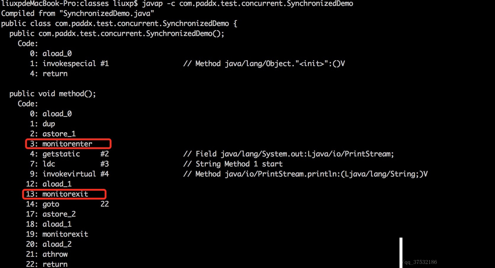

#### 三个并发编程概念

- 原子性问题
  - 原子是世界上的最小单位，具有不可分割性
  - 一个操作是原子操作，那么我们称它具有原子性。

即一个操作或者多个操作 要么全部执行并且执行的过程不会被任何因素打断，要么就都不执行。

- 可见性问题

指当多个线程访问同一个变量时，一个线程修改了这个变量的值，其他线程能够立即看得到修改的值。

- 有序性问题

即程序执行的顺序按照代码的先后顺序执行。

#### 缓存一致性

解决缓存不一致的问题：

1. 通过在总线加 LOCK#锁的方式

   因为 CPU 和其他部件进行通信都是通过总线来进行的，如果对总线加 LOCK#锁的话，也就是说阻塞了其他 CPU 对其他部件访问(如内存)，从而使得只能有一个 CPU 能使用这个变量的内存。

2. 通过缓存一致性协议

   最出名的就是 Intel 的 MESI 协议，MESI 协议保证了每个缓存中使用的共享变量的副本是一致的。它核心的思想是：当 CPU 写数据时，如果发现操作的变量是共享变量，即在其他 CPU 中也存在该变量的副本，会发出信号通知其他 CPU 将该变量的缓存行置为无效状态，因此当其他 CPU 需要读取这个变量时，发现自己缓存中缓存该变量的缓存行是无效的，那么它就会从内存重新读取。

#### 锁相关概念

- 可重入锁

  如果锁具备可重入性，则称作为可重入锁。像 synchronized 和 ReentrantLock 都是可重入锁，可重入性在我看来实际上表明了锁的分配机制：基于线程的分配，而不是基于方法调用的分配。举个简单的例子，当一个线程执行到某个 synchronized 方法时，比如说 method1，而在 method1 中会调用另外一个 synchronized 方法 method2，此时线程不必重新去申请锁，而是可以直接执行方法 method2。

  ```
  public MyClass{
      public synchronized void method1(){
          method2();
      }
      public synchronized void method2(){

      }
  }
  ```

  机制：每个锁都关联一个请求计数器和一个占有他的线程，当请求计数器为 0 时，这个锁可以被认为是 unhled 的，当一个线程请求一个 unheld 的锁时，JVM 记录锁的拥有者，并把锁的请求计数加 1，如果同一个线程再次请求这个锁时，请求计数器就会增加，当该线程退出 syncronized 块时，计数器减 1，当计数器为 0 时，锁被释放。

- 可中断锁

  可中断锁：顾名思义，就是可以相应中断的锁。

  在 Java 中，synchronized 就不是可中断锁，而 Lock 是可中断锁。

  如果某一线程 A 正在执行锁中的代码，另一线程 B 正在等待获取该锁，可能由于等待时间过长，线程 B 不想等待了，想先处理其他事情，我们可以让它中断自己或者在别的线程中中断它，这种就是可中断锁。

- 公平锁

  公平锁即尽量以请求锁的顺序来获取锁。比如同是有多个线程在等待一个锁，当这个锁被释放时，等待时间最久的线程(最先请求的线程)会获得该所，这种就是公平锁。

  非公平锁即无法保证锁的获取是按照请求锁的顺序进行的。这样就可能导致某个或者一些线程永远获取不到锁。

  在 Java 中，synchronized 就是非公平锁，它无法保证等待的线程获取锁的顺序。

  而对于 ReentrantLock 和 ReentrantReadWriteLock，它默认情况下是非公平锁，但是可以设置为公平锁。

  ```
  ReentrantLock lock = new ReentrantLock(true); \\公平锁
  ```

* 读写锁

  读写锁将对一个资源(比如文件)的访问分成了 2 个锁，一个读锁和一个写锁。

  正因为有了读写锁，才使得多个线程之间的读操作不会发生冲突。

  ReadWriteLock 就是读写锁，它是一个接口，ReentrantReadWriteLock 实现了这个接口。

  可以通过 readLock()获取读锁，通过 writeLock()获取写锁

* 偏向锁

  java 偏向锁(Biased Locking)是 java6 引入的一项多线程优化.它通过消除资源无竞争 q 情况下的同步原语,进一步提高了程序的运行性能.

  偏向锁，顾名思义，它会偏向于第一个访问锁的线程，如果在接下来的运行过程中，该锁没有被其他的线程访问，则持有偏向锁的线程将永远不需要触发同步。

  如果在运行过程中，遇到了其他线程抢占锁，则持有偏向锁的线程会被挂起，JVM 会尝试消除它身上的偏向锁，将锁恢复到标准的轻量级锁。(偏向锁只能在单线程下起作用)

  因此 流程是这样的 偏向锁->轻量级锁->重量级锁

  偏向锁，简单的讲，就是在锁对象的对象头中有个 ThreaddId 字段，这个字段如果是空的，第一次获取锁的时候，就将自身的 ThreadId 写入到锁的 ThreadId 字段内，将锁头内的是否偏向锁的状态位置 1.这样下次获取锁的时候，直接检查 ThreadId 是否和自身线程 Id 一致，如果一致，则认为当前线程已经获取了锁，因此不需再次获取锁，略过了轻量级锁和重量级锁的加锁阶段。提高了效率。

- 乐观锁，悲观锁

  - 乐观锁

    总是认为不会产生兵法问题，每次*读取*数据的时候认为不会有其他线程对数据进行修改，因此不会上锁。

    但是在更新的时候会判断其他线程在这之前有没有对数据进行修改,一般会使用*版本控制机制或 CAS*实现。

    实现：

    - 版本控制机制

      一般是在数据表中加上一个数据版本号字段(version)，表示数据被修改的次数,当数据被修改时，version 值会加 1.

      当线程 A 要更新数据时，读取数据的同时也会读取 version，提交更新时对比 version，若 version 与数据库中 version 相等时进行更新，否则重试更新操作，知道更新成功。(类似锁的自旋)

    - CAS

      即 compare and swap 或者 compare and set,涉及到三个操作数:数据所在的内存值，预期值，新值。

      当需要更新时,判断内存值(公共)与旧的预期值(之前取的值)是否相等,若相等，则没有被其他线程修改过，使用新值进行更新，否则进行重试,一般情况下是一个自旋，即不断的重试。

#### CAS(Compare-and-Swap)

CAS 算法是由硬件直接支持来保证原子性的，有三个操作数：内存位置 V、旧的预期值 A 和新值 B，当且仅当 V 符合预期值 A 时，CAS 用新值 B 原子化地更新 V 的值，否则，它什么都不做。

- CAS 的 ABA 问题

  当然 CAS 也并不完美，它存在"ABA"问题，假若一个变量初次读取是 A，在 compare 阶段依然是 A，但其实可能在此过程中，它先被改为 B，再被改回 A，而 CAS 是无法意识到这个问题的。CAS 只关注了比较前后的值是否改变，而无法清楚在此过程中变量的变更明细，这就是所谓的 ABA 漏洞。

#### volatile 关键字

1. 保证了不同线程对这个变量进行操作时的可见性，即一个线程修改了某个变量的值，这新值对其他线程来说是立即可见的。
2. 禁止进行指令重排序。

但是并不能保证 **原子性**,即：i 用 volatile 修饰,1000 个线程调 i++,结果并不一定 1000.因为自增操作不具备原子性，它包括读取变量的原始值、进行加一操作、写入内存。那么就是说自增操作的三个子操作可能会分割执行。

#### Synchronized

synchronized 是 jvm 层面的锁，是 Java 的内置特性
在 jvm 层面实现对临界资源的互斥访问，不可响应中断
锁的释放有虚拟机完成,不用人工干预。这既是缺点又是优点.优点是不用担心死锁,缺点是有可能获取到锁的线程阻塞之后其他线程会一直等待,性能不高
非公平锁
可重入锁

- 使用

  - 修饰实例方法,对当前实例加锁,进入同步代码前要获得当前实例的锁

    ```
    public synchronized void method(){
        try{
            Thread.sleep();
            System.out.println("synchronized method");
        }catch(InterruptedException e){
            e.printStackTrace();
        }
    }
    ```

  - 修饰静态方法,对当前类加锁,进入同步代码前要获得类对象的锁

    ```
    public static synchronized void method1(){
        try {
            System.out.println("static synchronized method");
            Thread.sleep(3000);
        } catch (InterruptedException e) {
            e.printStackTrace();
        }
    }
    ```

  - 修饰代码块，指定加锁对象，对指定对象加锁，进入同步代码块前要获得指定对象的锁

    ```
    public void method1(){
        try {
            synchronized (this) {
                System.out.println("synchronized block method");
                Thread.sleep(3000);
            }
        } catch (InterruptedException e) {
            e.printStackTrace();
        }
    }
    ```

- 实现原理

  > https://blog.csdn.net/wu1226419614/article/details/73740899

  > https://blog.csdn.net/qq_37532186/article/details/79728231

  > https://blog.csdn.net/javazejian/article/details/72828483

  synchronized 可以保证变量的原子性/可见性/顺序性.并且是一个可重入锁

  - 字节码层面

    synchronized 是基于进入和退出管程(Monitor)对象实现(monitorEntor 和 monitorExit),monitorEnter 指令插入同步代码开始位置，monitorExit 指令插入到同步代码结束位置。任何一个对象都有一个 monitor 与之相关联，当一个线程处于 monitor 之后，它将处于锁定状态

    

  - synchronized 的优化

    synchronized 在 jdk1.6 之前是重量级锁,在 jdk1.6 之后对 synchronized 做了优化，加入了偏向锁、轻量级锁、锁粗化、锁消除、适应性自旋等操作，大大增加了 synchronized 的效率

    - java 对象头

      | 长度     | 内容                   | 说明                         |
      | -------- | ---------------------- | ---------------------------- |
      | 32/64bit | Mark Word              | 存储对象 hashcode 或锁信息等 |
      | 32/64bit | Class Metadata Address | 存储到对象类型数据的指针     |
      | 32/64bit | Array Length           | 数组的长度(如果对象是数组)   |

    - Java 对象头里的 Mark Word 里默认存储对象的 HashCode，分代年龄和锁标记。

      32 位 JVM 的 Mark Word 的默认存储结构如下：

      |          | 25bit           | 4bit         | 1bit(是否偏向锁) | 2bit 锁标记位 |
      | -------- | --------------- | ------------ | ---------------- | ------------- |
      | 无锁状态 | 对象的 hashcode | 对象分代年龄 | 0                | 01            |

    - 运行期间 Mark Word 里的数据随着标志位的变化而变化。Mark Word 可能存储一下四种数据：

      

      当一个线程获取对象并加锁后，标志位从 01 变为 10，其他线程则处于排队状态。

      


    - 偏向锁

      - 目的：为了在无线程竞争情况下，减少不必要的轻量级锁操作.因为轻量级锁的加锁解锁操作需要依赖多次的CAS原子操作。

      - 核心思想： 如果一个线程获取了锁,那么锁就进入偏向模式，此时MarkWordd的结构也变为锁偏向结构,当这个线程再次请求锁时，无需再申请锁.

      - 场景： 无其他线程竞争

      - 加锁流程：
        1.  检测MarkWord是否为可偏向状态,即是否为偏向锁1，锁标志为是否为01
        2.  若为可偏向锁，则检测线程id是否为当前线程id。
          -  如果是则执行同步代码
          -  如果不是，则通过CAS操作竞争锁
              -  如果竞争成功，则将MarkWord的线程id替换为当前线程ID
              -  如果竞争不成功，则CAS竞争失败，证明当前存在多线程竞争情况，这时候需要锁膨胀为轻量级锁，才能保证线程间公平竞争锁。
      - 解锁

        当有另一个线程来竞争锁的时候，就不能再使用偏向锁了，要膨胀为轻量级锁。

        竞争线程尝试 CAS 更新对象头失败，会等待到全局安全点（此时不会执行任何代码）撤销偏向锁。

      
      

    - 轻量级锁

      - 目的： 在多线程竞争的情况下，减少传统的重量级锁使用操作系统互斥量产生的性能消耗

      - 场景： 线程交替执行同步块的场合

      - 加锁流程：
        1.  判断当前对象是否处于无锁状态(hashcode,o,01)
            - 如果是，JVM将在当前线程的栈帧中建立一个名为锁记录(Lock Record)的空间，用于存储当前锁对象markword的拷贝(Displaced Mark Word)
            - 如果不是，执行步骤3
        2.  JVM利用CAS操作尝试将对象的Mark Word更新为指向锁记录(Lock Record)的指针,
            - 如果成功，则表示竞争到锁,更新锁标志位为00(轻量级锁),执行同步操作
            - 如果失败，则进行步骤3
        3.  判断当前对象的Mark Word是否指向当前线程的栈帧,
            - 如果是，则表示当前线程已经持有当前对象的锁,直接进行同步代码
            - 否则说明对象是被其他线程所抢占,这是轻量级锁需要膨胀为重量级锁,锁标志位变为10,后面等待的线程将进入阻塞状态。

      - 解锁

        用CAS操作锁置为无锁状态（偏向锁位为”0”，锁标识位为”01”），若CAS操作失败则是出现了竞争，锁已膨胀为重量级锁了，此时需要释放锁（持有重量级锁线程的指针位为”0”，锁标识位为”10”）并唤醒重量锁的线程。

      

    - 自旋锁(自适应锁)

      轻量级锁失败后，虚拟机为了避免线程真实地在操作系统层面挂起，还会进行一项称为自旋锁的优化手段。这是基于在大多数情况下，线程持有锁的时间都不会太长，如果直接挂起操作系统层面的线程可能会得不偿失，毕竟操作系统实现线程之间的切换时需要从用户态转换到核心态，这个状态之间的转换需要相对比较长的时间，时间成本相对较高，因此自旋锁会假设在不久将来，当前的线程可以获得锁，因此虚拟机会让当前想要获取锁的线程做几个空循环(这也是称为自旋的原因)，一般不会太久，可能是50个循环或100循环，在经过若干次循环后，如果得到锁，就顺利进入临界区。如果还不能获得锁，那就会将线程在操作系统层面挂起，这就是自旋锁的优化方式，这种方式确实也是可以提升效率的。最后没办法也就只能升级为重量级锁了。


    - 重量级锁

      线程阻塞和唤醒都需要CPU从用户态转为核心态.
      让cpu通过操作系统指令,去调度多线程之间,谁执行代码，谁进行阻塞.这样会频繁出现程序运行状态的切换.会大量消耗资源

    - 锁粗化

      锁粗化的概念应该比较好理解，就是将多次连接在一起的加锁、解锁操作合并为一次，将多个连续的锁扩展成一个范围更大的锁。

      ```
      public class StringBufferTest {
          StringBuffer stringBuffer = new StringBuffer();

          public void append(){
              stringBuffer.append("a");
              stringBuffer.append("b");
              stringBuffer.append("c");
          }
      }
      ```

      这里每次调用stringBuffer.append方法都需要加锁和解锁，如果虚拟机检测到有一系列连串的对同一个对象加锁和解锁操作，就会将其合并成一次范围更大的加锁和解锁操作，即在第一次append方法时进行加锁，最后一次append方法结束后进行解锁。

    - 锁消除

      锁消除即删除不必要的加锁操作。根据代码逃逸技术，如果判断到一段代码中，堆上的数据不会逃逸出当前线程，那么可以认为这段代码是线程安全的，不必要加锁。看下面这段程序：

      ```
      public class SynchronizedTest02 {

          public static void main(String[] args) {
              SynchronizedTest02 test02 = new SynchronizedTest02();
              //启动预热
              for (int i = 0; i < 10000; i++) {
                  i++;
              }
              long start = System.currentTimeMillis();
              for (int i = 0; i < 100000000; i++) {
                  test02.append("abc", "def");
              }
              System.out.println("Time=" + (System.currentTimeMillis() - start));
          }

          public void append(String str1, String str2) {
              StringBuffer sb = new StringBuffer();
              sb.append(str1).append(str2);
          }
      }
      ```

      虽然StringBuffer的append是一个同步方法，但是这段程序中的StringBuffer属于一个局部变量，并且不会从该方法中逃逸出去，所以其实这过程是线程安全的，可以将锁消除

    - 对比

      |   锁   | 优点          | 缺点       | 场景 |
      | -------- | --------------- | ------------ | ---------------- |
      | <br>偏向锁<br><br> | 加锁和解锁不需要额外的x消耗,和非同步方法相比仅存在纳秒级的差距 | 如果线程间存在锁竞争，会增加额外的锁撤销消耗 | 只有一个线程访问同步块的场景  |
      | <br>轻量级锁<br><br> | 竞争的线程不用阻塞，提高了程序的响应速度 | 如果始终得不到锁竞争的线程会进入自旋消耗CPU | 追求响应速度,同步快执行速度非常快  |
      | <br>重量级锁<br><br> | 线程竞争不使用自旋，不消耗CPU | 线程阻塞，响应时间缓慢 | 追求吞吐量，同步块执行速度较长  |

#### Lock

> https://www.cnblogs.com/aishangJava/p/6555291.html

#### Synchronized 与 ReenTrantLock

两者较大的区别是，synchronized 是 JVM 层面的锁;而 ReenTrantLock 是 jdk 提供的 API 层面的互斥锁，需要 lock()和 unlock()方法配合 try/finally 语句块来完成。

1. Synchronized

   Synchronized 通过编译，会在同步块的前后分别形成 monitorenter 和 monitorexit 这两个字节码指令。执行 monitorenter 指令时，首先要尝试获取对象锁。如果这个对象没被锁定，或者当前线程已经拥有了那个对象锁，把锁的计算器加一，相应的，在执行 monitorexit 指令时会将锁计算器减一，当计算器为零时，所就释放了。


    每个对象有一个监视器锁(monitor)。当monitor被占用时就会处于锁定状态，线程执行monitorenter指令时尝试获取monitor的所有权，过程如下：
    *    1. 如果monitor的进入数为0，则该线程进入monitor，然后将进入数设置为1，该线程即为monitor的所有者。
    *    2. 如果线程已经占有该monitor，只是重新进入，则进入monitor的进入数加1.
    *    3. ’如果其他线程已经占用了monitor，则该线程进入阻塞状态，直到monitor的进入数为0，再重新尝试获取monitor的所有权。

    **synchronized锁住的是代码还是对象？**

        synchronized锁住的是对象，同一个对象中的方法在此访问时，并不会申请锁，而是计数加一，所以synchronized是可重入锁。

2. ReentrantLock

   ReentrantLock 是 java.util.concurrent 包下提供的一套互斥锁，相比 Synchronized，ReentrantLock 类提供了一些高级功能，主要有以下 3 项：

   - 1. 等待可中断，持有锁的线程长期不释放的时候，正在等待的线程可以选择放弃等待，这相当于 Synchronized 来说可以避免出现死锁的情况。
   - 2. 公平锁，多个线程等待同一个锁时，必须按照申请锁的时间顺序获得锁，Synchronized 锁非公平锁，ReentrantLock 默认的构造函数是创建的非公平锁，可以通过参数 true 设为公平锁，但公平锁表现的性能不是很好。
   - 3. 锁绑定多个条件，一个 ReentrantLock 对象可以同时绑定对个对象。
   - 4. 常见 api
        <br>isFair() //判断锁是否是公平锁
        　　 <br>isLocked() //判断锁是否被任何线程获取了
        　　 <br>isHeldByCurrentThread() //判断锁是否被当前线程获取了
        　　 <br>hasQueuedThreads() //判断是否有线程在等待该锁


    ```
    private Lock lock=new ReentrantLock();
    public void run() {
        lock.lock();
        try{
            for(int i=0;i<5;i++)
                System.out.println(Thread.currentThread().getName()+":"+i);
        }finally{
            lock.unlock();
        }
    }
    ```

#### Java 原子类

在 java 1.5 的 java.util.concurrent.atomic 包下提供了一些原子操作类，即对基本数据类型的 自增(加 1 操作)，自减(减 1 操作)、以及加法操作(加一个数)，减法操作(减一个数)进行了封装，保证这些操作是原子性操作。atomic 是利用 CAS 来实现原子性操作的(Compare And Swap)，CAS 实际上是利用处理器提供的 CMPXCHG 指令实现的，而处理器执行 CMPXCHG 指令是一个原子性操作。

    AtomicBoolean
    AtomicInteger
    AtomicIntegerArray
    AtomicIntegerFieldUpdater
    AtomicLong
    AtomicLongArray
    AtomicLongFieldUpdater
    AtomicMarkableReference
    AtomicReference
    AtomicReferenceArray
    AtomicReferenceFieldUpdater
    AtomicStampedReference
    DoubleAccumulator
    DoubleAdder
    LongAccumulator
    LongAdder

- 实现原理

  ```
  /**
      * Atomically increments by one the current value.
      *
      * @return the updated value
      */
      public final int incrementAndGet() {
          for (;;) {
              int current = get();
              int next = current + 1;
              if (compareAndSet(current, next))
                  return next;
          }
      }
  ```

1. 先获取当前的 value 值
2. 对 value 加一
3. 第三步是关键步骤，调用 compareAndSet 方法来来进行原子更新操作，这个方法的语义是：

   (CAS)

   先检查当前 value 是否等于 current，如果相等，则意味着 value 没被其他线程修改过，更新并返回 true。如果不相等，compareAndSet 则会返回 false，然后循环继续尝试更新。

#### 线程中断与 synchronized

> https://github.com/duiliuliu/Interview/tree/master/test/src/com/thread/threadInterrupt

> https://blog.csdn.net/javazejian/article/details/72828483#%E7%BA%BF%E7%A8%8B%E4%B8%AD%E6%96%AD%E4%B8%8Esynchronized

#### java 线程通信

> http://www.importnew.com/26850.html

有时候我们需要多个线程协同工作完成某个任务，这时就涉及线程通信了。

    知识点：
    - Thread.join()
    - object.wait()
    - object.notify()
    - FutureTask
    - callable等

- 如何让两个线程一次执行
- 那如何让两个线程按照指定方式有序交叉运行呢
- 让三个线程依次打印自己的 name 十次，如 ABCABCABC...

#### java 线程池

java.util.concurrent.Executors 工厂类可以创建四种类型的线程池，通过 Executors.new\*\*\*方式创建
分别为 newFiexdThreadPool、newCachedThreadPool、newSingleThreadPool、ScheduledThreadPool

- newFixedThreadPool

  ```
  public static ExecutorService newFixedThreadPool(int nThreads){
      return new ThreadPoolExecutor(nThreads, nThreads, 0L, TimeUnit.MILLISECONDS, new LinkedBlockingQueue<Runnable>());
  }
  ```

  创建容量固定的线程池
  阻塞队列采用 LinkedBlockingQueue (poll()、take()),它是一种无界队列
  由于阻塞队列是一个无界队列，因此永远不可能拒绝执行任务
  由于采用无界队列，实际线程数将永远维持在 nThreads,因此 maximumPoolSize 和 KeepAliveTime 将无效

- newCachedThreadPool

  ```
  public static ExecutorService newCachedThreadPool(){
      return new ThreadPoolExecutor(0, Interger.MAX_VALUE, 60L, TimeUnit.SECONDS, new SynchronousQueue<Runnable>());
  }
  ```

  CachedThreadPool 是一种可以无限扩容的线程池
  CachedThreadPool 比较适合执行时间片较小的任务
  KeepAliveTime 为 60，意味着线程空闲时间超过 60 秒就会被杀死
  阻塞队列采用 SynchronousQueue,这种阻塞队列没有存储空间，意味着只要有任务到来，就必须得有一个工作线程进行处理，如果当前没有空闲线程，就新建一个线程

- SingleThreadExecutor

  ```
  public static ExecutorService newSingleExecutor(){
      return new ThreadPoolExecutor(1, 1, 0L, TimeUnit.MILLSECONDS, new LinkedBlockingQueue<Runnable>());
  }
  ```

  SingleThreadExecutor 只会创建一个工作线程来处理任务

- ScheduledThreadPool 接收 ScheduleFutureTask 类型的任务，提交任务的方式有两种
  1. scheduledAtFixedRate
  2. scheduledWithFixedDelay
  - SchduledFutureTask 接收参数：
    time：任务开始时间
    sequenceNumber：任务序号
    period：任务执行的时间间隔
  - 阻塞队列采用 DelayQueue，它是一种无界队列
  - DelayQueue 内部封装了一个 PriorityQueue，它会根据 time 的先后排序，若 time 相同，则根据 sequenceNumber 排序
  - 工作线程执行流程：
    1. 工作线程会从 DelayQueue 中取出已经到期的任务去执行
    2. 执行结束后重新设置任务的到期时间，再次放回 DelayQueue。

#### ThreadLocal

ThreadLocal 是线程的局部变量，是每个线程独有的。

用来应对 为创建代价高昂的对象获取线程安全的方法，比如用来解决 数据库连接、Session 管理等。

这些对象进行不断的创建销毁会对系统造成很大的消耗，而且在多线程情况下，每个线程对比如数据库连接进行加锁会造成很大的执行效率的降低。当 ThreadLoacl 为每个线程维护一个变量副本，即多个线程访问的共享变量的各自的副本，并不会产生线程安全问题，而且因为是自己内存中的变量副本，也不会影响执行性能。

不过，ThreadLoacl 由于在每个线程中都创建了副本，所以要考虑他对资源的消耗，比如内存的占用会比不使用 ThreadLocal 要大

public T get() { }
public void set(T value) { }
public void remove() { }
protected T initialValue() { }

get()方法是用来获取 ThreadLocal 在当前线程中保存的变量副本
set()用来设置当前线程中变量的副本
remove()用来移除当前线程中变量的副本
initialValue()是一个 protected 方法，一般是用来在使用时进行重写的，它是一个延迟加载方法

```
public class ThreadLocal<T> {
     ...
    public void set(T value) {
        Thread t = Thread.currentThread();
        ThreadLocalMap map = getMap(t);
        if (map != null)
            map.set(this, value);
        else
            createMap(t, value);
    }

    ThreadLocalMap getMap(Thread t) {
        return t.threadLocals;
    }

    void createMap(Thread t, T firstValue) {
        t.threadLocals = new ThreadLocalMap(this, firstValue);
    }

        ThreadLocalMap(ThreadLocal<?> firstKey, Object firstValue) {
            table = new Entry[INITIAL_CAPACITY];
            int i = firstKey.threadLocalHashCode & (INITIAL_CAPACITY - 1);
            table[i] = new Entry(firstKey, firstValue);
            size = 1;
            setThreshold(INITIAL_CAPACITY);
        }
  ...
}
```

- ThreadLocal 的 set 方法:
  获取当前线程
  利用当前线程作为句柄，获取一个 ThreadLocalMap 的对象
  如果上述 ThreadLoacalMap 不为空，则设置值；否则，初始化 ThreadLocalMap 并设置值。

在 get 前需要 set，否则 throw nullpointexception;

- 原理：
  Thread 里面有一个 ThreadLoacals 成员变量，是 ThreadLocalMap 类型的，key 为 ThreadLocal 实例对象
  当 ThreadLocal 类 set()时，首先获取当前线程的 ThreadLocalMap 对象(为 null 则初始化一个)，然后以 ThreadLocal 对象为 key，设置 value。get()类似
  ThreadLocal.set() 到线程中的对象是该线程自己使用的对象，其他线程是不需要访问的，也访问不到的。当线程终止后，这些值会作为垃圾回收。

会造成内存泄漏(key 为 null 的 Entry)
threadlocal 里面使用了一个存在弱引用的 map,当释放掉 threadlocal 的强引用以后,map 里面的 value 却没有被回收.而这块 value 永远不会被访问到了. 所以存在着内存泄露. 最好的做法是将调用 threadlocal 的 remove 方法.

#### 例题

- 并行计算

  并行计算的方法：

  - 将数据拆分到节点上 如何拆分？
  - 每个节点并行的计算出结果 什么结果？
  - 将结果汇总 如何汇总？


    - 归并排序
        - 将数据分为左右俩半，分别进行归并排序，再把两个有序数据归并
        - 如何归并：

            [1,3,6,7], [1,2,3,5]

            分别保留两个指针，分别指向两个数组的最小元素，然后进行比较，选择较小的元素移除数组。

            当数据值一样时，我们选择左边的指针指向的数据作为较小数据移除数组，这样就是稳定的排序。

            [1,3,6,7], [1,2,3,5]  --  > 1
            [3,6,7], [1,2,3,5]  --  > 1
            [3,6,7], [2,3,5]  --  > 1
            [3,6,7], [3,5]  --  > 2
            [6,7], [3,5]  --  > 3
            ...
        - k路归并

            如何排序10G个元素，得到top10

            我们的电脑内存无法一次性对10g的数据进行排序，所以我们可以将部分排序分发到外面，进行外部排序。对结果进行汇总，然后归并。

            

            我们可以看到有k个数列的第一个元素进行比较，所以我们每次要比较k次。
            k个元素比较k次的话就是o(n^2)了。

            此时我们可以大根堆，建立堆需要o(n),第一次调整堆，进行排序需要(o(nlogn),调整一次lgn，n-1次为nlogn)，而在之后每得到一个top，数列中去掉一个最大值，重新加入一个数，进行调整只需要lgn，取出最大值lgn，这样在之后的时间复杂度就达到了lgn。
