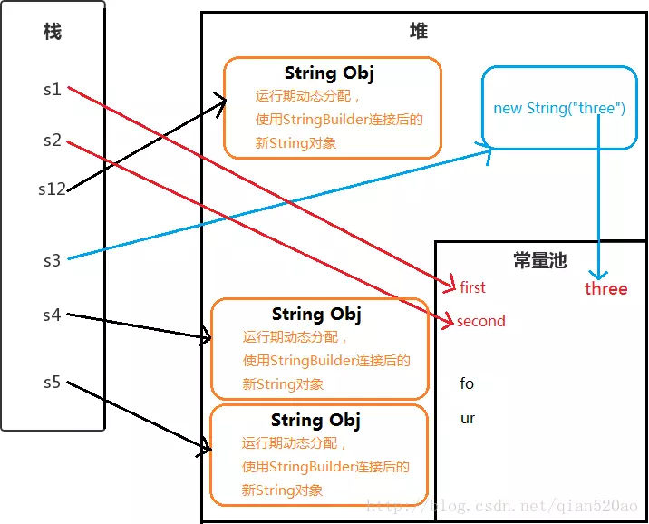

#### 类加载

> https://www.cnblogs.com/ITtangtang/p/3978102.html

Class 文件由类装载器装载后，在 JVM 中将形成一份描述 Class 结构的元信息对象，通过该元信息对象可以获知 Class 的结构信息：如构造函数，属性和方法等，Java 允许用户借由这个 Class 相关的元信息对象间接调用 Class 对象的功能。

虚拟机把描述类的数据从 class 文件加载到内存，并对数据进行校验，转换解析和初始化，最终形成可以被虚拟机直接使用的 Java 类型，这就是虚拟机的类加载机制。

- 步骤：

  

  某些情况中，解析阶段可以再初始化阶段之后在开始，这是为了支持 java 语言的运行时绑定(也称为动态绑定或晚期绑定)。

  1.  装载：查找和导入 Class 文件

      - 通过一个类的全限定名来获取定义此类的二进制字节流
      - 将这个字节流所代表的静态存储结构转化为方法区的运行时数据结构
      - 在 java 堆中生成一个代表这个类的 java.lang.Class 对象,作为方法区这些数据的访问入口。

  2.  链接：把类的二进制数据合并到 JRE 中

      (a)校验：检查载入 Class 文件数据的正确性

      (b)准备：给类的静态变量分配存储空间

          准备阶段是正式为类变量分配并设置类变量初始值的阶段，这些内存都将在方法区中进行分配

          这时候进行内存分配的仅包括类变量(被static修饰的变量),而不包括实例变量,实例变量将会在对象实例化时随着对象一起分配在Java堆中;这里所说的初始值"通常情况"是数据类型的零值，假如:

           public static int value = 123;

           value在准备阶段过后的初始值为0而不是123,而把value赋值的putstatic指令将在初始化阶段才会被执行

      (c)解析：将符号引用转成直接引用

          > https://blog.csdn.net/qq_34402394/article/details/72793119

          **待完善**

          - 符号引用
          - 直接引用

  3.  初始化：对类的静态变量，静态代码块执行初始化操作

- 类的初始化

  > <https://blog.csdn.net/justloveyou_/article/details/72466105>
 > <https://blog.csdn.net/justloveyou_/article/details/72217806>
 > <https://blog.csdn.net/justloveyou_/article/details/72466416>

  - 类的实例化是指创建一个类的实例(对象)的过程

  - 类的初始化是指为类中各个类成员(被 static 修饰的成员变量)赋初始值的过程，是类生命周期中的一个阶段。

  对于虚拟机初始化一个类，在虚拟机规范中指明有五种情况需立即对类进行初始化(发生在加载、验证、准备之后):

  1. 遇到 new、getstatic、putstatic 或 invokestatic、这四条字节码(注意：newarray 指令只是数组类型本身的初始化，而不会导致其相关类型的初始化。比如：new String[]只会直接触发 String[]类的初始化，也就是触发对类[Ljava.lang.String 的初始化，而不会导致触发 String 类的初始化)时，如果类没有初始化，则需要先对其初始化。生成这四条指令最常见的 java 代码场景是：

     - 使用 new 关键字实例化对象的时候
     - 读取或设置一个类的静态字段(被 final 修饰，编译器已把结果放入常量池的静态字段除外)的时候
     - 调用一个类的静态方法的时候

  2. 使用 java.lang.reflect 包的方法对类进行反射调用的时候，如果类没有进行过初始化，则进行初始化类

  3. 当初始化一个类时，如果发现其父类还未初始化过，则需要先触发其父类的初始化

  4. 当虚拟机启动时，用户需要指定一个需要运行的主类(包含 main()方法的那个类)，虚拟机会先初始化这个类

  5. 当使用 jdk1.7 动态语言支持时，如果一个 java.lang.invoke.MethodHandle 实例最后的解析结果 REF_getstatic,REF_putstatic,REF_invokeStatic 的方法句柄，并且这个方法句柄所对应的类没有进行初始化，则需要先出触发其初始化。


            JVM初始化步骤
            1、假如这个类还没有被加载和连接，则程序先加载并连接该类
            2、假如该类的直接父类还没有被初始化，则先初始化其直接父类
            3、假如类中有初始化语句，则系统依次执行这些初始化语句

            类初始化时机：只有当对类的主动使用的时候才会导致类的初始化，类的主动使用包括以下六种：
            – 创建类的实例，也就是 new 的方式
            – 访问某个类或接口的静态变量，或者对该静态变量赋值
            – 调用类的静态方法
            – 反射（如 Class.forName("com.shengsiyuan.Test")）
            – 初始化某个类的子类，则其父类也会被初始化
            – Java 虚拟机启动时被标明为启动类的类（Java Test），直接使用 java.exe 命令来运行某个主类

- 注意，对于这五种会触发类进行初始化的场景，虚拟机规范中使用了一个很强烈的限定语："有且只有"，这五种场景中的行为称为对一个类进行*主动引用*。除此之外，所有引用类的方式，都不会触发初始化，称为*被动引用*
- 被动引用的几种经典场景

  > https://github.com/duiliuliu/Interview/tree/master/test/src/com/javaBasic/classInitial

  - 通过子类引用父类的静态字段

    ```
    // PassiveReferenceParent
    public class PassiveReferenceParent {
        static {
            System.out.println("This is static block in the PassiveReferenceParent Class .");
        }
    }

    // PassiveReferenceSon_1
    public class PassiveReferenceSon_1 extends PassiveReferenceParent {
        static {
            System.out.println("This is static block in the PassiveReferenceSon_1 Class .");
        }

        public static String value = "PassiveReferenceSon_1_static_feild value";

        public PassiveReferenceSon_1() {
            System.out.println("PassiveReferenceSon_1 class init!");
        }
    }

    // PassiveReferenceSon_2
    public class PassiveReferenceSon_2 extends PassiveReferenceSon_1 {
        static {
            System.out.println("This is static block in the PassiveReferenceSon_2 Class .");
        }

        public PassiveReferenceSon_2() {
            System.out.println("PassiveReferenceSon_2 class init!");
        }
    }

    public static void main(String[] args) {
        System.out.println(PassiveReferenceSon_2.value);
    }

    // output:
      This is static block in the PassiveReferenceParent Class .
      This is static block in the PassiveReferenceSon_1 Class .
      PassiveReferenceSon_1_static_feild value
    ```

    对于静态字段，只有直接定义这个字段的类才会被初始化，因此通过其子类来引用父类中定义的静态字段，只会触发父类的初始化而不会触发子类的初始化。在本例中，由于 value 字段是在类 PassiveReferenceSon_1 中定义的，因此该类会被初始化；此外，在初始化类 PassiveReferenceSon_1 时，虚拟机会发现其父类 PassiveReferenceParent 还未被初始化，因此虚拟机将先初始化父类 PassiveReferenceParent PassiveReferenceSon_1，而 PassiveReferenceSon_2 始终不会被初始化。

  - 通过数组定义来引用类，不会触发此类的初始化

    ```
    PassiveReferenceSon_1[] passiveReferenceSons_1 = new PassiveReferenceSon_1[10];
    ```

    上述案例运行之后并没有任何输出，说明虚拟机并没有初始化类 PassiveReferenceSon_1[com.javaBasic.classInitial.PassiveReference.PassiveReferenceSon_1 的类的初始化。从类名称我们可以看出，这个类代表了元素类型为 PassiveReferenceSon_1 的一维数组，它是由虚拟机自动生成的，直接继承于 Object 的子类，创建动作由字节码指令 newarray 触发。

  - 常量在编译阶段会存入调用类的常量池中，本质上并没有直接引用到定义常量的类，因此不会触发定义常量的类的初始化

    ```
    System.out.println(PassiveReferenceParent.CONSTANT);
    // output:
    hello world
    ```

    述代码运行之后，只输出 "hello world"，这是因为虽然在 Java 源码中引用了 PassiveReferenceParent 类中的常量 CONSTANT，但是编译阶段将此常量的值"hello world"存储到了 NotInitialization 常量池中，对常量 PassiveReferenceParent.CONSTANT 的引用实际都被转化为 NotInitialization 类对自身常量池的引用了。也就是说，实际上 NotInitialization 的 Class 文件之中并没有 PassiveReferenceParent 类的符号引用入口，这两个类在编译为 Class 文件之后就不存在关系了。

- 类加载机制

  - 双亲委派模型：
    双亲委派模型的工作流程是：如果一个类加载器收到了类加载的请求，它首先不会自己去尝试加载这个类，而是把请求委托给父加载器去完成，依次向上，因此，所有的类加载请求最终都应该被传递到顶层的启动类加载器中，只有当父加载器在它的搜索范围中没有找到所需的类时，即无法完成该加载，子加载器才会尝试自己去加载该类。

  双亲委派机制:
  1、当 AppClassLoader 加载一个 class 时，它首先不会自己去尝试加载这个类，而是把类加载请求委派给父类加载器 ExtClassLoader 去完成。
  2、当 ExtClassLoader 加载一个 class 时，它首先也不会自己去尝试加载这个类，而是把类加载请求委派给 BootStrapClassLoader 去完成。
  3、如果 BootStrapClassLoader 加载失败（例如在$JAVA_HOME/jre/lib 里未查找到该 class），会使用 ExtClassLoader 来尝试加载；
  4、若 ExtClassLoader 也加载失败，则会使用 AppClassLoader 来加载，如果 AppClassLoader 也加载失败，则会报出异常 ClassNotFoundException。

- 类的实例化

  **待完善**

- 练习

  **java new 一个对象后创建了几个对象**

  - java String s = new String("abc")对象后创建了几个对象

    > https://juejin.im/entry/5a4ed02a51882573541c29d5

    创建了两个对象，一个对象时字符串‘abc’在常量池中，第二个对象是 Java heap 中的 String 对象

    使用 " " 双引号创建 ： String s1 = "first";
    使用字符串连接符拼接 ： String s2="se"+"cond";
    使用字符串加引用拼接 ： String s12="first"+s2;
    使用 new String("")创建 ： String s3 = new String("three");
    使用 new String("")拼接 ： String s4 = new String("fo")+"ur";
    使用 new String("")拼接 ： String s5 = new String("fo")+new String("ur");

    

    Java 会确保一个字符串常量只有一个拷贝。

    s1 ： 中的"first" 是字符串常量，在编译期就被确定了，先检查字符串常量池中是否含有"first"字符串,若没有则添加"first"到字符串常量池中，并且直接指向它。所以 s1 直接指向字符串常量池的"first"对象。

    s2 ： "se"和"cond"也都是字符串常量，当一个字符串由多个字符串常量连接而成时，它自己肯定也是字符串常量，所以 s2 也同样在编译期就被解析为一个字符串常量，并且 s2 是常量池中"second"的一个引用。

    s12 ： JVM 对于字符串引用，由于在字符串的"+"连接中，有字符串引用存在，而引用的值在程序编译期是无法确定的，即("first"+s2)无法被编译器优化，只有在程序运行期来动态分配使用 StringBuilder 连接后的新 String 对象赋给 s12。
    (编译器创建一个 StringBuilder 对象，并调用 append()方法，最后调用 toString()创建新 String 对象，以包含修改后的字符串内容)

    s3 ： 用 new String() 创建的字符串不是常量，不能在编译期就确定，所以 new String() 创建的字符串不放入常量池中，它们有自己的地址空间。
    但是"three"字符串常量在编译期也会被加入到字符串常量池（如果不存在的话）

    s4 ： 同样不能在编译期确定，但是"fo"和"ur"这两个字符串常量也会添加到字符串常量池中，并且在堆中创建 String 对象。（字符串常量池并不会存放"four"这个字符串）

    s5 ： 原理同 s4

  - java new 一个对象后，内存中发生了什么

    1. 类加载检查

       虚拟机遇到一条 new 指令时，首先将去检查这个指令的参数是否能在常量池中定位到一个类的符号引用，并且检查这个符号引用所代表的类是否已加载/解析和初始化过。如果没有则进行相应加载解析初始化

    2. 分配内存空间

       类加载检查通过后，jvm 为新生对象分配内存空间，这是对象所需内存大小已经完全确定了

    3. 设置对象基本信息
    4. 程序员意愿的初始化和调用构造函数

**java 创建一个对象有哪几种方法**

#### oom

- 内存溢出 out of memory

程序在申请内存空间时，没有足够的内存空间供其使用，就发生了溢出。如申请一个

- 内存泄漏 memory leak

是指程序在申请内存后，无法释放已申请的内存空间，一次内存泄露危害可以忽略，但内存泄露堆积后果很严重，无论多少内存,迟早会被占光。

- OOM 的可能原因?
  - 数据库的 cursor 没有及时关闭
  - 构造 Adapter 没有使用缓存 contentview
  - RegisterReceiver()与 unRegisterReceiver()成对出现
  - 未关闭 InputStream outputStream
  - Bitmap 使用后未调用 recycle()
  - static 等关键字
  - 非静态内部类持有外部类的引用　 context 泄露

#### 垃圾回收

jvm 内存区域分为方法区，本地方法栈，虚拟机栈，堆，程序计数器

- 方法区

  主要是存储类信息，常量池（static 常量和 static 变量），编译后的代码（字节码）等数据

- 栈 用来存放基本类型数据与对象引用，每个线程会有个私有的栈。
- 堆 用来存放对象
- 分为新生代、年老代，以比例 1：2 划分

  新生代分为 Eden，survival （from+ to）(8:1:1)

  堆里面分为新生代和老生代（java8 取消了永久代，采用了 Metaspace），新生代包含 Eden+Survivor 区，survivor 区里面分为 from 和 to 区，内存回收时，如果用的是复制算法，从 from 复制到 to，当经过一次或者多次 GC 之后，存活下来的对象会被移动到老年区，当 JVM 内存不够用的时候，会触发 Full GC，清理 JVM 老年区

      当新生区满了之后会触发Minor GC,先把存活的对象放到其中一个Survice
      区，然后进行垃圾清理。因为如果仅仅清理需要删除的对象，这样会导致内存碎
      片，因此一般会把Eden 进行完全的清理，然后整理内存。那么下次GC 的时候，
      就会使用下一个Survive，这样循环使用。如果有特别大的对象，新生代放不下，
      就会使用老年代的担保，直接放到老年代里面。因为JVM 认为，一般大对象的存
      活时间一般比较久远。

      所以 Minor GC  新生代，频繁执行;Full GC 很少执行，较慢 system.gc()显式触发 或 老年代空间不足触发

- 垃圾收集主要针对的是堆和方法区进行。
  程序计数器、虚拟机栈、和本地方法都是属于线程私有的，只存在与线程的生命周期内，线程结束后也会消失，所以不需要对这三个区域进行垃圾回收。

  - 垃圾收集算法

  垃圾收集有**根回收算法**与**引用计数算法**。

  - 根回收算法是从跟对象为起点，能够到达的对象都是存活的，不可达的对象可被回收。
  - java 中可以作为 GC Roots 对象包括以下几种：
    - 1.虚拟机栈（栈帧中的本地变量表）中的引用对象。
    - 2.方法区中的类静态属性引用的对象。
    - 3.方法区中的常量引用的对象。
    - 4.本地方法栈中 JNI(也即一般说的 Native 方法)的引用的对象。
  - 引用计数是给对象添加一个引用计数器，当对象增加一个引用时计数器加 1，引用失效时计数器减 1。引用计数不为 0 的对象仍然存活。
    两个对象出现循环引用的情况下，此时引用计数器永远不为 0，导致无法对它们进行回收。

  - Java 语言使用跟搜索算法进行垃圾回收，回收方法有：

    - 标记-清除 将存活的对象标记，清理掉未标记的对象 不足：产生大量不连续内存
    - 标记-整理 将存活的对象移到一端，清理掉边界外的对象
    - 复制 分一半内存，一块内存用满后对此块内存中还存活的对象复制的另一块内存中，然后清理此块内存 不足：只占用了一半的内存
      分代回收
      Young Generation 复制
      Old Generation 标记清除
      Permanent Generation

- 垃圾收集器

  > 多线程/单线程 ： 单线程指垃圾收集器只使用一个线程清理，而多线程使用多个线程 <br>
  > 串行/并行 ： 串行指的是垃圾收集器与用户程序交替执行，意味着执行垃圾收集的时候需要停顿用户程序。并行指的是垃圾收集与用户程序同时执行。除了 CMS 和 G1，其他垃圾收集器使用串行方式。

  - serial 串行 单线程 Client 模式下的默认新生代收集器 优点：简单高效
  - parNew serial 的多线程版本
  - Parallel scavenge 多线程 "吞吐量优先"收集器 这里的吞吐量指 CPU 用于运行用户代码的时间占总时间的比值
  - CMS CMS（Concurrent Mark Sweep），Mark Sweep 指的是标记 - 清除算法
  - serial Old Serial 收集器的老年代版本 Client 模式下的虚拟机使用
  - Parallel Old Parallel Scavenge 收集器的老年代版本
  - G1 一款面向服务端应用的垃圾收集器，在多 CPU 和大内存的场景下有很好的性能

- CMS (Concurrent Mark sweep collector 并发标记清楚收集器)
  主要被用来收集老年代的未被使用的对象(垃圾)，以获取最小停顿时间为目的
  如果需要使用 CMS，需添加命令到 JVM 的命令行中 `-XX:+UseConcMarkSweepGC`

  - 特点：

    - 希望 java 垃圾收集器收集垃圾的时间尽可能的短
    - 应用运行在多 CPU 的机器上，有足够的 CPU 资源
    - 希望应用的响应时间短

  - 流程
    CMS 也是采用分代策略的，用于收集老年代的垃圾对象。过程有 6 个阶段(4 个并发，2 个暂停其他应用程序)

    - 初始标记(CMS-initial-mark)
      - 这个阶段会扫描 root 对象直接关联的可达对象。不过并不会递归的追踪下去，只是到达第一层而已。这个过程会 stop-the-world，但是时间很短
    - 并发标记(CMS-concurrent-mark)
      - 从初次收集到的'根对象'引用开始，遍历所有能被引用的对象
    - 并发预处理()
      - 由当前应用程序产生的对象引用，并递归遍历，更新第二阶段的结果
    - 重新标记
      - 在并发 mark 阶段，应用的线程可能产生新的垃圾，所以需要重新标记，这个阶段也是会 stop-the-world.这一阶段十分重要，因为必须避免收集到仍被引用的对象
    - 并发清理
      - 所有不再被应用的对象将从堆里清除掉
    - 并发重置
      - 收集器做一些收尾的工作，以便下一次 GC 周期能有一个干净的状态

  - 问题

    - 如何确定老年代是活着的
      - 通过 GC ROOT TRACING 可到达的对象就是活着的
    - 是否需要扫描新生代，确定新生代的对象是否活着
      - 必须扫描新生代来确保。这也是为什么 CMS 虽然是老年代的 gc，但仍要扫描新生代的原因。(注意初始标记也会扫描新生代)
    - 全量的扫描新生代和老年代会不会很慢
      - 很慢
    - 如何解决
      - 扫描新生代前先进行一次 Minor GC
    - CMS 有什么问题
      - 并发问题
        并发意味着多线程抢占 CPU 资源。即 GC 线程和用户线程抢占 CPU，造成用户线程执行效率下降
      - 浮动垃圾
        CMS 提供了 CMSInitiatingOccupancyFraction 参数来设置老年代空间使用百分比，达到百分比就进行垃圾回收。这个参数默认是 92%。
        设置太小会导致频繁的 GC
        设置太大会使得用户线程空间过小，可能产生 Concurrent Mode Fail 错误(并发模式失败)
      - 空间碎片

  - MinorGC FullGC
    - http://www.importnew.com/15820.html

#### JVM 调优

- 堆大小设置

  JVM 中最大堆大小有三方面限制：
  相关操作系统的数据模型(32-bit 或 64-bit)限制；
  系统的可用虚拟内存限制
  系统的可用物理内存限制
  如：java -Xmx3550m -Xms3550m -Xmn2g -Xss128k
  -Xmx3550m: 设置最大可用内存为 3550m
  -xms3550m：设置 JVM 初始内存为 3550m。此值可以设置与-Xmx 相同，以避免每次垃圾回收完后 JVM 重新分配内存
  -Xmn2g：设置年轻代大小为 2g。持久代大小一般固定为 64m
  -Xss128k: 设置每个堆栈大小

- 回收器选择
- 辅助信息
