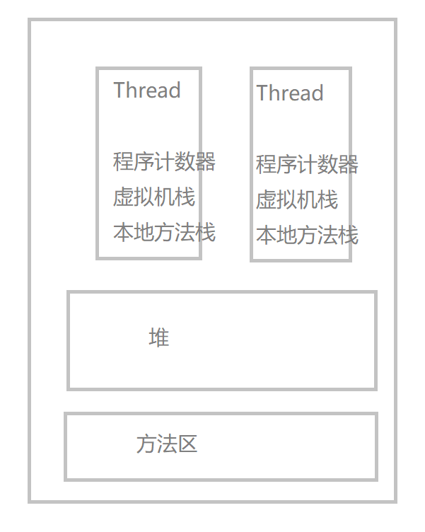

JVM(java virtual machine)是 Java 虚拟机的缩写，是 Java 程序运行的平台

#### 内存模型

JVM 分为方法区，虚拟机栈，本地方法栈，程序计数器，堆。其中，虚拟机栈与本地方法栈，程序计数器是属于线程私有的，只存活于该线程的生命周期内，各个线程共享方法区与堆。

- 程序计数器

  记录正在执行的虚拟即字节码指令的地址

- 虚拟机栈

  即 Java 方法栈。每个方法执行的时候会创建一个存放 局部变量(对象引用)、操作数栈、常量池引用等信息，方法的执行就是虚拟栈中的栈帧出栈、入栈的过程。

  

  可以通过 -Xss 这个虚拟机参数来调整每个线程虚拟机栈的内存大小

  `java -Xss 128k HackTheJava`

  当 Xss 值越大，每个线程虚拟机栈的内存也就越大，线程所占的空间也就越大，系统所容纳的线程就变得越少了。容易出现 OutofMemoryEror(系统内存不足) 错误
  当 Xss 值越小，栈中存储得信息也就越少，容易出现 StackOverflowError(栈溢出) 错误

  StackOverflowError --> 栈内存过小，递归过深
  OutofMemoryError --> 系统空间不足，无法申请到足够的内存

- 本地方法栈

  类似于虚拟机栈，不过是为本地方法(c++)服务的。

- 堆

  大部分对象的存储地，是垃圾收集的主要区域

  主要分为新生代与老年代两大块，其中新生代占堆区域的 1/3.新生代用来存储新建立的对象，年老代存储经过多次垃圾回收后依然存活的对象。

  将堆分块是因为 Java 垃圾收集算法使用的是分代回收，采用分而治之的思想，吧不同生命周期的对象放在不同代上。越是新生的对象它的生命周期也就越短，越是年老的对象，生存能力越强，所以老年代的空间是新生代空间的两倍

  新生代又分为 Eden 区域与两个 survival，空间比例为 8:1:1,同样是因为新生的对象生命周期短，所以 eden 区域较大。两个 survival 是为了方便进行垃圾回收复制算法。

  可以通过 -Xmx 和 -Xms 调整堆内存的大小

  `java -Xmx3550m -Xms3550m`

      -Xmx3550m: 设置最大可用内存为 3550m
      -xms3550m：设置 JVM 初始内存为 3550m。此值可以设置与-Xmx 相同，以避免每次垃圾回收完后 JVM 重新分配内存 FFF

  -XX:NewSize 和-XX:MaxNewSize

      用于设置年轻代的大小，建议设为整个堆大小的 1/3 或者 1/4,两个值设为一样大。

  -XX:SurvivorRatio

      用于设置 Eden 和其中一个 Survivor 的比值，这个值也比较重要。

  -XX:+PrintTenuringDistribution

      这个参数用于显示每次Minor GC时Survivor区中各个年龄段的对象的大小。

  -XX:InitialTenuringThreshol 和-XX:MaxTenuringThreshold

      用于设置晋升到老年代的对象年龄的最小值和最大值，每个对象在坚持过一次Minor GC之后，年龄就加1。

  - 不需要连续内存，可以动态扩展，增加内存失败后 --> OutofMemoryError

- 方法区

  用来存储 已被加载的类信息、常量、静态变量、即时编译后的代码等数据

  垃圾回收时主要是对常量池的回收和对类的卸载

  - 不需要连续内存，可以动态扩展，增加内存失败后 --> OutofMemoryError

#### 垃圾回收

#### 类加载

- 过程
- 加载机制
