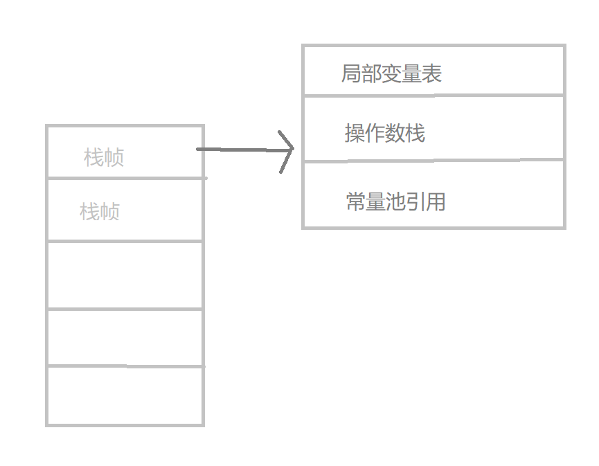
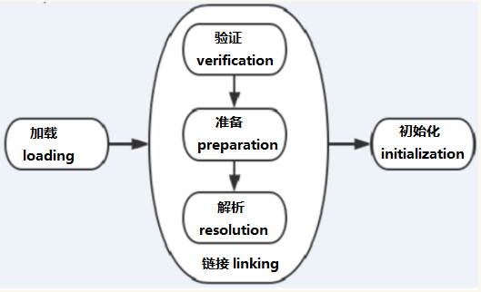

JVM(java virtual machine)是 Java 虚拟机的缩写，是 Java 程序运行的平台

#### 内存模型

JVM 分为方法区，虚拟机栈，本地方法栈，程序计数器，堆。其中，虚拟机栈与本地方法栈，程序计数器是属于线程私有的，只存活于该线程的生命周期内，各个线程共享方法区与堆。

- 程序计数器

  记录正在执行的虚拟即字节码指令的地址

- 虚拟机栈

  即 Java 方法栈。每个方法执行的时候会创建一个存放 局部变量(对象引用)、操作数栈、常量池引用等信息，方法的执行就是虚拟栈中的栈帧出栈、入栈的过程。

  

  可以通过 -Xss 这个虚拟机参数来调整每个线程虚拟机栈的内存大小

  `java -Xss 128k HackTheJava`

  当 Xss 值越大，每个线程虚拟机栈的内存也就越大，线程所占的空间也就越大，系统所容纳的线程就变得越少了。容易出现 OutofMemoryEror(系统内存不足) 错误
  当 Xss 值越小，栈中存储得信息也就越少，容易出现 StackOverflowError(栈溢出) 错误

  StackOverflowError --> 栈内存过小，递归过深
  OutofMemoryError --> 系统空间不足，无法申请到足够的内存

- 本地方法栈

  类似于虚拟机栈，不过是为本地方法(c++)服务的。

- 堆

  大部分对象的存储地，是垃圾收集的主要区域

  主要分为新生代与老年代两大块，其中新生代占堆区域的 1/3.新生代用来存储新建立的对象，年老代存储经过多次垃圾回收后依然存活的对象。

  将堆分块是因为 Java 垃圾收集算法使用的是分代回收，采用分而治之的思想，吧不同生命周期的对象放在不同代上。越是新生的对象它的生命周期也就越短，越是年老的对象，生存能力越强，所以老年代的空间是新生代空间的两倍

  新生代又分为 Eden 区域与两个 survival，空间比例为 8:1:1,同样是因为新生的对象生命周期短，所以 eden 区域较大。两个 survival 是为了方便进行垃圾回收复制算法。

  可以通过 -Xmx 和 -Xms 调整堆内存的大小

  `java -Xmx3550m -Xms3550m`

      -Xmx3550m: 设置最大可用内存为 3550m
      -xms3550m：设置 JVM 初始内存为 3550m。此值可以设置与-Xmx 相同，以避免每次垃圾回收完后 JVM 重新分配内存 FFF

  -XX:NewSize 和-XX:MaxNewSize

      用于设置年轻代的大小，建议设为整个堆大小的 1/3 或者 1/4,两个值设为一样大。

  -XX:SurvivorRatio

      用于设置 Eden 和其中一个 Survivor 的比值，这个值也比较重要。

  -XX:+PrintTenuringDistribution

      这个参数用于显示每次Minor GC时Survivor区中各个年龄段的对象的大小。

  -XX:InitialTenuringThreshol 和-XX:MaxTenuringThreshold

      用于设置晋升到老年代的对象年龄的最小值和最大值，每个对象在坚持过一次Minor GC之后，年龄就加1。

  - 不需要连续内存，可以动态扩展，增加内存失败后 --> OutofMemoryError

- 方法区

  用来存储 已被加载的类信息、常量、静态变量、即时编译后的代码等数据

  垃圾回收时主要是对常量池的回收和对类的卸载

  - 不需要连续内存，可以动态扩展，增加内存失败后 --> OutofMemoryError

#### 垃圾回收

- 垃圾收集算法

  - 可达性分析

    以根对象 GC Roots 为起点，沿着对象引用链搜索，不可达的对象为垃圾对象

    可作为 GC Roots 的对象包括：

    1. 虚拟机栈(栈帧中的本地变量表)中引用的对象
    2. 方法区中的类静态属性引用的对象
    3. 方法区中的常量引用的对象
    4. 本地方法栈中 JNI(即一般说的 Native 方法)引用的对象

  - 引用计数

    在对象头部维持一个计数器，如果一个对象增加了一个引用，则引用计数加一；如果引用关系失效，则引用计数减一；当引用计数为 0 时，说明该对象为垃圾对象，进行回收

    - 引用环：
      如果一个对象 A 持有对象 B，而对象 B 也持有一个对象 A，那发生了类似操作系统中死锁的循环持有，这种情况下 A 与 B 的 counter 恒大于 1，会使得 GC 永远无法回收这两个对象

      python 中引用环解决方法：

      Python 会复制每个对象的引用计数，比如有两个相互引用的对象 a 和 b，此时 a 的引用计数我们用 gc_ref_a 来表示，同理用 gc_ref_b 来表示 b 的引用计数，然后 Python 会遍历所有的引用对象，这里只有 a 和 b，遍历到 a 的时候，a 指向 b，将 b 的 gc_ref_b 的值减 1，同理遍历 b 的时候将 a 的 gc_ref_a 的值减 1，结果他们的值都为 0，最后将不为 0 的对象保留，为 0 的对象进行垃圾回收。

- 垃圾回收算法

  - 标记清除

    将存活的对象标记，清理掉未标记的对象 不足：产生大量不连续内存

  - 标记整理

    将存活的对象移到一端，清理掉边界外的对象

  - 复制

    分一半内存，一块内存用满后对此块内存中还存活的对象复制的另一块内存中，然后清理此块内存 不足：只占用了一半的内存

  - 分代回收

    Young Generation 复制
    Old Generation 标记清除
    Permanent Generation

- 垃圾收集器

  > 多线程/单线程 ： 单线程指垃圾收集器只使用一个线程清理，而多线程使用多个线程  
  > 串行/并行 ： 串行指的是垃圾收集器与用户程序交替执行，意味着执行垃圾收集的时候需要停顿用户程序。并行指的是垃圾收集与用户程序同时执行。除了 CMS 和 G1，其他垃圾收集器使用串行方式。

  - serial 串行 单线程 Client 模式下的默认新生代收集器 优点：简单高效
  - parNew serial 的多线程版本
  - Parallel scavenge 多线程 "吞吐量优先"收集器 这里的吞吐量指 CPU 用于运行用户代码的时间占总时间的比值
  - CMS CMS（Concurrent Mark Sweep），Mark Sweep 指的是标记 - 清除算法
  - serial Old Serial 收集器的老年代版本 Client 模式下的虚拟机使用
  - Parallel Old Parallel Scavenge 收集器的老年代版本
  - G1 一款面向服务端应用的垃圾收集器，在多 CPU 和大内存的场景下有很好的性能

- CMS (Concurrent Mark sweep collector 并发标记清楚收集器)
  主要被用来收集老年代的未被使用的对象(垃圾)，以获取最小停顿时间为目的
  如果需要使用 CMS，需添加命令到 JVM 的命令行中 `-XX:+UseConcMarkSweepGC`

  - 特点：

    - 希望 java 垃圾收集器收集垃圾的时间尽可能的短
    - 应用运行在多 CPU 的机器上，有足够的 CPU 资源
    - 希望应用的响应时间短

  - 流程
    CMS 也是采用分代策略的，用于收集老年代的垃圾对象。过程有 6 个阶段(4 个并发，2 个暂停其他应用程序)

    - 初始标记(CMS-initial-mark)
      - 这个阶段会扫描 root 对象直接关联的可达对象。不过并不会递归的追踪下去，只是到达第一层而已。这个过程会 stop-the-world，但是时间很短
    - 并发标记(CMS-concurrent-mark)
      - 从初次收集到的'根对象'引用开始，遍历所有能被引用的对象
    - 并发预处理()
      - 由当前应用程序产生的对象引用，并递归遍历，更新第二阶段的结果
    - 重新标记
      - 在并发 mark 阶段，应用的线程可能产生新的垃圾，所以需要重新标记，这个阶段也是会 stop-the-world.这一阶段十分重要，因为必须避免收集到仍被引用的对象
    - 并发清理
      - 所有不再被应用的对象将从堆里清除掉
    - 并发重置
      - 收集器做一些收尾的工作，以便下一次 GC 周期能有一个干净的状态

  - 问题

    - 如何确定老年代是活着的
      - 通过 GC ROOT TRACING 可到达的对象就是活着的
    - 是否需要扫描新生代，确定新生代的对象是否活着
      - 必须扫描新生代来确保。这也是为什么 CMS 虽然是老年代的 gc，但仍要扫描新生代的原因。(注意初始标记也会扫描新生代)
    - 全量的扫描新生代和老年代会不会很慢
      - 很慢
    - 如何解决
      - 扫描新生代前先进行一次 Minor GC
    - CMS 有什么问题
      - 并发问题
        并发意味着多线程抢占 CPU 资源。即 GC 线程和用户线程抢占 CPU，造成用户线程执行效率下降
      - 浮动垃圾
        CMS 提供了 CMSInitiatingOccupancyFraction 参数来设置老年代空间使用百分比，达到百分比就进行垃圾回收。这个参数默认是 92%。
        设置太小会导致频繁的 GC
        设置太大会使得用户线程空间过小，可能产生 Concurrent Mode Fail 错误(并发模式失败)
      - 空间碎片

* Minor GC 与 FULL GC

  Minor GC : 发生在新生代的垃圾收集动作，非常频繁

      虚拟机给每一个对象定义一个对象年龄计数器，若对象在 eden 出生并经过第一次 minor gc 后仍然存活，并且能被 survivor 容纳的话，将被移到 survivor 空间中，并且对象年龄设为 1.对象在 survivor 中每熬过一次 minor gc，年龄就+1，当他年龄达到一定程度（默认为 15）， 就会晋升到老年代

  Full GC: 发生在老年代的收集动作

* 对象的分配

  - 大多数情况下，对象在新生代 eden 区中分配，当 eden 区中没有足够的内存空间分配时，虚拟机将发起一次 minorgc
  - 大对象直接进入老年代
  - 长期存活的对象进入老年代
  - 若在 survivor 空间中，相同年龄对象的数量大于 survivor 空间大小的一半，则年龄>=该年龄的对象直接进入老年代

* 空间分配担保

  在发生 minor gc 前，虚拟机会检测老年代最大可用的连续空间是否>新生代 all 对象总空 间，若这个条件成立，那么 minor gc 可以确保是安全的。若不成立，则虚拟机会查看 HandlePromotionFailure 设置值是否允许担保失败。若允许，那么会继续检测老年代最大可 用的连续空间是否>历次晋升到老年代对象的平均大小。若大于，则将尝试进行一次 minor gc，尽管这次 minor gc 是有风险的。若小于或 HandlePromotionFailure 设置不允许冒险，则 这时要改为进行一次 full gc

* 方法区垃圾回收
  垃圾手机主要针对堆与方法区，其中方法区的垃圾回收主要为常量池中垃圾的回收以及类卸载

  - 类卸载的情况：

    - 该类所有的实例已被回收
    - 加载该类的 classloader 已被回收
    - 该类对应的 class 对象没有在任何地方被引用(反射)

    可以通过`-Xnoclassgc`参数控制是否对类进行卸载(关闭)

* 引用类型
  - 强引用 new 一个对象时的引用
  - 软引用 内存不够时会回收，使用 SoftRefreance 创建
  - 弱引用 一定回收，使用 WeakRefrence 创建
  - 虚引用 无意义，主要是回收时会通知系统

#### 类加载

Class 文件有类装载器装载后，在 JVM 中将形成一份描述 Class 结构的元信息对象，通过该元信息对象可以获知 Class 的结构信息：如构造函数，属性和方法等，Java 允许用户借由这个 Class 相关的元信息对象简介调用 Class 对象的功能

虚拟机把描述类的数据从 class 文件加载到内存，并对数据进行校验，转换解析和初始化，最终形成可以被虚拟机直接使用的 Java 类型，这就是虚拟机的类加载机制

- 步骤

  

  1.  装载：查找和导入 Class 文件

  - 通过一个类的全限定名来获取定义此类的二进制字节流
  - 将这个字节流所代表的静态存储结构转化为方法区的运行时数据结构
  - 在 java 堆中生成一个代表这个类的 java.lang.Class 对象,作为方法区这些数据的访问入口。

  2.  链接：把类的二进制数据合并到 JRE 中

  (a)校验：检查载入 Class 文件数据的正确性

  (b)准备：给类的静态变量分配存储空间

        准备阶段是正式为类变量分配并设置类变量初始值的阶段，这些内存都将在方法区中进行分配

        这时候进行内存分配的仅包括类变量(被static修饰的变量),而不包括实例变量,实例变量将会在对象实例化时随着对象一起分配在Java堆中;这里所说的初始值"通常情况"是数据类型的零值，假如:

          public static int value = 123;

          value在准备阶段过后的初始值为0而不是123,而把value赋值的putstatic指令将在初始化阶段才会被执行

  (c)解析：将符号引用转成直接引用

  3. 初始化

- 加载机制
