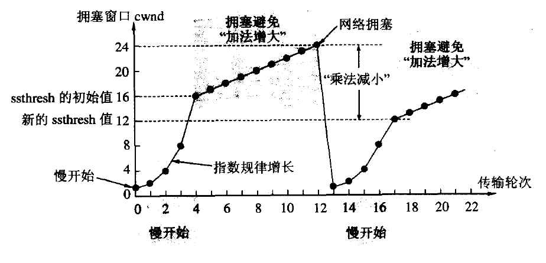

#### osi 七层模型、TCP/IP 模型

- 应用层 HTTP FTP TFTP SMTP SNMP DNS TELNET HTTPS POP3 DHCP
- 表示层

  数据的表示、安全、压缩。（在五层模型里面已经合并到了应用层）

  格式有，JPEG、ASCll、DECOIC、加密格式等

- 会话层

  建立、管理、终止会话。（在五层模型里面已经合并到了应用层）
  对应主机进程，指本地主机与远程主机正在进行的会话

- 传输层
  - 判断数据包的可靠性，错误重传机制，TCP/UDP 协议
  - TCP 协议 基于连接的
- 网络层
  进行逻辑地址寻址，实现不同网络之间的路径选择。
  协议有：ICMP IGMP IP（IPV4 IPV6） ARP RARP
- 数据链路层 节点到节点数据包的传递,并校验数据包的安全性

  建立逻辑连接、进行硬件地址寻址、差错校验 [2] 等功能。（由底层网络定义协议）
  将比特组合成字节进而组合成帧，用 MAC 地址访问介质，错误发现但不能纠正。

- 物理层


#### 网络传输

- 不可靠
  - 丢包、重复包
  - 出错
  - 乱序
- 不安全
  - 中间人攻击
  - 窃取
  - 篡改

#### TCP

TCP(Transmission Control Protocol 传输控制协议)是一种面向连接的、可靠的、基于字节流的传输层通信协议

    - 在数据正确性与合法性上，TCP用一个校验和函数来检验数据是否有错误，在发送和接收时都要计算校验和;同时可以使用md5认证对数据进行加密。
    - 在保证可靠性上，采用超时重传和捎带确认机制。
    - 在流量控制上，采用滑动窗口协议，协议中规定，对于窗口内未经确认的分组需要重传。
    - 在拥塞控制上，采用TCP拥塞控制算法(也称AIMD算法)。该算法主要包括三个主要部分：1)加性增、乘性减;2)慢启动;3)对超时事件做出反应。


    * TCP 是面向连接的传输层协议
    * 每一条 TCP 连接只能有两个端点(endpoint),每一条 TCP 连接只能是点对点的(一对一)
    * TCP 提供可靠交付的服务
    * TCP 提供全双工通信
    * 面向字节流

- 报头

  

  我们来分析分析每部分的含义和作用

  - 源端口号/目的端口号: 各占两个字节，端口是传输层与应用层的服务接口
  - 32 位序号: 占 4 字节，连接中传送的数据流中的每一个字节都编上一个序号。序号字段的值则指的是本报文段所发送的数据的第一个字节的序号。
  - 确认序号: 占 4 字节,是期望收到对方的下一个报文段的数据的第一个字节的序号
  - 4 位首部长度: 表示该 tcp 报头有多少个 4 字节(32 个 bit)
  - 6 位保留: 占 6 位,保留为今后使用,但目前应置为 0
  - 6 位标志位：

    URG: 标识紧急指针是否有效

    ACK: 标识确认序号是否有效 。只有当 ACK=1 时确认号字段才有效.当 ACK=0 时,确认号无效

    PSH: 用来提示接收端应用程序立刻将数据从 tcp 缓冲区读走

    RST: 要求重新建立连接. 我们把含有 RST 标识的报文称为复位报文段

    SYN: 请求建立连接. 我们把含有 SYN 标识的报文称为同步报文段 。　同步 SYN = 1 表示这是一个连接请求或连接接受报文

    FIN: 通知对端, 本端即将关闭. 我们把含有 FIN 标识的报文称为结束报文段。FIN=1 表明此报文段的发送端的数据已发送完毕,并要求释放运输连接

  - 16 位窗口大小:
  - 16 位检验和: 由发送端填充, 检验形式有 CRC 校验等. 如果接收端校验不通过, 则认为数据有问题. 此处的校验和不光包含 TCP 首部, 也包含 TCP 数据部分.
  - 16 位紧急指针: 用来标识哪部分数据是紧急数据.
    选项和数据暂时忽略

- 三次握手

  客户端 CLOSE 状态，服务器 LISTEN(监听)状态<br>
  客户端向服务器主动发出连接请求, 服务器被动接受连接请求

  客户端 -- > 服务端 发送 SYN 包，请求建立连接<br>
  服务端 -- > 客户端 发送 SYN+ACK 包，确认收到连接请求，并回复响应<br>
  客户端 -- > 服务端 发送 ACK 包，确认回复，建立连接

  

  **为什么不用两次?**

      主要是为了防止已经失效的连接请求报文突然又传送到了服务器，从而产生错误。

      如果使用的是两次握手建立连接，那么假设：
          客户端发送的第一个请求在网络中滞留较长时间，由于客户端迟迟没有收到服务端的回应，重新发送请求报文，服务器收到后与客户端建立连接，传输数据，然后关闭连接。此时滞留的那一次请求因为网络通畅了，到达了服务器，这个报文本应是失效的，但是两次握手的机制将会让客户端与服务端再次建立连接，导致不必要的错误和资源浪费。

          如果采用的是三次握手，就算失效的报文传送过来，服务端就收到报文并回复了确认报文，但是客户端不会再次发送确认。由于服务端没有收到确认，就知道客户端没有连接。

  **为什么不用四次？**

        因为三次就足够了，四次就多余了。

- 四次挥手

  客户端和服务器都是处于 ESTABLISHED 状态<br>
  客户端主动断开连接，服务器被动断开连接

  客户端 -- > 服务端 发送 FIN=1(连接释放报文)，并且停止发送数据，进入 FIN-WAIT-1(终止等待 1)状态<br>
  服务端 -- > 客户端 发送确认报文 ACK，并带上自己的序列号 seq=v，进入了 CLOSE-WAIT(关闭等待)状态<br>
  客户端 收到服务器确认，进入 FIN-WAIT-2(终止等待 2)状态，等待服务器发送连接释放报文(在这之前还需要接受服务器发送的最终数据)<br>
  服务端 -- > 向客户端发送连接释放报文，FIN=1，确认序号为 v+1,服务器就进入了 LAST-ACK(最后确认)状态，等待客户端的确认。<br>
  客户端 -- > 收到服务器 FIN，向服务端 发送 ACK 包，等待确认进入 TIME_WAIT 状态,断开连接<br>
  服务器 收到确认,断开连接

  

  **TIME_WAIT 状态相关问题**

      1.  TIME_WAIT 状态是什么？

          简单说：time_wait 状态是四次挥手中 serve 向 clint 发送 FIN 终止连接后进入的状态

  

      2.  为什么会有 TIME_WAIT 状态

          - 可靠的终止 TCP 连接
          - 保证有足够的时间让迟来的报文废弃掉

          time_wait 持续的时间是 2MSL，保证旧的数据能够丢弃。由于网络中的数据最大存在 MSL(maxinum segment lifetime)

      3.  哪一方会有 TIME_WAIT 状态

          time_wait 状态是一般有 client 的状态。

          并且会占用 port
          有时产生在 server 端，由于 server 主动断开连接或者发生异常

      4.  怎样避免 TIME_WAIT 状态占用资源

          如果是 client，我们一般不用操心，由于 client 一般选用暂时 port。再次创建连接会新分配一个 port。

          除非指定 client 使用某 port，只是一般不须要这么做。

          如果是 server 主动关闭连接后异常终止。则由于它总是使用用一个知名 serverport 号，所以连接的 time_wait 状态将导致它不能重新启动。
          我们可以通过 socket 的选项 SO_REUSEADDR 来强制进程马上使用处于 time_wait 状态的连接占用的 port。
          通过 socksetopt 设置后，即使 sock 处于 time_wait 状态，与之绑定的 socket 地址也能够马上被重用。

          此外也能够通过改动内核參数/proc/sys/net/ipv4/tcp_tw/recycle 来高速回收被关闭的 socket,从而使 tcp 连接根本不进入 time_wait 状态，进而同意应用程序马上重用本地的 socket 地址。

  **为什么最后客户端还要等待 2\*MSL 的时间呢?(即 TIME_WAIT 状态)**

        MSL(Maximum Segment Lifetime)，TCP 允许不同的实现可以设置不同的 MSL 值

        1. 保证客户端发送的最后一个 ACK 报文能够到达服务器，如果 ACK 报文丢失，服务器未收到确认，会再次发送，而客户端就能在这个 2MSL 时间段内收到重传的报文，接着给出回应报文，并且会重启 2MSL 计时器。

        2. 防止类似与"三次握手"中提到了的"已经失效的连接请求报文段"出现在本连接中。客户端发送完最后一个确认报文后，在这个 2MSL 时间中，就可以使本连接持续的时间内所产生的所有报文段都从网络中消失。这样新的连接中不会出现旧连接的请求报文。(简单讲，就是这段时间所有的报文段会慢慢消失，以至于其余的连接请求是不会有正确确认的)

  **为什么建立连接是三次握手，关闭连接确是四次挥手呢？**

        断开连接时，服务器收到对方的FIN包后，仅仅表示对方不在发送数据了，但是还能接收数据。所以己方还可能有数据发送给客户端，因此己方ACK与FIN包会分开发送，从而导致多了一次。

  **如果已经建立了连接, 但是客户端突发故障了怎么办?**

        TCP设有一个保活计时器。
        显然，如果客户端发生故障，服务器不能一直等下去，浪费资源。
        服务器每收到一次客户端的请求都会重置复位这个计时器，时间通常设置为2小时。两小时没有收到客户端请求，会发送一个探测报文段，以后每隔75分钟发送一次，连续10次后，客户端仍没反应，则认为客户端故障，关闭连接。

- 确认应答机制(ACK 机制)

  TCP 将每个字节的数据都进行了编号, 即为序列号

  

  每一个 ACK 都带有对应的确认序列号, 意思是告诉发送者, 我已经收到了哪些数据; 下一次你要从哪里开始发.

  比如, 客户端向服务器发送了 1005 字节的数据, 服务器返回给客户端的确认序号是 1003, 那么说明服务器只收到了 1-1002 的数据.
  1003, 1004, 1005 都没收到.
  此时客户端就会从 1003 开始重发.

- 超时重传机制

  特定的时间间隔内，发生网络丢包(到客户端的数据包丢失或者客户端确认的 ACK 包丢失)，主机未收到另一端的确认应答，就会进行重发。

  这种情况下, 主机 B 会收到很多重复数据.
  那么 TCP 协议需要识别出哪些包是重复的, 并且把重复的丢弃.
  这时候利用前面提到的序列号, 就可以很容易做到去重.

  **超时时间如何确定?**

  TCP 为了保证任何环境下都能保持较高性能的通信, 因此会动态计算这个最大超时时间.

> https://www.cnblogs.com/wxgblogs/p/5616829.html

- 滑动窗口

  缓存

- 流量控制

  通过控制滑动窗口控制流量

- 拥塞控制

  - 慢开始

    

    一开始从 1 开始，慢慢来，指数增长

  - 拥塞避免

    乘法减小
    加法增大

  - 快重传

    三次重复确认回复则断定分组缺失，立即重传丢失的报文段，而不必等待重传计时器超时

  - 快恢复

    乘法减小
    加法增大

  当 cwnd<ssthresh 时，使用慢开始算法。

  当 cwnd>ssthresh 时，改用拥塞避免算法。

  当 cwnd=ssthresh 时，慢开始与拥塞避免算法任意。

#### HTTP 协议

- url

  URI 包括 URL 和 URN，目前 WEB 只有 URL 比较流行，所以见到的基本都是 URL

  - URI（Uniform Resource Identifier，统一资源标识符）
  - URL（Uniform Resource Locator，统一资源定位符）
  - URN（Uniform Resource Name，统一资源名称）

- 请求与相应报文头

  请求报文：

  ```
  请求行 : 请求方式 url http版本  如： GET /index,html HTTP/1.1
  请求头  如： 
                host: www.dlmu.edu.cn  web代理高速缓存所要求的
                connection: close(/keep-alive)  不希望使用持续连接，要求服务器在发送完请求响应后就关闭连接
                user-agent: mozzilla  指明用户代理，向服务器发送请求的浏览器类型
                accept-language 文档语言
  空行
  报文主体
  ```

  响应报文：

  ```
  状态行 : http版本 状态码 状态说明  如： HTTP/1.1 200 OK
  响应头  如：
              connection：close   服务器用~告诉客户端，发送完报文后将关闭该tcp连接
              date：tue 09 AUG ...  指服务器产生 并 发送响应报文的日期和时间
              server: Apache    类似useragent
              Last-modified:   文档创建或最后更新的时间(对于在本地客户端或者网络缓存服务器上的缓存对象来说很重要)
              Content-length:6821  被发送对象的字节数
              content-Type:text.Html  类型
  空行
  报文主体
  ```

  - 请求方式

    - GET 获取资源  
      当前网络请求中，绝大部分使用的是 GET 方法。
    - HEAD 获取报文首部
      主要用于确认 URL 的有效性以及资源更新的日期时间等。
    - POST 传输实体主体
      POST 主要用来传输数据，而 GET 主要用来获取资源。
      向指定资源提交数据进行处理请求（例如提交表单或者上传文件）。数据被包含在请求体中。POST 请求可能会导致新的资源的建立和/或已有资源的修改。
    - PUT 上传文件 (从客户端向服务器传送的数据取代指定的文档的内容。)
      由于自身不带验证机制，任何人都可以上传文件，因此存在安全性问题，一般不使用该方法。
    - DELETE 删除文件
      与 PUT 功能相反，并且同样不带验证机制。
    - PATCH 对资源进行部分修改
      PUT 也可以用于修改资源，但是只能完全替代原始资源，PATCH 允许部分修改。

  - http 状态码

    服务器返回的 响应报文 中第一行为状态行，包含了状态码以及原因短语，用来告知客户端请求的结果。

    | 状态码 | 类别                             | 原因短语                   | 例                                                                                                                                                                                                                             |
    | ------ | -------------------------------- | -------------------------- | ------------------------------------------------------------------------------------------------------------------------------------------------------------------------------------------------------------------------------ |
    | 1XX    | Informational（信息性状态码）    | 接收的请求正在处理         | 100 Continue                                                                                                                                                                                                                   |
    | 2XX    | Success（成功状态码）            | 请求正常处理完毕           | 200 OK  、 204 No Content                                                                                                                                                                                                      |
    | 3XX    | Redirection（重定向状态码）      | 需要进行附加操作以完成请求 | 301 Moved Permanently ：永久性重定向 、302 Found ：临时性重定向                                                                                                                                                                |
    | 4XX    | Client Error（客户端错误状态码） | 服务器无法处理请求         | 400 Bad Request ：请求报文中存在语法错误</br>401 Unauthorized ：该状态码表示发送的请求需要有认证信息（BASIC 认证、DIGEST 认证）。如果之前已进行过一次请求，则表示用户认证失败</br>403 Forbidden ：请求被拒绝</br>404 Not Found |
    | 5XX    | Server Error（服务器错误状态码） | 服务器处理请求出错         |                                                                                                                                                                                                                                |

  - http 头部

    通用头：

- 工作原理
  HTTP 协议是应用层基于 TCP 的协议

  - 客户端连接 web 服务器

    一个 HTTP 客户端，通常是浏览器，与 Web 服务器的 HTTP 端口（默认为 80）建立一个 TCP 套接字连接

  - 发送 HTTP 请求

    通过 TCP 套接字，客户端向 web 服务器发送一个文本的请求报文，一个请求报文由请求行、请求头部、空行和请求数据 4 部分组成

  - 服务器接受请求并返回 HTTP 响应

    web 服务器解析请求，定位请求资源。将资源副本写到 TCP 套接字，由客户端读取。一个响应由状态行、响应头部、空行和响应数据组成

  - 释放连接 TCP

    若 connection 模式为 close，则服务器主动关闭 TCP 连接，客户端被动关闭连接，释放 TCP 连接;若 connection 模式为 keepalive，则该连接会保持一段时间，在该时间内可以继续接收请求;

  - 客户端浏览器解析 HTNL

    客户端浏览器首先解析状态行，查看表明请求是否成功的状态代码。然后解析每一个响应头，响应头告知以下为若干字节的 HTML 文档和文档的字符集。客户端浏览器读取响应数据 HTML，根据 HTML 的语法对其进行格式化，并在浏览器窗口中显示。

    例如：在浏览器地址栏键入 URL，按下回车之后会经历以下流程：

        1、浏览器向 DNS 服务器请求解析该 URL 中的域名所对应的 IP 地址;

        2、解析出 IP 地址后，根据该 IP 地址和默认端口 80，和服务器建立 TCP 连接;

        3、浏览器发出读取文件(URL 中域名后面部分对应的文件)的 HTTP 请求，该请求报文作为 TCP 三次握手的第三个报文的数据发送给服务器;

        4、服务器对浏览器请求作出响应，并把对应的 html 文本发送给浏览器;

        5、释放 TCP 连接;

        6、浏览器将该 html 文本并显示内容;

- 持续连接与非持续连接

- 会话跟踪

  因为 http 协议是无状态的协议，所以需要会话跟踪技术来保持会话，标识身份

  - url 重写

    在 url 尾部添加一个附加数据以标识会话

  - 隐藏表单域

    通过隐藏的表单来保存提交会话 id

  - cookie

    存放于客户端保存会话信息，一般限制在一个 cookie 大小为 4KB，而且同一个服务器最多保存 20 个 cookie，一个客户端最多保存 500 个 cookie，当然各个浏览器不一致

    cookie可存在于：

      - 响应报文响应头
      - 请求报文请求头
      - 客户端cookie文件
      - 服务端数据库

  - session

    存放于服务端保存会话信息，没有数量于大小限制。过多的 sessio 会给服务器带来压力

  **Cookie 与 Session 区别**

      - cookie保存在客户端，session保存在服务端
      - cookie有安全隐患，可以被编辑伪造
      - cookie有大小和数量限制，而session无
      - session过多会消耗服务器资源

  **Cookie 被禁用了 session 怎么办**

      保持登陆的关键不是cookie，而是通过cookie保存和传输会话的session ID

- 缓存