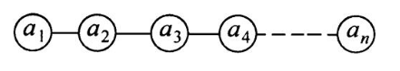
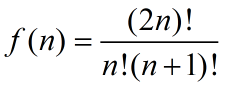
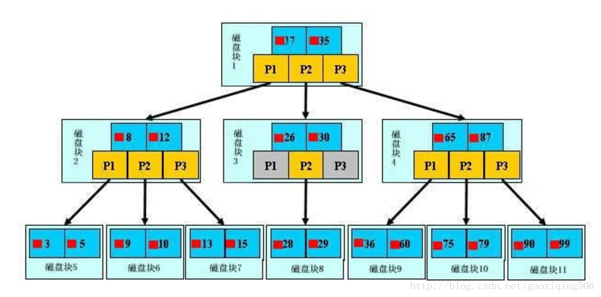
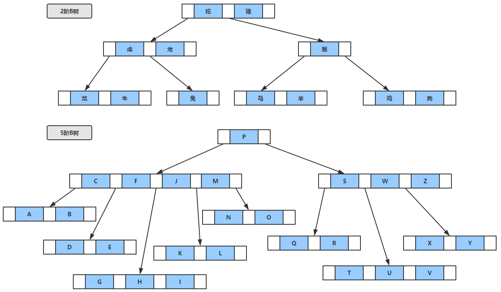
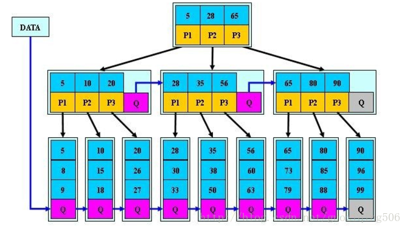

> https://github.com/xiufengcheng/DATASTRUCTURE

#### 线性表

- 是 n(n≥0)个相同类型的数据元素构成的有限序列。

  

  - 线性表除第一个和最后一个元素之外，每一格数据元素只有一个前驱和一个后继
  - 分有序线性表(顺序表)和无序线性表(链表)，有序线性表的元素按照值的递增顺序排列;无序线性表在元素的值与位置之间没有特殊的联系

- 顺序表

  顺序表：一组连续地址存储线性表的各个元素

  求址：
  每个元素占用 k 个存储单元，则
  LOC(ai)= LOC(a1)+(i-1)\*k (1≤i ≤n)
  LOC(ai+1)= LOC(ai)+k (1≤i ≤n)

  **注意**

        访问顺序表中元素的时间都相等,具有这一特点的称为 随机存取结构

- 链表

  链表：一组随机地址存储线性表各个元素，元素之间使用指针连接起来

  单链表：各元素只有一个指针域的链表(只含有一个指针域)

  头结点在链表中并不是必须的，仅仅是为了操作上的方便。

  双向链表: 有两个指针域的链表，一个指向前驱，另一个指向后继

        节点p既指向前驱，又指向后继。因此可随意在其上向前或向后移动，使得操作更加容易。

        操作上比单链表更加便利，但存储开销增大。

        双(向)链表是非循环的，有首尾节点，注意与双向循环链表区别开来

  循环链表(约瑟夫环)：

        尾部指针的next指向头指针,形成环状数据结构

        一般有两种形式的循环链表，即单向循环链表和双向循环链表。

        单向循环链表中，表尾结点的指针域不为空，回指第一个结点，整个链表形成一个环。

        在双向循环链表中，除了表尾结点的后继指针域回指第一个结点外，同时表头结点的前驱指针域回指表尾结点，这样在链表中构成了两个环。

#### 栈

可用顺序表或链表实现。特点：后进先出 (LIFO)

- 多栈共享邻接空间

  - 定义：即两个栈栈底位置为两端，两个栈顶在中间不断变化，由两边往中间延伸。动态变化(想象把两个花瓶口对口连起来)。
  - 目的：若多个栈同时使用，可能出现一个栈的空间被占满而其它栈空间还有大量剩余，因此采用这个方法。
  - 特点：设有 top1 和 top2 两个指针，top1 = -1 表示左栈为空，top2 >= StackSize 表示右栈为空; top1 + 1 >= top2 时表示栈满。

    

#### 队列

- 先进先出
- 顺序循环队列

  - 初始状态为 front = rear = 0
  - 入队时，把元素插到 rear 指示位置，然后 rear++
  - 出队时，把 front 指示位置元素删除，然后 front++

  - **判断空**

    1. 少用一个存储单元

       插入时，判断下一元素是否为 front，如果是，则停止插入。

       判满条件：(rear+1) mod maxsize = front

       判空条件：rear == front

    2. 设置一个标志位

       即设置一个标志位 tag=0,当进队成功时 tag=1;当出队成功时 tag=0

       判满条件：(rear==front) && (tag==1)

       判空条件：(rear==front) && (tag==0)

    3. 设置计数器

       即设置一个计数器 count=0，当进队成功时 count++;当出队成功时 count--

       判满条件：(rear==front) && count>0\*\*

       判空条件：count == 0

#### 查找

#### 排序

- 快速排序

  快排是不稳定的排序，最好的情况对半分，时间复杂度为 nlogn
  最坏的情况选择最小或最大的元素作为切分元素，时间复杂度为 n^2

  快排是内部进行比较交换，所以不需要额外的空间，但是递归调用会占用栈空间

  ArrayList.sort()方法使用的是快排

  对快排的优化：

  1. 对于小数组或者切分为小数组时可以用插入排序，效率较高
  2. 可以选择三个数，从中取中值
  3. 对于重复值多的序列，可以三向切分，大于、等于、小于


    补充：
        快速排序通过一个切分元素将数组分为两个子数组，左子数组小于等于切分元素，右子数组大于等于切分元素。再将两个子数组排序就是整个数组排序了

        ```
        public class QuickSort<T extends Comparable<T>> exths Sort<T>{

            @override
            public void sort(T[] nums){
                shuffle(nums);
                sort(nums,0,nums.length-1);
            }

            public void sort(t[] nums, int l,int h){
                if(l == h){
                    return
                }
                int mid =partition(nums, l, h);
                sort(nums, l, mid+1);
                sort(nums, mid-1, h);
            }

            public void shuffle(T[] nums){
                List<Comparable> list = Arrays.asList(nums);
                Collections.shuffle(lsit);
                list.toArray(nums);
            }
        }
        ```

        取a[l]元素作为切分元素，定义i指针指向l，从左向右(i++)扫描数组，直到找到第一个大于等于他的元素，接着从右往左扫描，遇到第一个小于等于他的元素，交换这两个元素，不断重复这个过程，直到两个指针相遇。最后将切分元素a[l]与a[j]交换。这样保证了切分元素左面都是小于等于他的元素，右面都是大于等于他的元素。

        ```
        private int partition(T[] nums, int l, int h){
            T v = T[l];
            int i = l, j = h + 1;
            while(true){
                while(less(nums[++i], v) && i!=h);
                while(less(nums[--j], v) && j!=l);
                if (i>=j){
                    break;
                }
                swap(nums,i,j);
            }
            swap(nums,l,j);
            return j;
        }
        ```

    排序的话，快排是不稳定的排序，同样不稳定排序有 选择排序、希尔排序、堆排序

    Java中Arrays.sort()使用的是快排

- 堆排序

  堆可以看做是一颗树，节点在树中的高度可以被定义为从本节点到叶子节点的最长简单下降路径上边的数目；定义树的高度为树根的高度。我们将看到，堆结构上的一些基本操作的运行时间至多是与树的高度成正比，为 O(lgn)

  1. 先将初始数列建成一个大根堆，此堆为初始的无序区
  2. 将堆顶元素 R[1]与最后一个 R[n]交换，此事得到新的无序区(R1,R2,......Rn-1)和新的有序区(Rn)
  3. 由于交换后新的堆顶 R[1]可能违反堆的性质，因此需要对当前无序区(R1,R2,......Rn-1)调整为新堆，然后再次将 R[1]与无序区最后一个元素交换，得到新的无序区(R1,R2....Rn-2)和新的有序区(Rn-1,Rn)。不断重复此过程直到有序区的元素个数为 n-1，则整个排序过程完成

  初始大顶堆：从最后一个有子节点的开始网上调整最大堆 从下往上 从右往左
  调整堆： 堆顶元素 R[1]与最后一个元素 R[n]交换，交换后堆长度减一
  即每次调整都是从父节点、左孩子节点、右孩子节点三者中选择最大者跟父节点进行交换(交换之后可能造成被交换的孩子节点不满足堆的性质，因此每次交换之后要重新对被交换的孩子节点进行调整)。有了初始堆之后就可以进行排序了。 从上往下 从左往右

  堆排序 平均时间复杂度 nlog2(n) 空间复杂度 o(1)

  Java 中 PriorityQueue 实现依赖小根堆

  实现：

        首先初始化堆，从最后一个有子节点的开始网上调整最大堆

        ```
        private static void maxHeapify(int[] nums,int heapSize,int index){
            int left = getChildLeftIndex();
            int right = getChildRightIndex();
            int largest = index;

            if (left < index && data[index] < data[left])
                larget = left;
            if (right < index && data[largest] < data[right])
                largest = right;

            if (largest!=index){
                swap(data,index,largest);
                //得到最大值后可能需要交换，如果交换了，其子节点可能就不是最大堆了，需要重新调整
                maxHeapify(data, heapSize, largest);
            }
        }
        ```

        依次从下往上 从右往左，调整堆

        ```
        private static void buildMaxHeapify(int[] data) {
            int startIndex = getParentIndex(data.length - 1);
            for (int i = startIndex; i >= 0; i--) {
                maxHeapify(data, data.length, i);
            }
        }
        ```

        进行堆排序

        ```
        private static void heapSort(int[] data) {
            for (int i = data.length - 1; i > 0; i--) {
                ArrayMethod.swap(data, 0, i);
                maxHeapify(data, i, 0);
            }
        }
        ```

#### 树

|          |                                                                                                                                 |
|----------|---------------------------------------------------------------------------------------------------------------------------------|
| 二叉树      | ▪ 二叉树	▪ 二叉查找树	▪ 笛卡尔树	▪ Top tree <br> ▪ T树                                                                                       |
| 自平衡二叉查找树 | ▪ AA树	▪ AVL树	▪ 红黑树	▪ 伸展树 <br>  ▪ 树堆	▪ 节点大小平衡树                                                                                   |
| B树       | ▪ B树	▪ B+树	▪ B*树	▪ Bx树 <br> ▪ UB树	▪ 2-3树	▪ 2-3-4树	▪ (a,b)-树 <br> ▪ Dancing tree	▪ H树                                            |
| Trie     | ▪ 前缀树	▪ 后缀树	▪ 基数树                                                                                                               |
| 空间划分树    | ▪ 四叉树	▪ 八叉树	▪ k-d树	▪ vp-树 <br> ▪ R树	▪ R*树	▪ R+树	▪ X树 <br> ▪ M树	▪ 线段树	▪ 希尔伯特R树	▪ 优先R树                                            |
| 非二叉树     | ▪ Exponential tree	▪ Fusion tree	▪ 区间树	▪ PQ tree <br> ▪ Range tree	▪ SPQR tree	▪ Van Emde Boas tree                             |
| 其他类型     | ▪ 堆	▪ 散列树	▪ Finger tree	▪ Metric tree <br> ▪ Cover tree	▪ BK-tree	▪ Doubly-chained tree	▪ iDistance <br> ▪ Link-cut tree	▪ 树状数组 |

	

#### 搜索二叉树 (Binary Search Tree)

二叉树是每个节点最多有两个子节点的树。

- 相关概念

  - 孩子节点
  - 双亲节点
  - 兄弟节点
  - 树的深度 即树高
  - 节点的度 节点子树的个数
  - 有序树
  - 无序树
  - 叶子节点 度为 0 的节点

- 特性：

  - 在非空二叉树中，第 i 层的节点总数不超过 2^(i-1)
  - 深度为 h 的二叉树最多有 2^h-1 个节点， 最少有 h 个节点(链状了)
  - 具有 n 个节点的完全二叉树的深度为 [logn]+1 (logn 向下取整)
  - 给定 n 个节点，能构成 f(n) 个节点 

- 二叉树遍历

  设 L、D、R 分别表示遍历左子树、访问根结点和遍历右子树， 则对一棵二叉树的遍历有三种情况：DLR（称为先根次序遍历），LDR（称为中根次序遍历），LRD （称为后根次序遍历）。

  - 先序遍历

    ```
    void preTraversal(TreeNode root){
      if (root == null) {
        return;
      }

      print(root.value);
      preTraversal(node.leftChild);
      preTraversal(node.rightChild);
    }
    ```

  - 中序遍历

    ```
    void inTraversal(TreeNode root){
      if (root == null) {
        return;
      }

      inTraversal(node.leftChild);
      print(root.value);
      inTraversal(node.rightChild);
    }
    ```

  - 后序遍历

    ```
    void postTraversal(TreeNode root){
      if (root == null) {
        return;
      }

      postTraversal(node.leftChild);
      postTraversal(node.rightChild);
      print(root.value);
    }
    ```

  - 层次遍历

    即按照层次访问，通常用队列来做。访问根，访问子女，再访问子女的子女（越往后的层次越低）（两个子女的级别相同

- 完全二叉树

  h 层的树，前 h-1 层满；且第 h 层的叶子从左至右一次排列

- 满二叉树

  即第 h 层也满了
  除了叶结点外每一个结点都有左右子叶且叶子结点都处在最底层的二叉树。

- 平衡二叉树

  平衡二叉树又被称为 AVL 树（区别于 AVL 算法），它是一棵二叉排序树，且具有以下性质：它是一棵空树或它的左右两个子树的高度差的绝对值不超过 1，并且左右两个子树都是一棵平衡二叉树。

- 线索二叉树

  线索二叉树(保留遍历时结点在任一序列的前驱和后继的信息)：若结点有左子树，则其lchild域指示其左孩子，否则令lchild域指示其前驱；若结点有右子树，则其rchild域指示其右孩子，否则令rchild指示其后继。还需在结点结构中增加两个标志域LTag和RTag。LTag=0时，lchild域指示结点的左孩子，LTag=1时，lchild域指示结点的前驱；RTag=0时，rchild域指示结点的右孩子，RTag=1时，rchild域指示结点的后继

#### 平衡二叉树 (Balanced Binary Search Tree)

#### 红黑树 (Red-Black-Tree)

AVL 是高度平衡的树，插入删除都需要大量的左旋右旋进行重新平衡
而红黑树放弃了极致平衡以追求插入删除时的效率

红黑树的特点：

1.  节点非黑即红
2.  叶子节点为黑色
3.  到叶子节点的任意路径下的黑色节点个数一致
4.  红色节点的两个子节点都为黑色

#### b 树,b+树，b-树(易于混淆)

> https://www.xuebuyuan.com/3191430.html
 > https://www.cnblogs.com/qlqwjy/p/7965491.html

动态查找树主要有：二叉查找树(Binary Search Tree),平衡二叉树，红黑树，B-tree/B+-tree/b\*-tree

强调： B-tree 读作 b 树,B+-tree 读作 b+树，所以 b-树就是 b 树。

前三者是典型的二叉查找树结构，其查找的时间复杂度 O(logN)与树的深度相关，那么降低树的深度自然会查找提高效率。

- b-树 多路搜索树
  - 对于m阶b树，非叶子节点最多有m个儿子且m大于2
  - 根节点的儿子数为[2,m]
  - 除根节点的给叶子节点的儿子数为[M/2,M]
  - 每个节点存放至少M/(2-1)(向上取整)到(M-1)个关键字
  - 非叶子节点的关键字字数 等于 指向儿子的指针数减一
  - 关键字有序
  - 所有叶子节点在同一层

  
  

  b树的查寻过程与二叉树的类似，从根节点依次比较每个节点(每个节点有序)，对节点内的关键字进行二分查找，如果命中记录返回结果，否则进入范围所属的儿子节点进行查询

- b+树

  定义与b-树基本相同，不同点有：

  - 非叶子节点的子树指针和关键字字数相等
  - 非叶子节点的子树指针p[i]，指向关键字属于[k[i],k[i+1]]的子树
  - 为所有叶子节点增加一个链指针
  - 所有的关键字都只在叶子节点出现

  **b+树与b-树**

      1. b+树空间利用率更高，因为b+树的内部节点是作为索引使用，而不像b-树那样每个节点都需要存储磁盘数据指针
      2. b+树增删文件效率更高，因为b+树的叶子节点包含所有关键字并且以有序的链表结构存储

  

  

#### Trie 树

> https://blog.csdn.net/sunhuaqiang1/article/details/52463257

#### 用两个栈实现一个队列或者俩个队列实现一个栈

1. 区别与联系

相同点：
(1)栈和队列都是控制访问点的线性表;
(2)栈和队列都是允许在端点处进行数据的插入和删除的数据结构;

不同点：
(1)栈遵循“后进先出(LIFO)”的原则，即只能在该线性表的一头进行数据的插入和删除，该位置称为“栈顶”，而另外一头称为“栈底”;根据该特性，实现栈时用顺序表比较好;
(2)队列遵循“先进先出(FIFO)”的原则，即只能在队列的尾部插入元素，头部删除元素。根据该特性，在实现队列时用链表比较好

2. 两站实现队列
   栈是后进先出的，所以两个栈 一个栈用来入栈，而将栈中的数据再次出栈存入另一个栈中，这样经过两次后进先出， 则实现了先进先出

3. 两队列实现栈
   始终保持一个队列为空，需要出队时，队列抛出 n-1 个数据到另一队列中，只留下一个 top1 数据，这样那个队列再次 pop,pop 的数据就是队首元素了。
