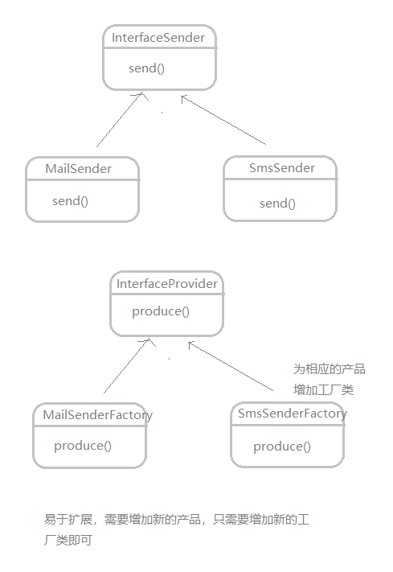

> https://www.cnblogs.com/geek6/p/3951677.html <br>
> https://github.com/CyC2018/CS-Notes/blob/master/notes/%E8%AE%BE%E8%AE%A1%E6%A8%A1%E5%BC%8F.md

#### 设计模式的六大原则

* 总原则：开闭原则(Open Close Principle)

    开闭原则就是说对扩展开放，对修改关闭。
    
    在程序需要进行拓展的时候，不能去修改原有的代码，而是要扩展原有代码，实现一个热插拔的效果。

1. 单一职责原则

    不要存在多于一个导致类变更的原因，也就是说每个类应该实现单一的职责，如若不然，就应该把类拆分。

2. 里氏替换原则(Liskov Substitution Principle)

    任何基类可以出现的地方，子类一定可以出现。

    在继承关系中，父类的对象如果替换为子类的对象，他原来执行的行为依然保持不变。这样来说，java的多态正是依赖于里氏替换原则的。

3. 依赖倒转原则(Dependence Inversion Principle)

    面向接口编程，依赖于抽象而不依赖于具体。写代码时用到具体类时，不与具体类交互，而与具体类的上层接口交互。

4. 接口隔离原则(Interface Segregation Principle)

    每个接口中不存在子类用不到却必须实现的方法，如果不然，就要将接口拆分。使用多个隔离的接口，比使用单个接口(多个接口方法集合到一个的接口)要好。

5. 迪米特法则(最少知道原则)(Demeter Principle)

    一个类对自己依赖的类知道的越少越好。也就是说无论被依赖的类多么复杂，都应该将逻辑封装在方法的内部，通过public方法提供给外部。这样当被依赖的类变化时，才能最小的影响该类。

6. 合成复用原则(Composite Reuse Principle)

    原则是尽量首先使用合成/聚合的方式，而不是使用继承。

#### 简单工厂模式

就是建立一个工厂类，对实现了同一接口的一些类进行实例的创建

-
    

```
public interface Sender {  
    public void Send();  
}  

public class MailSender implements Sender {  
    @Override  
    public void Send() {  
        System.out.println("this is mailsender!");  
    }  
}  

public class SmsSender implements Sender {  
  
    @Override  
    public void Send() {  
        System.out.println("this is sms sender!");  
    }  
}  

//1. 依据传入的字符串创建对象
//如果传入的字符串有误，不能正确创建对象
public class SendFactory {  
    public Sender produce(String type) {  
        if ("mail".equals(type)) {  
            return new MailSender();  
        } else if ("sms".equals(type)) {  
            return new SmsSender();  
        } else {  
            System.out.println("请输入正确的类型!");  
            return null;  
        }  
    }  
}  

//2. 多个工厂方法分别创建不同的对象
public class SendFactory {  
    public Sender produceMail(){  
        return new MailSender();  
    }  
    public Sender produceSms(){  
        return new SmsSender();  
    }
}

//3. 多个静态方法分别创建不同的对象
//相较于上一种，不需要实例化工厂类
public class SendFactory {  
    public static Sender produceMail(){  
        return new MailSender();  
    }  
    public static Sender produceSms(){  
        return new SmsSender();  
    }
}
```
总体来说，工厂模式适合：凡是出现了大量的产品需要创建，并且具有共同的接口时，可以通过工厂方法模式进行创建。

#### 工厂方法模式(Factory Method)

简单工厂模式有一个问题就是，类的创建依赖工厂类，也就是说，如果想要拓展程序，必须对工厂类进行修改，这违背了闭包原则.

所以，用到工厂方法模式，创建一个工厂接口和创建多个工厂实现类，这样一旦需要增加新的功能，直接增加新的工厂类就可以了，不需要修改之前的代码。

-
    

```
public interface Sender {  
    public void Send();  
} 

public class MailSender implements Sender {  
    @Override  
    public void Send() {  
        System.out.println("this is mailsender!");  
    }  
}  

public class SmsSender implements Sender {  
    @Override  
    public void Send() {  
        System.out.println("this is sms sender!");  
    }  
}  

// 工厂接口
public interface Provider {  
    public Sender produce();  
}  

public class SendMailFactory implements Provider {  
    @Override  
    public Sender produce(){  
        return new MailSender();  
    }  
} 

public class SendSmsFactory implements Provider{  
  
    @Override  
    public Sender produce() {  
        return new SmsSender();  
    }  
}   

// 调用时

public class Main {  
  
    public static void main(String[] args) {  
        Provider provider = new SendMailFactory();  
        Sender sender = provider.produce();  
        sender.Send();  
    }  
}  

```

对于增加改变的产品，只需实现Provider接口，做一个相应的工厂类就行了。拓展性较好。

#### 抽象工厂模式

(*-*) 等等哈，没抽象明白！ 

#### 单例模式 
*   适用场景：
    1. 有些类对象的创建与销毁非常耗费资源，而且有经常用到
    2. 需要生成唯一序列话的环境，如部分窗口对象，关闭后打开我们需要保持在之前的界面，
    3. 方便资源互相通信的环境， 如一个log日志单例类，不同地方的的调用可以将日志按顺序记录到一个文件中。
*   优点：
    1. 实现了对唯一实例的访问的可控
    2. 对于一些频繁创建和销毁的对象来说可以提高系统的性能
*   缺点：
    1. 滥用单例会带来一些负面问题，如为了节省资源将数据库连接池对象设计为单例类，可能会导致共享连接池对象的程序太多，而出现连接池溢出
    2. 如果实例化的对象长时间不被利用，系统会认为该对象是垃圾而被回收，这可能会导致对象状态的丢失
*   实现
    1. 饿汉式 初始化时直接创建一个单例对象 初始启动时创建对象延迟启动，而且对象长时间不用占用一定空间，浪费<br>
    2. 懒汉式 需要的时候再去创建。
      *  线程不安全
      *  线程安全 
            *  synchronized锁住方法
            *  synchronized锁部分代码块，缩小锁粒度
            *  内部类，利用类的加载一定线程安全的原因
            *  枚举类 该实现在多次序列化再进行反序列化之后，不会得到多个实例

饿汉式

    ```
    static instance = new SingleInstance();
    ```

懒汉式(线程不安全)

    ```
    static instance = null;
    ...
    getInstance(){
        if(instance==null)
            return new SingleInstance();
    }
    ```

懒汉式加锁synchronized(低效)

    ```
    synchronized getInsance(){
        if (instance==null){
            return new SingleInstance();
        }
    }
    ```

懒汉式双重锁检查(volatile防止指令重排)

    ```
    static volatile instance = null;
    ...
    getInstance(){
        if(instance==null){
            synchronized(SingleInstance.class){
                if (instance==null){
                    return new SingleInstance();
                }
            }
        }
    } 
    ```

内部类(在方法getInstance()调用时加载内部类，利用classLoader保证了同步)

    ```
    // 内部类
    private static class InnerSingleInstance {
        private staic final SingleInstance INTANCE = new SingleInstance();
    }
    private SingleInstance(){};
    public static SingleInstance getInstance(){
        return InnerSingleInstance.INSTANCE;
    }
    ```
枚举实现

该实现可以防止反射攻击。在其它实现中，通过 setAccessible() 方法可以将私有构造函数的访问级别设置为 public，然后调用构造函数从而实例化对象，如果要防止这种攻击，需要在构造函数中添加防止多次实例化的代码。该实现是由 JVM 保证只会实例化一次，因此不会出现上述的反射攻击。

    ```
    public enum Singleton {
        INSTANCE;
        private String objName;

        public String getObjName() {
            return objName;
        }

        public void setObjName(String objName) {
            this.objName = objName;
        }
    ```

#### 代理模式

*   1. 实现类与代理类 都继承同一个接口， 代理类的方法实现实际是调用实现类的该方法实现。 如：spring AOP中的jdk动态代理

    


*   2. 代理类继承实现类，覆盖其中的方法。 如：spring AOP 中的cglib代理

    

JDK动态代理只能对实现了接口的类生成代理对象;

cglib可以对任意类生成代理对象，它的原理是对目标对象进行继承代理，如果目标对象被final修饰，那么该类无法被cglib代理。

#### 适配器模式


#### 职责链模式

- 
    

将能够处理同一类请求的对象连成一条链，使这些对象都有机会处理请求，所提交的请求沿着链传递，从而避免请求的发送者和接受者之间的耦合关系。链上的对象逐个判断是否有能力处理该请求，如果能则处理，如果不能，则传递给链上的下一个对象。直到有一个对象处理它为止。

场景：
    打牌时，轮流出牌
    接力赛跑
    请假审批
    公文审批

    ```
    // 共同抽象处理类
    public abstract class Handler {

        protected Handler successor ;

        public Handler (Handler successor ){
            this.successor  = successor ;
        }
        
        public abstract void handleRequest(Request request);
    }

    // 主任对应的处理类
    public class DirectorHandler extends Handler {

        private String name = "director";

        public DirectorHandler(Handler successor) {
            super(successor);
        }

        @Override
        public void handleRequest(Request request) {
            if (request.getlevel() == 1) {
                System.out.println("\t" + name + " handler the request: \n\t\t" + request.getMsg());
                return;
            }

            if (successor != null) {
                successor.handleRequest(request);
            }
        }
    }

    // 经理对应的处理类
    public class ManagerHandler extends Handler {

        private String name = "manager";

        public ManagerHandler(Handler successor) {
            super(successor);
        }

        @Override
        public void handleRequest(Request request) {
            if (request.getlevel() == 2) {
                System.out.println("\t" + name + " handler the request: \n\t\t" + request.getMsg());
                return;
            }

            if (successor != null) {
                successor.handleRequest(request);
            }
        }
    }

    // 请求类
    public class Request {
        private int level;
        private String msg;

        public Request(int level, String msg) {
            this.level = level;
            this.msg = msg;
        }

        public void setlevel(int level) {
            this.level = level;
        }

        public void setMsg(String msg) {
            this.msg = msg;
        }

        public int getlevel() {
            return this.level;
        }

        public String getMsg() {
            return this.msg;
        }
    }

    // 客户端
    public class Client {

        public static void main(String[] args) {
            Handler generalManagerHandler = new GeneralManagerHandler(null);
            Handler managerHandler = new ManagerHandler(generalManagerHandler);
            Handler directorHandler = new DirectorHandler(managerHandler);

            Request request1 = new Request(1,
                    "the request's level is 1 and request body is the person need one day to rest \n");
            directorHandler.handleRequest(request1);

            Request request2 = new Request(2,
                    "the request's level is 2 and request body is the person need ten day to rest \n");
            directorHandler.handleRequest(request2);
        }
    }

    // output:
        director handler the request:
                the request's level is 1 and request body is the person need one day to rest

        manager handler the request:
                the request's level is 2 and request body is the person need ten day to rest

    ```


